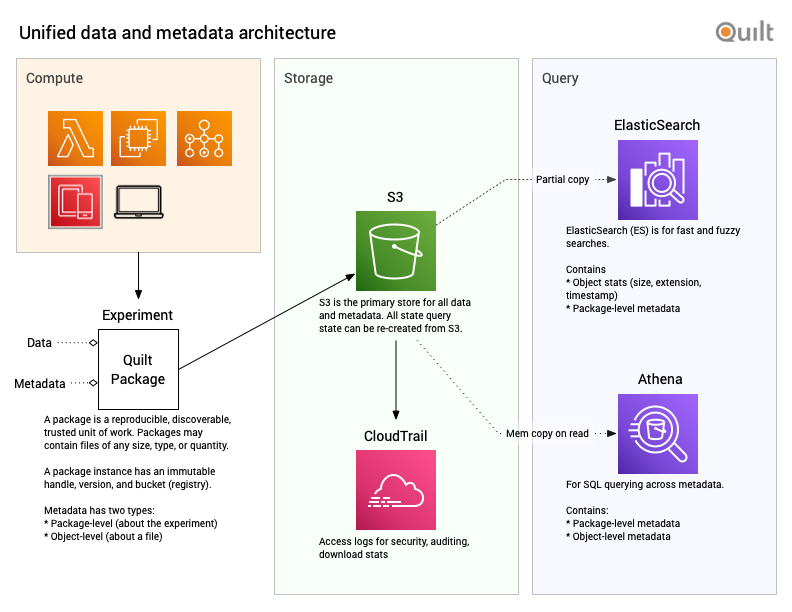

# Quilt packages unify data and metadata

Quilt data packages are reproducible, discoverable, and trusted data sets that
live in blob storage.

A package manifest includes both *metadata* and physical keys to primary data.

All package metadata and data are stored in your S3 buckets. A slice of the 
package-level metadata as well as S3 object contents are sent to an ElasticSearch
cluster managed by Quilt. All Quilt package manifests are accessible via SQL
using AWS Athena.

