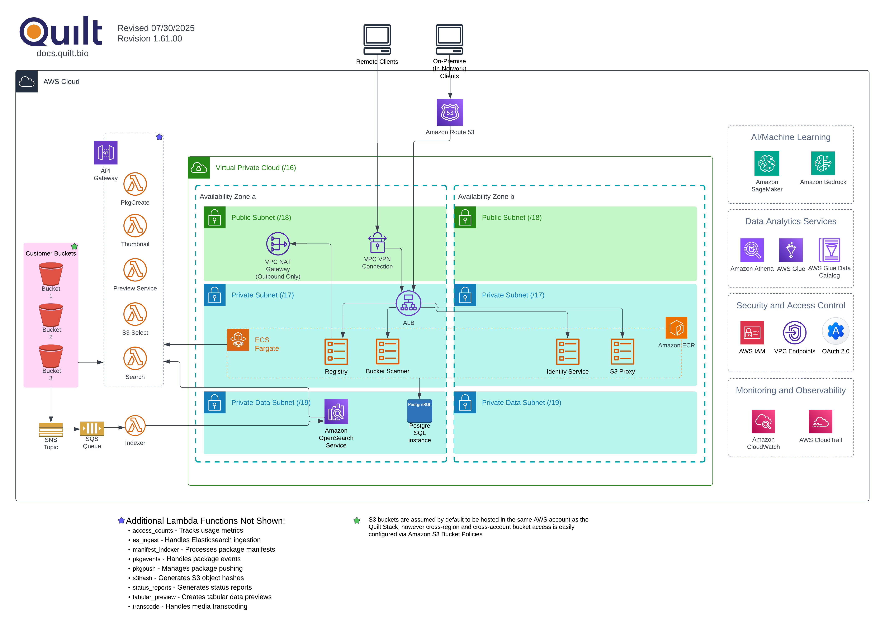
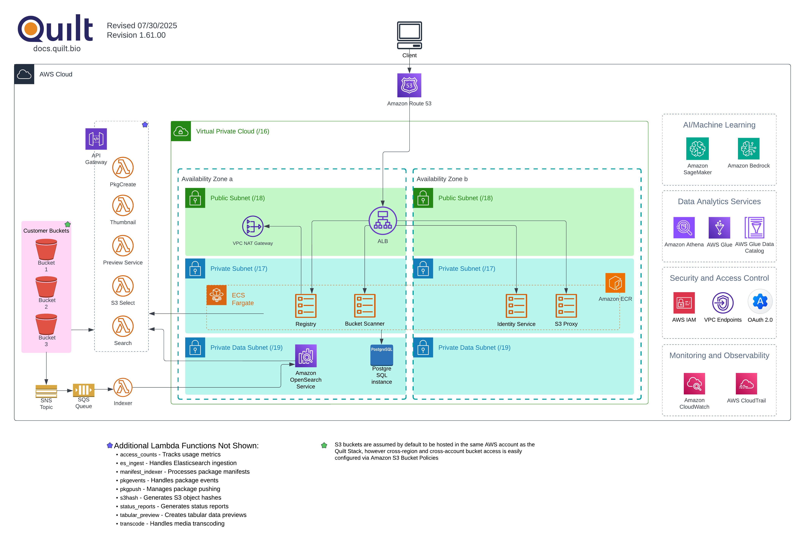
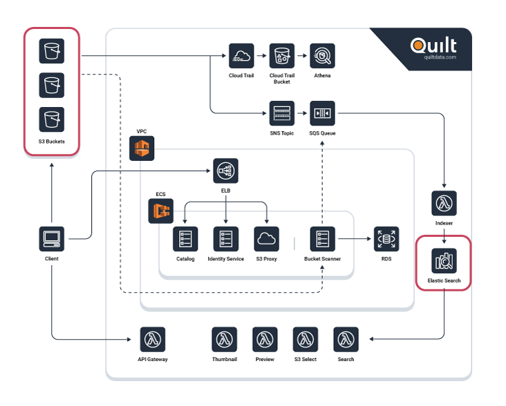

<!-- markdownlint-disable -->
# Quilt Architecture

## Overview

Quilt packages unify data and metadata. Quilt data packages are reproducible, discoverable, and trusted data sets that live in blob storage.

A package manifest includes both *metadata* and physical keys to primary data.

All package metadata and data are stored in your S3 buckets. A slice of the 
package-level metadata, as well as S3 object contents, are sent to an ElasticSearch
cluster managed by Quilt. All Quilt package manifests are accessible via SQL
using AWS Athena.

## Enterprise Architecture

Each Quilt instance consists of a CloudFormation stack that is privately hosted in your 
AWS account. The stack includes backend services for the web catalog, single sign-on,
user identification and access, an ElasticSearch cluster, and more.

Quilt uses subnets and security groups to isolate network services and runs key
services within the VPC.

A private stack with an inward load balancer is shown below.

For an internet-facing load balancer the data plane remains the same, as shown below.

### Network Architecture

You may provide your own VPC and subnets to a Quilt stack or have the Quilt stack
create its own network.

> If you provide the subnets you may choose to reuse subnets across parameters.
> For example you can use the same subnets for the Private and User subnet parameters.

You may optionally provide your own VPC CIDR block
if the default block of 10.0.0.0/16 conflicts with shared or
peered VPC services. We recommend a CIDR block no smaller than /24 (256 addresses)
for production, multi-AZ deployments. Larger CIDR blocks are easier to upgrade to
new Quilt versions with expanded services.

> For cost-sensitive deployments, Quilt ECS services can be configured to use
> a single AZ.

> You may use a combination of interface endpoints and gateway endpoints to
> restrict the data plane traffic shown above to your VPC.
> See [Private endpoint access](advanced-features/private-endpoint-access.md) for more.

#### Production, multi-AZ subnet division for private ELBv2 (you provide the network)

| Type       | AZ | Description            | Services | IPs needed† |
|------------|----|------------------------|----------|--------------|
| Private    | a  | Routes to Internet     | ECS, Lambda | 32 |
| Private    | b  | " | " | 32 |
| Intra      | a  | Does not route to Internet  | RDS, OpenSearch* | 32 |
| Intra      | b  | " | " | 32 |
| User       | a  | Reachable by GUI catalog users | App load balancer, API Gateway Endpoint | 16 |
| User       | b  | " | " | 16 |

> \* One IP per master node, one IP per data node

> †  Includes 5 IPs for AWS (network, routing, DNS, reserved, broadcast) plus room
> for new services in future updates.

Below are the subnet configurations and sizes for Quilt version 2.0 networks,
new as of June 2023. The configuration is similar to the
[AWS Quick Start VPC](https://aws-quickstart.github.io/quickstart-aws-vpc/).

#### Subnet division when Quilt creates the VPC

- 2 public subnets for NAT gateways and an internet-facing application load balancer
for accessing the validation server, which also sends password reset emails
(1/4 the VPC CIDR)
- 2 private subnets for Quilt services in ECS or Lambda, and an inward facing
application load balancer
(1/2 of the VPC CIDR)
- 2 private subnets for intra-VPC traffic to and from the Quilt RDS database and
OpenSearch domain
(1/8 of the VPC CIDR)
- Unused (1/8 of the VPC CIDR)

### Sizing
The Quilt CloudFormation template will automatically configure appropriate instance sizes for RDS, ECS (Fargate), Lambda and Elasticsearch Service. Some users may choose to adjust the size and configuration of their Elasticsearch cluster. All other services should use the default settings.

### Elasticsearch Service Configuration
By default, Quilt configures an Elasticsearch cluster with 3 master nodes and 2 data nodes. Please contact the Quilt support team before adjusting the size and configuration of your cluster to avoid disruption.

### Cost
The infrastructure costs of running a Quilt stack vary with usage. Baseline infrastructure costs start at $620 and go up from there. See below for a breakdown of baseline costs for `us-east-1` at 744 hours per month.

| Service  | Cost |
| ------------- | ------------- |
| Elasticsearch Service | $258.42 |
| RDS  | $75.56 |
| ECS (Fargate) | $26.64 |
| Lambda | Variable |
| CloudTrail | Variable |
| Athena | Variable |
| **Total** | **$619.03 + Variable Costs** |

## Security Architecture

All customer data and metadata in Quilt is stored in S3. It may also be cached in Elasticsearch Service (shown in red in the diagram below). No other services in the Quilt stack store customer data.

We recommend using [S3 encryption](https://docs.aws.amazon.com/AmazonS3/latest/userguide/UsingEncryption.html) and [Elasticsearch Service encryption at rest](https://docs.aws.amazon.com/elasticsearch-service/latest/developerguide/encryption-at-rest.html) to provide maximum protection.

User email addresses are stored by the Identity Service in RDS Postgres (part of the Quilt stack). User email addresses are also sent through an encrypted channel to the customer support messaging system ([Intercom](https://www.intercom.com/)).
