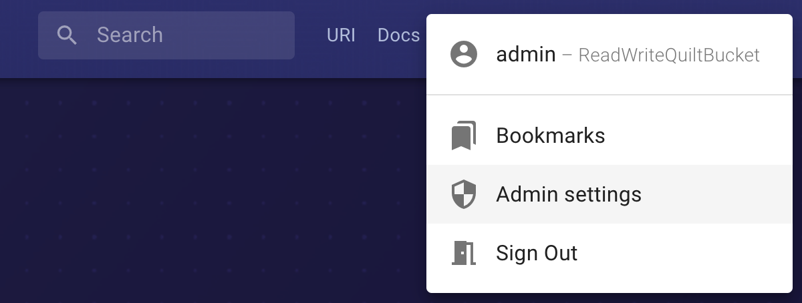
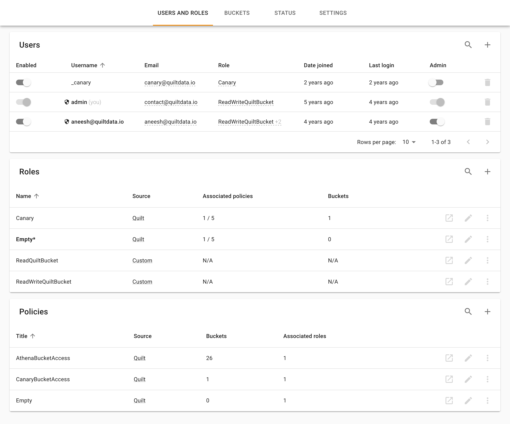
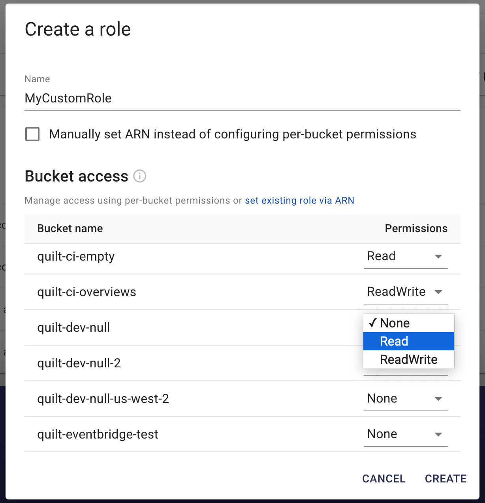
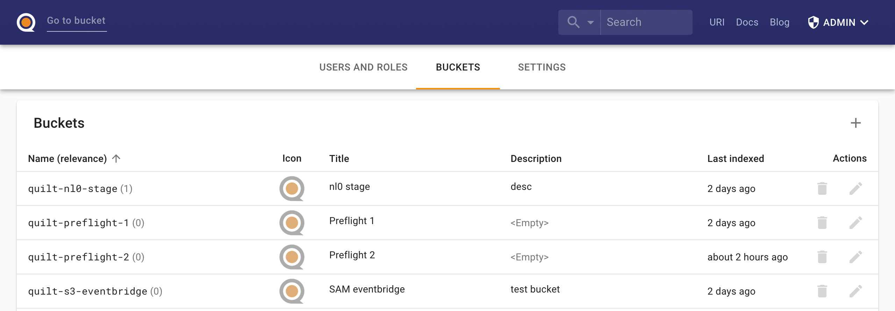
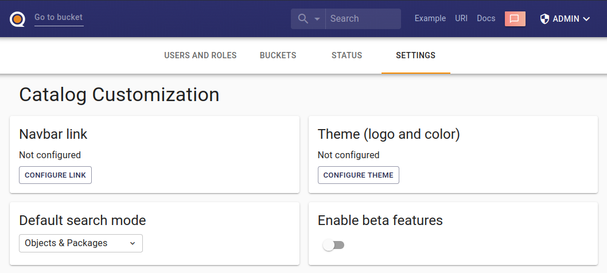

The Quilt catalog includes an admin panel that allows you to manage
users and buckets in Quilt, as well as customize the Quilt catalog. You can access
the panel via a dropdown menu under username in the navbar.

The admin page is only accessible to designated administrators. The first admin
is set during the CloudFormation installation. Subsequent admins may be designated
through the panel. Only admins may create other admins. 

Quilt requires at least one admin account per stack.

## Users and roles

This section provides comprehensive access control management for the follwing
functions:
* Create/Delete user
* De/activate user
* De/admin user
* Assign roles to users

You may invite new users to your Quilt stack by clicking the + button, upper right.

You may create custom roles for different groups of users. With the exception of
administrators, users of managed roles are only aware of the buckets that they
are permitted to read. All other stack buckets are invisible to users of managed
roles.

You must select the default role for all new users, else they will
not be able to sign in to the Quilt catalog.
The default role is shown in bold.

## Buckets

Here you can add or remove buckets from Quilt and configure bucket indexing and
display settings. 
<!--TODO explain sub sections of bucket editro !-->

## Settings

This section allows you to customize your Quilt catalog, including custom links
in the navbar.

## Further settings
See [Prefences](Preferences.md) for further control over the catalog user interface.
