<!-- markdownlint-disable -->
The Quilt catalog includes an admin panel that allows you to manage
users and buckets in Quilt, as well as customize the Quilt catalog. You can access
the panel via the **Admin** entry in the left sidebar.

The admin page is only accessible to designated administrators. The first admin
is set during the CloudFormation installation. Subsequent admins may be designated
through the panel. Only admins may create other admins. 

Quilt requires at least one admin account per stack.

## Users and roles

This section provides comprehensive access control management for the following
functions:
* Create/Delete user
* De/activate user
* De/admin user
* Assign roles to users
* Configure access policies

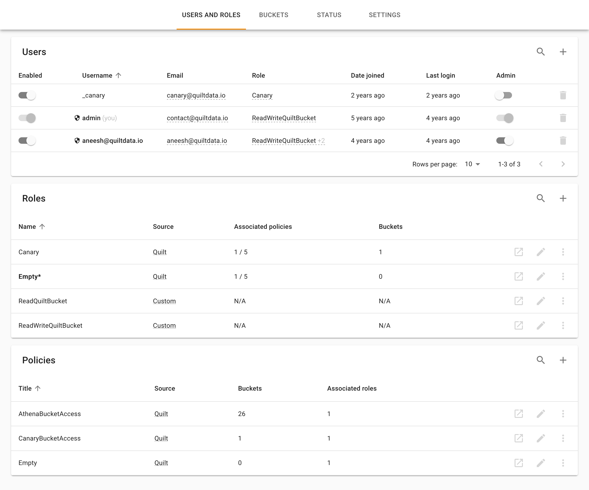

You may invite new users to your Quilt stack by clicking the + button, upper right.
You must assign one or more roles to all new users (default role is pre-selected for you).
You can edit existing users' attributes by clicking on underlined cells.

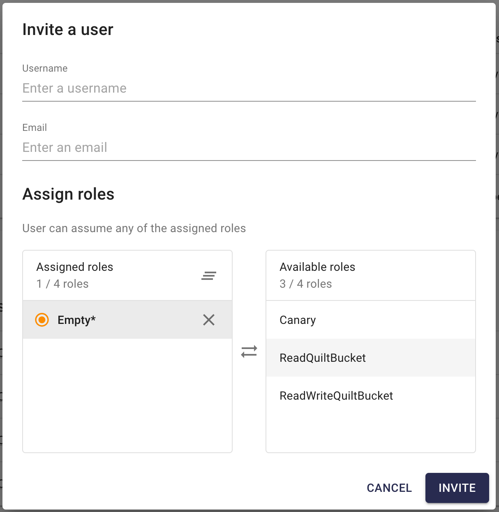

Users can switch between assigned roles via the dropdown menu in the navbar
(if assigned more than one).

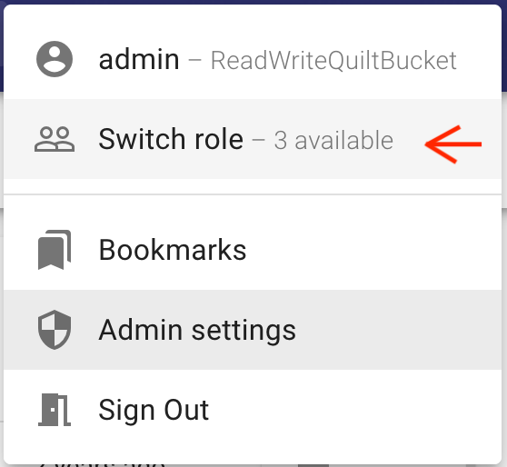

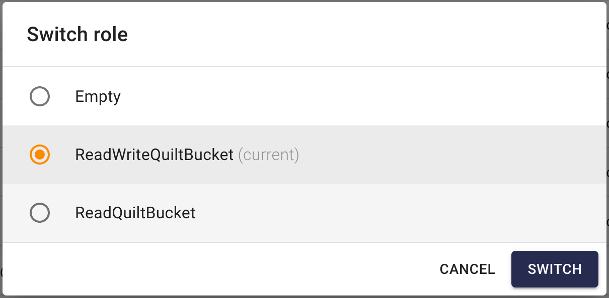

You must select the default role for all new users, else they will not be able
to sign in to the Quilt catalog. The default role is shown in bold.

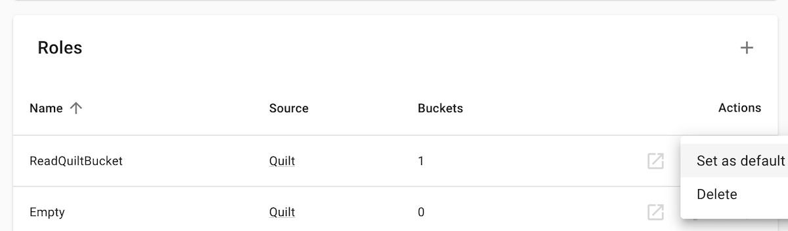

You may create roles for different groups of users by combining up to 5 policies.
Users of managed roles — including administrators — only see, list, and search
buckets for which their role is explicitly granted read access.

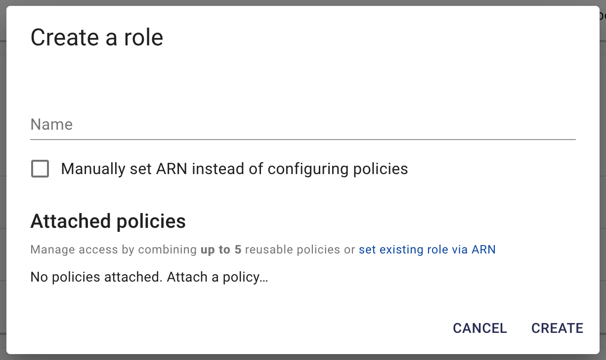

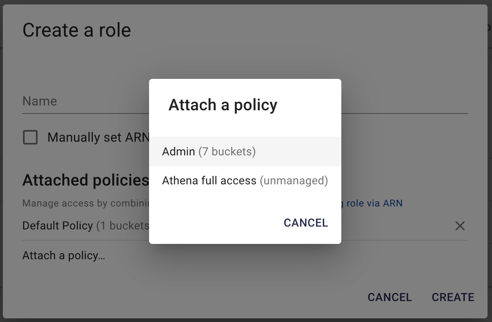

Alternatively, you may provide your own IAM roles via ARN:

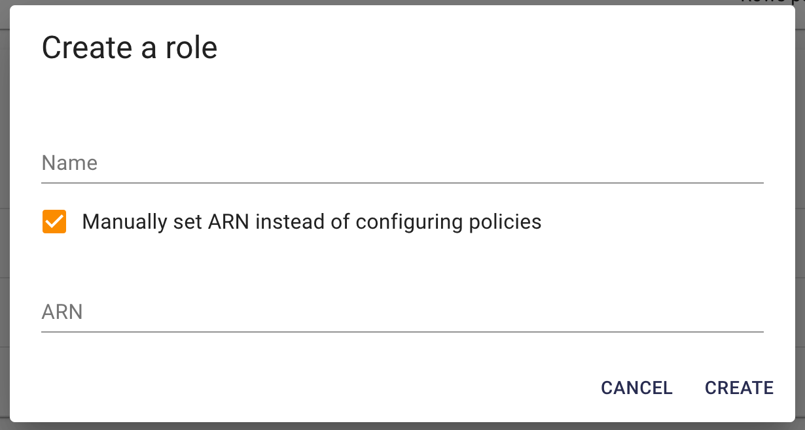

You may create policies providing access to a selected set of buckets:

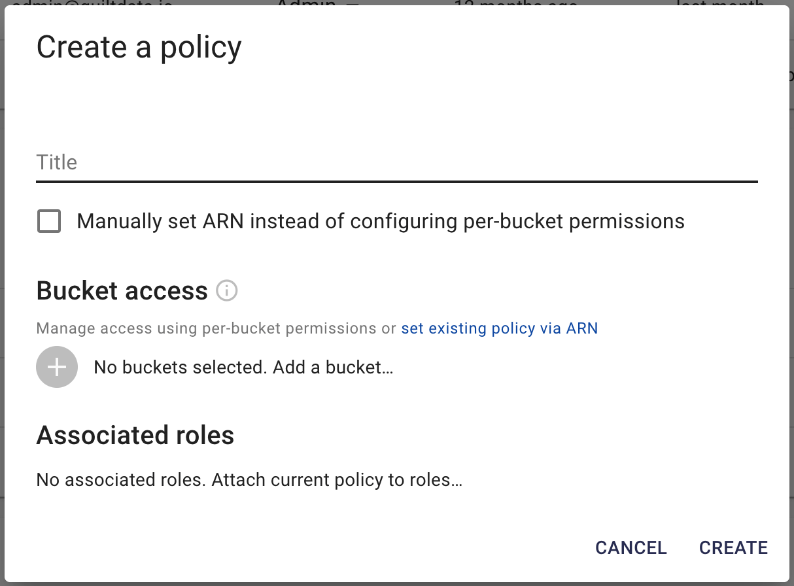

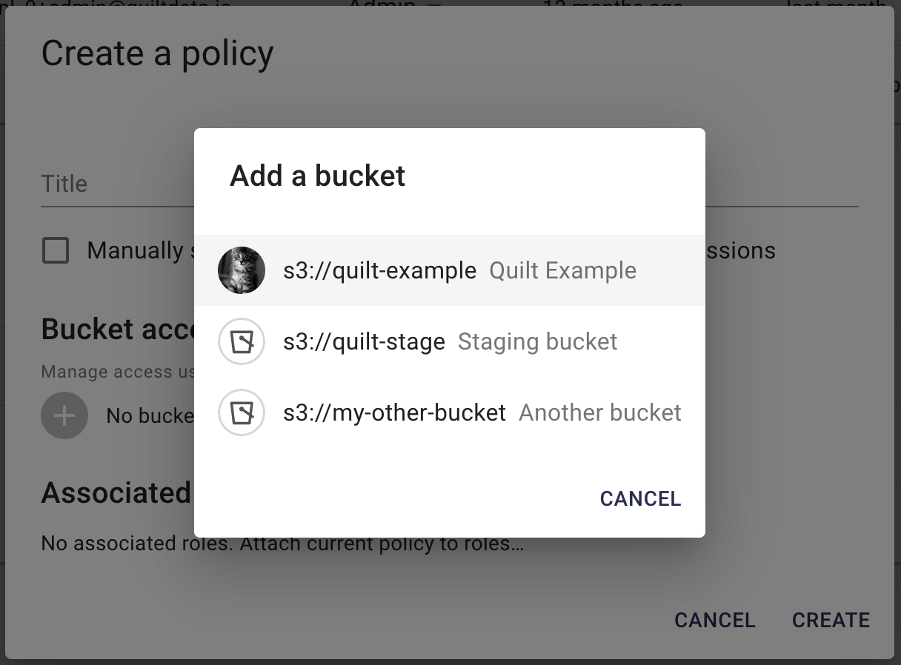

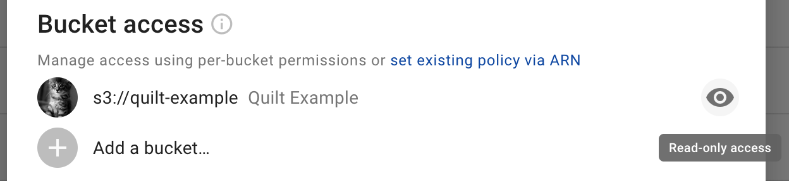

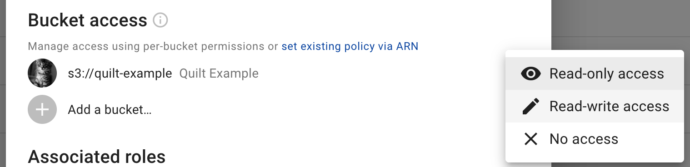

You may attach policies to managed roles from policy edit and create screens:

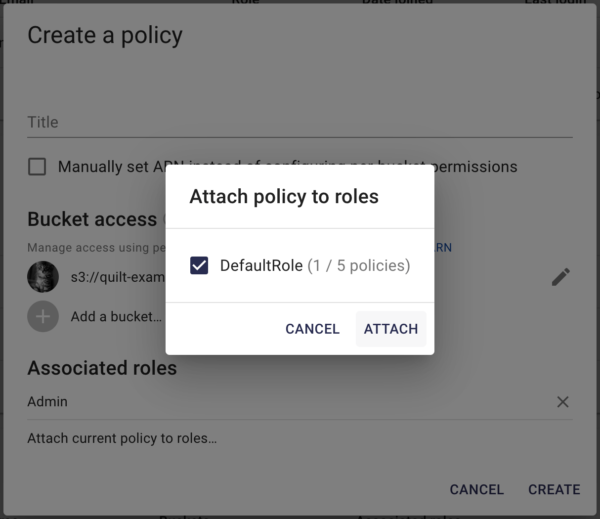

You may also provide custom policies via ARN:

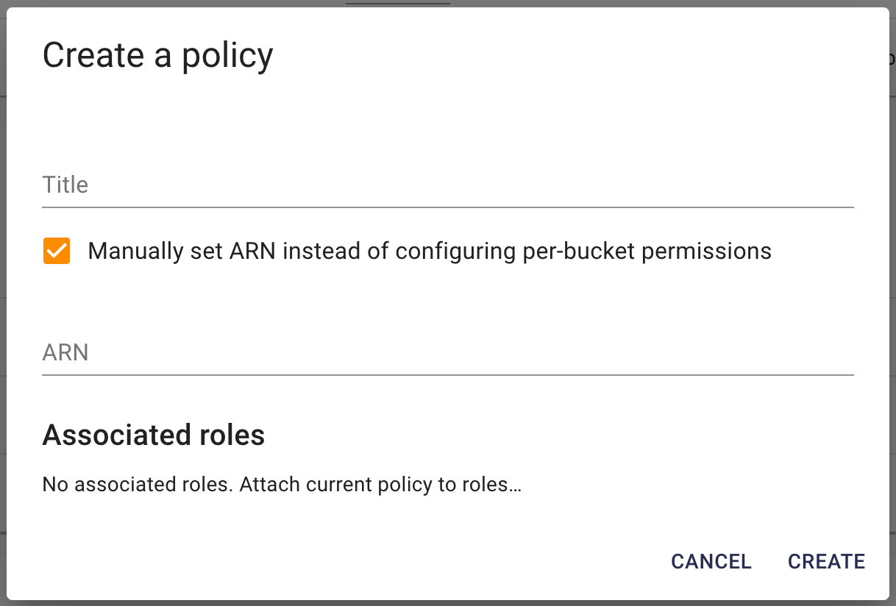

The resulting permission set is equivalent to a union of all permissions
provided by the policies attached to that role.

> **Note:** a managed role's IAM policy is regenerated when its bucket permissions
> are saved, so permissions added in a newer Quilt release reach existing managed
> roles on their next save.

## Buckets

Here you can add or remove buckets from Quilt and configure bucket indexing and
display settings. 
<!--TODO explain sub sections of bucket editor !-->

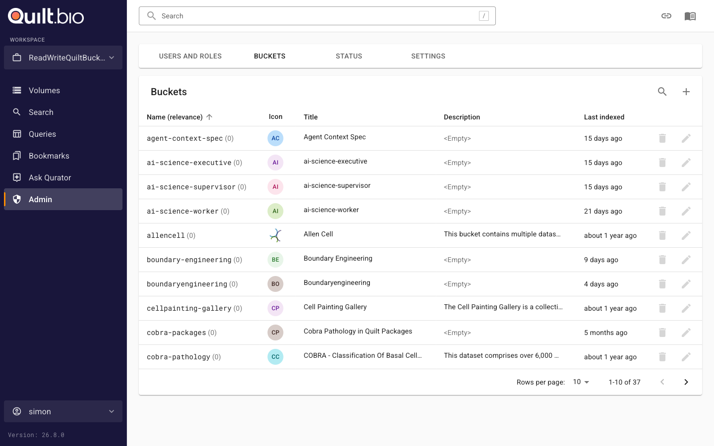

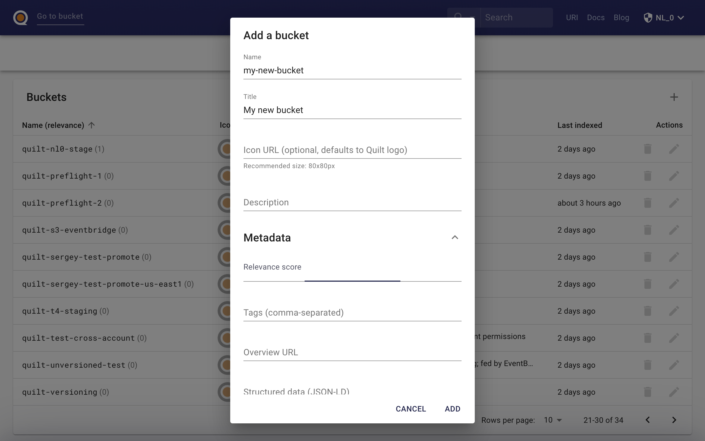

### Reindexing

Stack admins can reindex a bucket via `POST /api/admin/reindex/<bucket>`.
The request accepts an optional `prefix` field; when supplied, the
existing Elasticsearch indices are left in place and only keys under
that prefix are re-walked. This is useful for refreshing a slice of a
large bucket without a full reindex.

### S3 events

By default, when you add a bucket to the Quilt stack one of two things will happen:

1. If there is no existing bucket notification, Quilt will attempt to add a new notification
1. If there is an existing bucket notification, Quilt will use the existing notification if and only if it supports the required events (object creation and deletion)

If either of the above conditions fails, Quilt will not add the bucket in question.

See [S3 Events, EventBridge](../EventBridge.md) for more.

### Stack-managed bucket protections

Manual bucket-management operations on stack-managed S3 buckets are denied by
bucket policy. All configuration changes to a stack-managed bucket — including
notifications, policies, and lifecycle rules — must go through CloudFormation
rather than the S3 console, CLI, or API. This keeps each bucket's
configuration in sync with the stack template and prevents drift that could
break indexing or event delivery.

## Settings

This section allows you to customize your Quilt catalog, including custom links
in the navbar, custom logo, and default search mode. The Theme editor accepts
a logo as either a direct file upload (PNG, JPEG, WebP, or GIF) or a URL
(all of those plus SVG).

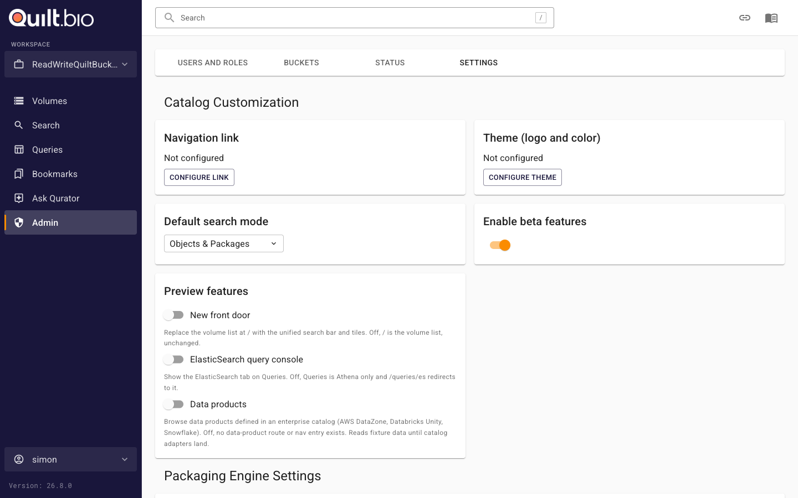

### Beta and preview features

The Settings tab also contains stack-wide opt-in switches for features that
are not yet enabled by default. Both are admin-editable at runtime (no
redeployment) and apply to the whole stack.

**Enable beta features** is a single global switch that currently gates:

* the new bucket Overview page (Overview v2) and bucket header card
* the Tabulator tables panel on the Athena Queries page

> Note: Overview v2 is controlled only by this switch. There is no per-bucket
> configuration key for it in `.quilt/catalog/config.yaml`.

**Preview features** are independently switchable capabilities. Each toggle is
off by default:

* **New front door** — replaces the volume list on the catalog home page with
  a unified search bar and tiles. When off, the home page is the volume list,
  unchanged.
* **ElasticSearch query console** — shows the ElasticSearch tab on the Queries
  page. When off, Queries is Athena-only and `/queries/es` redirects to it.
* **Data products** — adds a browsing surface for data products defined in an
  enterprise catalog (AWS DataZone, Databricks Unity Catalog, Snowflake).
  Enabling it also reveals a **Data Product Catalogs** configuration section in
  Settings. When off, no data-product route or navigation entry exists.

### Support Diagnostics

The Support Diagnostics section lets an admin generate and download a stack
diagnostics bundle (a zip file) to attach when contacting Quilt support.

## Further settings
See [Preferences](Preferences.md) for further control over the catalog user interface.
