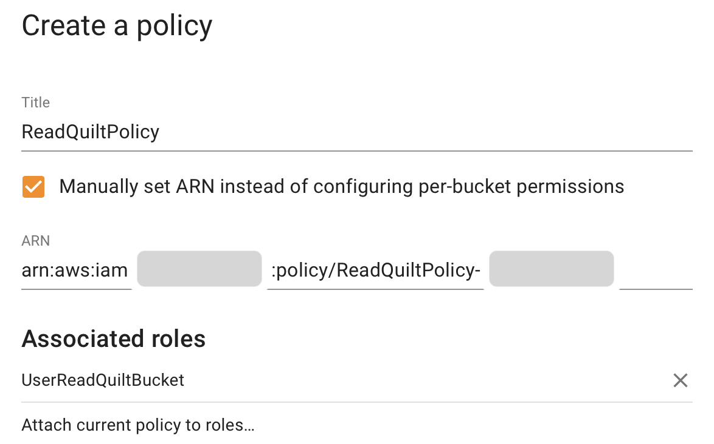

The Quilt catalog includes an admin panel that allows you to manage
users and buckets in Quilt, as well as customize the Quilt catalog. You can access
the panel via a dropdown menu under username in the navbar.

The admin page is only accessible to designated administrators. The first admin
is set during the CloudFormation installation. Subsequent admins may be designated
through the panel. Only admins may create other admins.

Quilt requires at least one admin account per stack.

## Users and roles

This section provides comprehensive access control management for the following
functions:
* Create/Delete user
* De/activate user
* De/admin user
* Assign roles to users
* Configure access policies

You may invite new users to your Quilt stack by clicking the + button, upper right.

You must select the default role for all new users, else they will not be able
to sign in to the Quilt catalog. The default role is shown in bold.

You may create roles for different groups of users by combining up to 5 policies.
With the exception of administrators, users of managed roles can only see, list,
and search buckets for which they are explicitly granted read access.

Alternatively, you may provide your own IAM roles via ARN:

However, these 'Custom' Roles are managed by AWS, not Quilt,
so you cannot attach policies to them using the Admin Settings UI.

## Policies

You may create policies providing access to a selected set of buckets:

You may attach policies to managed roles from policy edit and create screens:

You may also provide custom policies via ARN:

The resulting permission set is equivalent to a union of all permissions
provided by the policies attached to that role.

### Extending built-in roles

The initial "Source=Custom" roles defined by Quilt (`ReadQuiltBucket`, `ReadWriteQuiltBucket`) are locked to AWS ARNs, and thus cannot be extended by Quilt policies.  If you want a "Source=Quilt" UI-managed role that automatically has access to all registered buckets, you need to first import those specific polices.

## A. Create a Source=Quilt role

For concreteness, we will create a new `UserReadQuiltBucket` read-only role to which we can add Quilt policies.

1. Login to your Quilt instance at, e.g. https://quilt.mycompany.com
2. Click on "Admin Settings" in the upper right, under your Profile name
3. Scroll down to the "Roles" section on the bottom
4. Click "+" to define a new role
5. Name it `UserReadQuiltBucket`
6. Save

You can also create a `UserReadWriteQuiltBucket` if you want grant full permissions

## B. Display existing policies in AWS Console

While still in the Roles section of Admin Settings:

1. Find 'Custom' role "ReadWriteQuiltBucket"
2. Click "Open in AWS Console" (square-with-arrow icon) on the right

A new browser tab will open.
You will see (at least) three polices, whose names include:
* BucketReadPolicy
* BucketWritePolicy
* ReadQuiltPolicy

3. Command-click those names to open each policy in its own tab, so you can copy the Policy ARN

## C. Import and attach policy ARNs

In the initial window, while still in Admin Settings:

1. Scroll down to Policies
2. Click "+" to create a new policy
3. Set Title to one of: `BucketReadPolicy` | `BucketWritePolicy` | `ReadQuiltPolicy`
4. Click "set existing policy via ARN"
5. For 'ARN' paste in "Policy ARN" from the corresponding browser tab (above)
6. If NOT `BucketWritePolicy`: a) Click on "No associated role. Attach policy to roles..."; b) Select `UserReadQuiltBucket`; c) Click "Attach"
7. Click "Create"
8. Repeat until you have created all three policies

## D. Assign users to this new Role

While still in Admin Settings:

1. Scroll up to Users
2. Find the user(s) you want to edit (may want to set "Rows per page" to 100)
3. Click on the pop-up in the Role column
4. Repeat for all users

When finished, click on "Q" in the upper-right to exit Admin settings

## Buckets

Here you can add or remove buckets from Quilt and configure bucket indexing and
display settings.
<!--TODO explain sub sections of bucket editor !-->

### S3 events

By default, when you add a bucket to the Quilt stack one of two things will happen:

1. If there is no existing bucket notification, Quilt will attempt to add a new notification
1. If there is an existing bucket notification, Quilt will use the existing notification if and only if it supports the required events (object creation and deletion)

If either of the above conditions fails, Quilt will not add the bucket in question.

See [S3 Events, EventBridge](EventBridge.md) for more.

## Settings

This section allows you to customize your Quilt catalog, including custom links
in the navbar.

## Further settings
See [Prefences](Preferences.md) for further control over the catalog user interface.

See [Athena](../advanced-features/athena.md) to enable querying metadata via Athena SQL.
