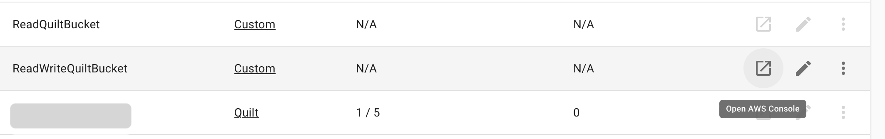
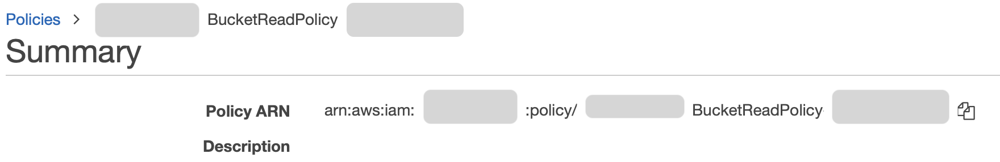

The Quilt catalog includes an admin panel that allows you to manage
users and buckets in Quilt, as well as customize the Quilt catalog. Admins can access
the panel via a dropdown menu under username in the navbar.

The first admin
is set during the CloudFormation installation. Subsequent admins may be designated
through the panel. Only admins can create other admins.

Quilt requires at least one admin account per stack.

## Users and roles

This section provides comprehensive access control management for the following
functions:
* Create/Delete user
* De/activate user
* De/admin user
* Assign roles to users
* Configure access policies

You may invite new users to your Quilt stack by clicking the + button, upper right.

> Note: An admin must set the default role for all new users in order for new
users to be able to sign in to the Quilt catalog. Admin Settings shows the current
default role in bold.

Each user in Quilt has one and only one Quilt user role at any given time.
Admins can create and assign new roles. In order for Quilt user roles to function,
you must attach one or more Quilt user policies.

> Note: You can attach a maximum of 5 policies to each Quilt role.

With the exception of administrators, users of managed roles can only see, list,
and search buckets for which they are explicitly granted read access.

Alternatively, you may provide your own IAM roles via ARN:

## Policies

Quilt policies can grant Read or ReadWrite access to buckets in the same account
as Quilt. You can designate the permissions of a Quilt policy as follows:

You may attach policies to managed roles from the UI either in the policy editor or in the Quilt role editor.

> Note: 'Custom' Quilt Roles are managed by AWS, not Quilt,
so you cannot attach policies to Custom roles via Admin Settings.

If you already have a suitable policy in AWS IAM, you can provide the policy's ARN 
to a Quilt policy.

Quilt roles have permissions equivalent to to the union of all attached Quilt roles.

**Quilt user policies for services other than Amazon S3 have no effect until and
unless a CloudFormation administrator for the Quilt stack sets the
`ManagedUserRoleExtraPolicies` parameter to include a superset of the permissions
needed by Quilt users**.

> `ManagedUserRoleExtraPolicies` is a security feature that prevents Quilt
admins and users from escalating their permissions beyond what they can do in
the AWS console.

### Extending built-in roles

The initial "Source=Custom" roles defined by Quilt (`ReadQuiltBucket`, `ReadWriteQuiltBucket`)
are backed by AWS-managed ARNs. You therefore cannot be attach Quilt policies
to Custom roles.

#### A. Create a Source=Quilt role

To illustrate Quilt roles and permissions, below we create a read-only `UserReadQuiltBucket`
role.

1. Login to your Quilt instance at, e.g. https://quilt.your-company.com
2. Click on Admin Settings under your login name (upper right)
3. Scroll down to Roles under the Users and Roles tab
4. Click "+" to create a new Quilt role
5. Name it `UserReadQuiltBucket`
6. Save the Quilt role

#### B. Display existing policies in AWS Console

While still in the Roles section of Admin Settings:

1. Find 'Custom' role "ReadWriteQuiltBucket"
2. Click "Open in AWS Console" (square-with-arrow icon) on the right

A new browser tab will open.
You will see (at least) three polices, whose names include:
* BucketReadPolicy
* BucketWritePolicy
* ReadQuiltPolicy

3. Command-click those names to open each policy in its own tab, so you can copy the Policy ARN

#### C. Create and attach Quilt roles from AWS roles

1. Scroll down to Policies
2. Click "+" to create a new policy
3. Set Title to one of: `BucketReadPolicy` | `BucketWritePolicy` | `ReadQuiltPolicy`
4. Click "set existing policy via ARN"
5. For 'ARN' paste in "Policy ARN" from the corresponding browser tab (above)
6. If NOT `BucketWritePolicy`: a) Click on "No associated role. Attach policy to roles..."; b) Select `UserReadQuiltBucket`; c) Click "Attach"
7. Click "Create"
8. Repeat until you have created all three policies

#### D. Assign users to this new Role

While still in Admin Settings:

1. Scroll up to Users
2. Find the user you wish to edit
    > Tip: Increase "Rows per page" to minimize pagination.
3. Select an item from the Role dropdown next to the username in question
4. Repeat for all users

## Buckets

Here you can add or remove buckets from Quilt and configure bucket indexing and
display settings.
<!--TODO explain sub sections of bucket editor !-->

### S3 events

By default, when you add a bucket to the Quilt stack one of two things will happen:

1. If there is no existing bucket notification, Quilt will attempt to add a new notification
1. If there is an existing bucket notification, Quilt will use the existing notification if and only if it supports the required events (object creation and deletion)

If either of the above conditions fails, Quilt will not add the bucket in question.

See [S3 Events, EventBridge](EventBridge.md) for more.

## Settings

This section allows you to customize your Quilt catalog, including custom links
in the navbar.

## Further settings
See [Prefences](Preferences.md) for further control over the catalog user interface.

See [Athena](../advanced-features/athena.md) to enable querying metadata via Athena SQL.
