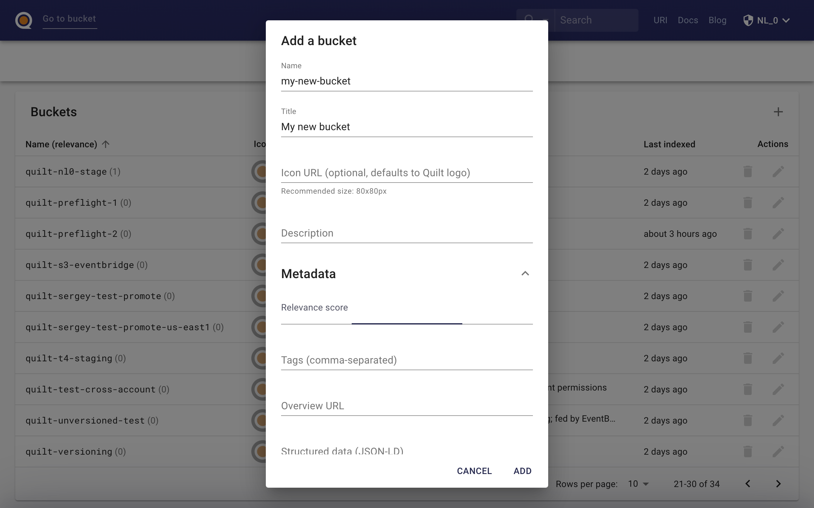

The Quilt catalog includes an admin panel that allows you to manage
users and buckets in Quilt, as well as customize the Quilt catalog. You can access
the panel via a dropdown menu under username in the navbar.

The admin page is only accessible to designated administrators. The first admin
is set during the CloudFormation installation. Subsequent admins may be designated
through the panel. Only admins may create other admins. 

Quilt requires at least one admin account per stack.

## Users and roles

This section provides comprehensive access control management for the following
functions:
* Create/Delete user
* De/activate user
* De/admin user
* Assign roles to users
* Configure access policies

You may invite new users to your Quilt stack by clicking the + button, upper right.

You must select the default role for all new users, else they will not be able
to sign in to the Quilt catalog. The default role is shown in bold.

You may create roles for different groups of users by combining up to 5 policies.
With the exception of administrators, users of managed roles can only see, list,
and search buckets for which they are explicitly granted read access.

Alternatively, you may provide your own IAM roles via ARN:

You may create policies providing access to a selected set of buckets:

You may attach policies to managed roles from policy edit and create screens:

You may also provide custom policies via ARN:

The resulting permission set is equivalent to a union of all permissions
provided by the policies attached to that role.

## Buckets

Here you can add or remove buckets from Quilt and configure bucket indexing and
display settings. 
<!--TODO explain sub sections of bucket editor !-->

### S3 events

By default, when you add a bucket to the Quilt stack one of two things will happen:

1. If there is no existing bucket notification, Quilt will attempt to add a new notification
1. If there is an existing bucket notification, Quilt will use the existing notification if and only if it supports the required events (object creation and deletion)

If either of the above conditions fails, Quilt will not add the bucket in question.

See [S3 Events, EventBridge](EventBridge.md) for more.

## Settings

This section allows you to customize your Quilt catalog, including custom links
in the navbar.

## Further settings
See [Prefences](Preferences.md) for further control over the catalog user interface.
