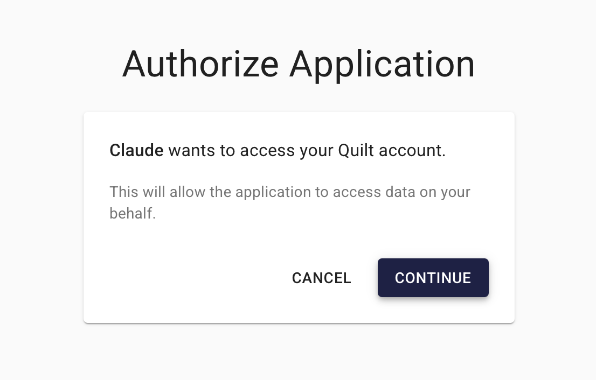

<!-- markdownlint-disable-next-line first-line-h1 -->
> Connect Server requires Quilt Platform version 1.68 or later.

**Quilt Connect Server** is an identity provider and gateway that enables
external services to securely interact with your Quilt data and perform
actions on behalf of your users. Connect Server:

- Authenticates requests using your organization's identity provider
- Issues session tokens scoped to individual user permissions
- Routes requests to authorized services within your AWS environment

One such service is the **Quilt Platform MCP Server** (below), which lets you use
web-based AI assistants — like  Claude.ai — to interact with
your Quilt data through natural language and the
[Model Context Protocol (MCP)](https://modelcontextprotocol.io/).

## Admin Setup

Connect Server is disabled by default. To enable it, set the `ConnectAllowedHosts`
CloudFormation parameter to a non-empty value.

### CloudFormation Parameters

<!-- markdownlint-disable MD013 MD060 -->
| Parameter               | Default       | Description |
| ----------------------- | ------------- | --------------------------------------------------- |
| `ConnectAllowedHosts`   | _(empty)_     | Comma-separated hostnames allowed as OAuth          |
|                         |               | `redirect_uri`. Empty = disabled. Set to AI         |
|                         |               | client domains                                      |
|                         |               | (e.g. `claude.ai, your-tenant.benchling.com`).      |
| `ConnectSecurityGroup`  | _(empty)_     | Optional EC2 security group ID for Connect ALB      |
|                         |               | IP allowlisting. Empty = allow all.                 |
| `CertificateArnConnect` | _(empty)_     | Optional ACM certificate ARN for the Connect ALB.   |
|                         |               | Empty = reuses main stack TLS certificate.          |
<!-- markdownlint-enable MD013 MD060 -->

### DNS Configuration

After deploying with Connect enabled, create a DNS alias record for your
Connect subdomain (typically `<stack-name>-connect.<your-domain>`):

| Route 53 Field  | Value                                                   |
| --------------- | ------------------------------------------------------- |
| Record type     | `A` (alias)                                             |
| Alias target    | `ConnectLoadBalancerDNSName` CloudFormation output      |
| Hosted zone ID  | `ConnectLoadBalancerCanonicalHostedZoneID` output       |

The final Connect Server hostname is available in the `ConnectHost` CloudFormation
output. Share this URL with your users.

### IP Allowlisting (Optional)

To restrict which IP ranges can reach the Connect Server, create an EC2
security group with inbound rules on port 443 for your trusted CIDR ranges,
then pass the security group ID as `ConnectSecurityGroup`. If omitted, the
Connect ALB accepts traffic from any IP.

## Platform MCP Server

The Platform MCP Server is a service that runs behind Connect Server. It allows
web-based AI assistants like Claude.ai to search packages, browse buckets, and
retrieve data on your behalf, all within your organization's AWS environment
and subject to your existing Quilt permissions — no local installation required.

### Administrator Setup

Your Quilt administrator will provide a **Connect Server URL** of the form
`https://<stack-name>-connect.<your-domain>`. Typically, your Organization's administrator
will use this URL to add Quilt as an MCP server in your AI assistant. For example:

1. Go to Claude.ai's [Organization Settings -> Connectors](https://claude.ai/admin-settings/connectors)
2. Click **Add Custom Connector**.
3. Enter your Connect Server URL: `https://<connect-host>/mcp/platform/mcp`

### User Authorization

Next, each user will need to individually authorize their connection.

1. Login to your Quilt stack as usual (e.g.,  via Okta SSO)
2. Go to, e.g., Claude.ai [Settings -> Connectors](https://claude.ai/settings/connectors)
3. Click **Connect**

The first time your AI assistant connects to Quilt, you will be redirected to the
Quilt catalog authorization page at `/connect/authorize`. This page shows:

- The name of the AI client requesting access
- What the client is allowed to do (read access, scoped to your Quilt role)

Click **Continue** to grant access, or **Cancel** to deny it. After
authorizing, the AI assistant receives a session token scoped to your Quilt
user — it cannot access data beyond what your assigned Quilt role permits.

You do not need to re-authorize the same client unless your session expires.

Once authenticated, you may also need to authorize individual tools when used.
You can pre-authorize them by clicking **Configure** on the connector page.
