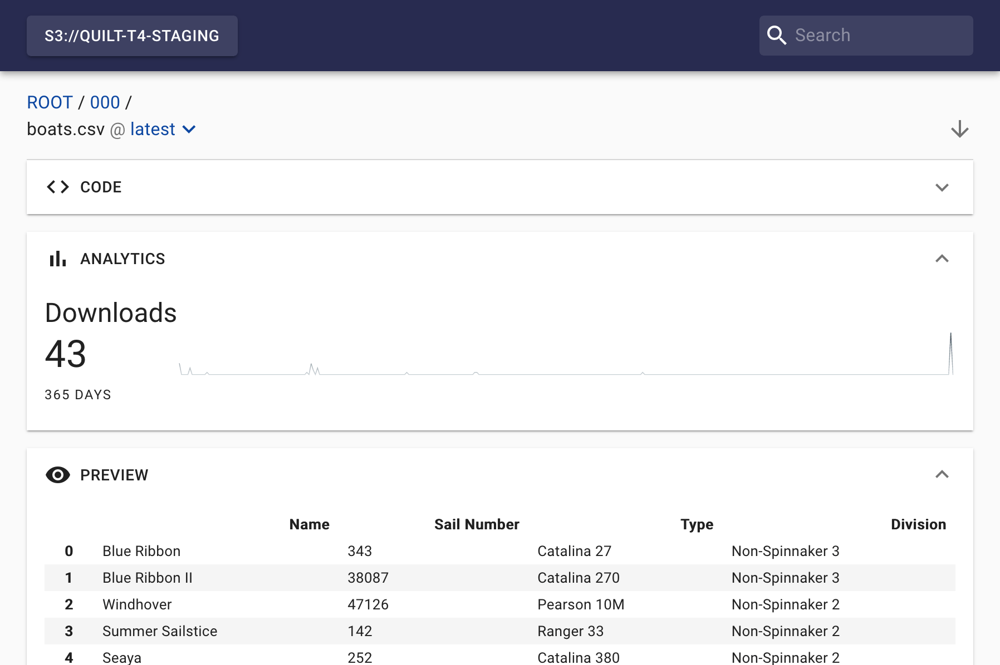
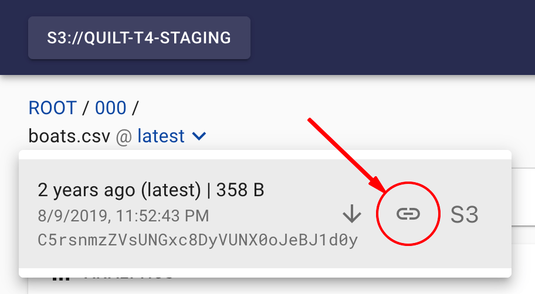
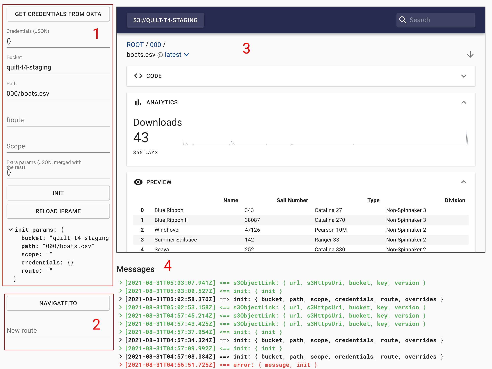

The Quilt catalog has limited-feature S3 browser called Embed, an embeddable iframe.
Embed is served off the main catalog under `/__embed` route.




## Usage

Here's a sample code snippet in plain JavaScript + React that outlines the basic use cases:

```js
import * as React from 'react'

const EMBED_ORIGIN = 'https://my-quilt-catalog'
const PARENT_ORIGIN = window.location.origin
const EVENT_SOURCE = 'quilt-embed'

const mkNonce = () => `${Math.random()}`.slice(2)

function Embed() {
  const iframeRef = React.useRef(null)

  const [nonce, setNonce] = React.useState(mkNonce)

  // nonce is used to identify "our" Embed instance and make sure we're receiving messages from the same instance
  // origin must be sent as a query parameter to enable cross-origin message passing from Embed to the parent
  const src = `${EMBED_ORIGIN}/__embed?nonce=${nonce}&origin=${encodeURIComponent(PARENT_ORIGIN)}`

  const postMessage = React.useCallback(
    // function for sending messages to the Embed (it will only handle messages sent by the window that opened it aka parent)
    (msg) => {
      if (!iframeRef.current) return
      // origin must be sent as a second parameter to enable cross-origin message passing
      iframeRef.current.contentWindow.postMessage(msg, EMBED_ORIGIN)
    },
    [iframeRef],
  )

  const initialize = React.useCallback(() => {
    // see the `init` command reference in the API section below for details
    postMessage({
      type: 'init',
      bucket: 'your-bucket-here',
      path: 'path-to-object-or-prefix',
      // deep linking can be implemented by storing Embed's route and then initializing it with this stored route
      route: location.search.route || undefined,

      // e.g. { provider, token } for SSO or { password, username } (which doesn't seem like a right choice in most cases)
      // getting credentials is your app's responsibility
      credentials: { provider: 'okta', token: 'my token' },

      theme: {
        palette: {
          primary: {
            main: '#282b50',
          },
          secondary: {
            main: '#339933',
          },
        },
        typography: {
          fontFamily: '"Comic Sans MS", "Comic Sans", cursive',
        },
      },

      overrides: {
        s3ObjectLink: {
          href: 'https://my-app/s3-browser?route=<%= encodeURIComponent(url) %>',
          // notification shown after copying href to the clipboard (if `emit` is not set to "override")
          emit: 'override',
        },
      },

      // arbitrary CSS files can be injected to further customize look and feel and/or layout
      css: [
        'https://my-cdn.com/my-custom-styles-1.css',
        'https://my-other-host.com/my-custom-styles-2.css',
      ],
    })
  }, [postMessage])

  const navigate = React.useCallback((route) => {
    // command the Embed to navigate to an arbitrary route
    postMessage({ type: 'navigate', route })
  }, [postMessage])

  const reloadIframe = React.useCallback(() => {
    // reload the iframe by generating a new nonce (and therefore changing `src` computed value)
    setNonce(mkNonce)
  }, [setNonce])

  const handleMessage = React.useCallback(
    (e) => {
      if (
        // ignore messages from other windows
        e.source !== iframeRef.current.contentWindow ||
        // ensure origin is what we expect it to be (user has not navigated away)
        e.origin !== EMBED_ORIGIN ||
        // ensure the message has expected format (.source set to 'quilt-embed')
        e.data.source !== EVENT_SOURCE ||
        // ensure this is "our" instance by comparing nonce passed to the iframe
        // via query string to the nonce passed back by the iframe
        nonce !== e.data.nonce
      ) {
        return
      }
      // handle messages from the Embed
      switch (e.data.type) {
        case 'error':
          console.error(e.data.message, e.data)
          return
        case 'ready':
          initialize()
          return
        case 'navigate':
          // store Embed state (route), e.g. update our URL to store the embed route in a query paramter or smth
          console.log('embed navigating to', e.data.route)
          return
        case 's3ObjectLink':
          // construct a custom link using e.data and copy it to clipboard or perform any other relevant action
          console.log('s3 object link clicked', e.data)
          return
      }
    },
    [iframeRef, nonce, initialize],
  )

  React.useEffect(() => {
    // subscribe to messages from Embed
    window.addEventListener('message', handleMessage)
    return () => {
      window.removeEventListener('message', handleMessage)
    }
  }, [handleMessage])

  return (
    <iframe
      ref={iframeRef}
      src={src}
      width="900"
      height="600"
      // other things like styling and stuff
    />
  )
}
```


## API reference

### URL and query parameters

The Embed is served off the main catalog server under `/__embed` route
which takes two optional query parameters:

`nonce` (any unique string) is used to identify "our" Embed instance and make sure we're receiving messages from that same instance.

`origin` must be sent to enable cross-origin message passing from Embed to the parent.


### Commands to Embed

Embed accepts commands from the parent via [`postMessage` API](https://developer.mozilla.org/en-US/docs/Web/API/Window/postMessage).
Command message data format:

```ts
interface Command {
  type: string
  // ...parameters
}
```

Available commands are listed below.

#### `init`

Initialize the Embed.
This command must be sent after the Embed is ready
(see `ready` message reference for details).
Supported SSO providers are listed in the [Technical Reference](../Technical Reference.md#single-sign-on-sso).

```ts
interface InitCommand extends Command {
  type: 'init'

  // Bucket name, e.g. 'my-bucket'
  bucket?: string
  // Path to object or prefix in the given bucket, e.g. 'some-prefix/some-object.csv'
  path?: string

  // Initial route Embed will navigate to, e.g. '/b/my-bucket/tree/some/path',
  // takes precedence over bucket / path
  route?: string

  // Embed accepts any credentials supported by the Quilt authentication endpoint,
  // e.g. { provider, token } for [SSO](../Technical Reference.md#single-sign-on-sso)
  // or { password, username } (which doesn't seem like a right choice in most cases tho).
  // Getting credentials is your app's responsibility.
  credentials: { provider: string; token: string } | { username: string; password: string }

  // Embed can be "scoped" to a prefix, meaning that prefix will be a virtual "root" for the object browser,
  // but only for display purposes (i.e. formatting paths / rendering breadcrumbs),
  // it won't prevent navigating to the paths outside the scope if navigated directly
  // via a command (navigate or init) or a link, so it's not to be considered a security measure.
  scope?: string

  // Look and feel of the Embed can be customzied by providing theme overrides,
  // see [MUI theming reference](https://material-ui.com/customization/theming/)
  // and [Quilt theme construction code](https://github.com/quiltdata/quilt/blob/master/catalog/app/constants/style.js#L145)
  // for details.
  theme?: MUI.ThemeOptions // https://github.com/mui-org/material-ui/blob/v4.12.3/packages/material-ui/src/styles/createTheme.d.ts#L15

  // Some aspects of the UI can be overriden:
  overrides?: {
    // This prop is responsible for customizing the display and behaviour
    // of the "link" button in the object revision list menu
    s3ObjectLink?: {
      // Title of the link element
      title?: string
      // Link [template](https://lodash.com/docs/4.17.15#template).
      // Template context:
      //   url: string -- url / route of the object version in the context of the Embed
      //   s3HttpsUri: string -- HTTPS URI of the object version, e.g. https://my-bucket.s3.amazonaws.com/${key}?versionId=${version} (with properly encoded key)
      //   bucket: string -- current bucket
      //   key: string -- key of the browsed object
      //   version: string -- object version id
      // Example: 'https://my-app/s3-browser?route=<%= encodeURIComponent(url) %>'
      href?: string
      // Notification shown after copying href to the clipboard (if `emit` is not set to "override")
      notification?: string
      // Set to "notify" or "override" to enable Embed sending "s3ObjectLink" messages
      // (otherwise those messages won't be sent).
      // Set to "override" to disable default action on click (copying href to clipboard).
      emit?: 'notify' | 'override' | null
    }
  }

  // List of CSS URLs to be injected (to further customize look and feel and/or layout)
  // Example:
  // [
  //   'https://my-cdn.com/my-custom-styles-1.css',
  //   'https://my-other-host.com/my-custom-styles-2.css',
  // ],
  css?: string[]
}
```

#### `navigate`

Navigate to the given route.

```ts
interface NavigateCommand extends Command {
  type: 'navigate'
  // Route to navigate to, e.g. '/b/my-bucket/tree/some/path'
  route: string
}
```

### Messages from Embed

Embed sends messages to its parent via [`postMessage` API](https://developer.mozilla.org/en-US/docs/Web/API/Window/postMessage).
Message data format:

```ts
interface Message {
  source: 'quilt-embed'
  nonce: string
  type: string
  // ...parameters
}
```

Available messages are listed below.

#### `ready`

Sent when the Embed is done loading and ready to receive commands (waiting for `init` command).

```ts
interface ReadyMessage extends Message {
  type: 'ready'
}
```

#### `error`

Sent when an error occurs.

```ts
interface ErrorMessage extends Message {
  type: 'error'
  message: string
  credentials?: object // for authentication error
  init?: object // for initialization error
  data?: object // for navigation error
}
```

#### `navigate`

Sent when the Embed navigates to a new route.
Useful for syncing Embed state with the parent app state.

```ts
interface NavigateMessage extends Message {
  type: 'navigate'
  route: string
  action: 'PUSH' | 'POP' | 'REPLACE'
}
```

#### `s3ObjectLink`

Enabled only when `overrides.s3ObjectLink.emit` parameter is set during initialization.
Sent when the link button in the object version menu is clicked.



```ts
interface S3ObjectLinkMessage extends Message {
  type: 's3ObjectLink'
  // URL aka route of the object version in the context of the Embed
  url: string
  // HTTPS URI of the object version, e.g. https://my-bucket.s3.amazonaws.com/${key}?versionId=${version} (with properly encoded key)
  s3HttpsUri: string
  // Bucket the object resides in
  bucket: string
  // Object's key
  key: string
  // Object's version ID
  version: string
}
```

## Testing and debugging

The catalog's `/__embed-debug` route is a simple driver for testing Embed:



`__embed-debug` is useful for trying different parameters and inspecting messages passed to and from the Embed.

Its main components are:

1. Inputs for `init` parameters and button for sending the `init` command.

2. "Navigate to" button and route input for sending the `navigate` command.

3. Embed window.

4. Message log.
