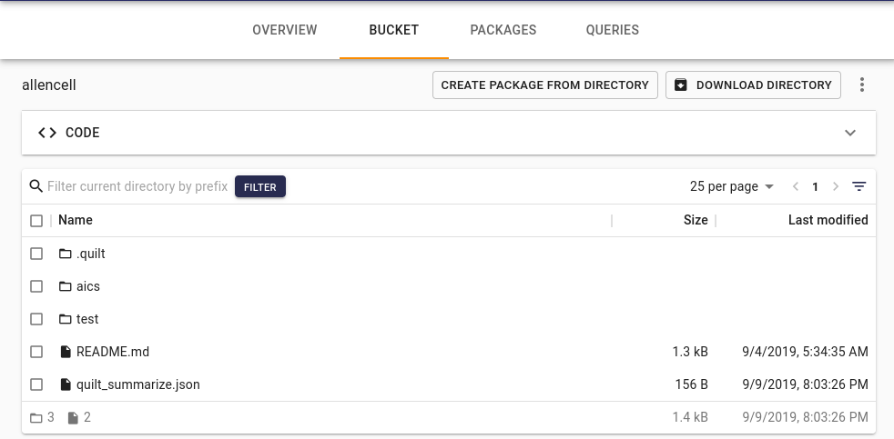
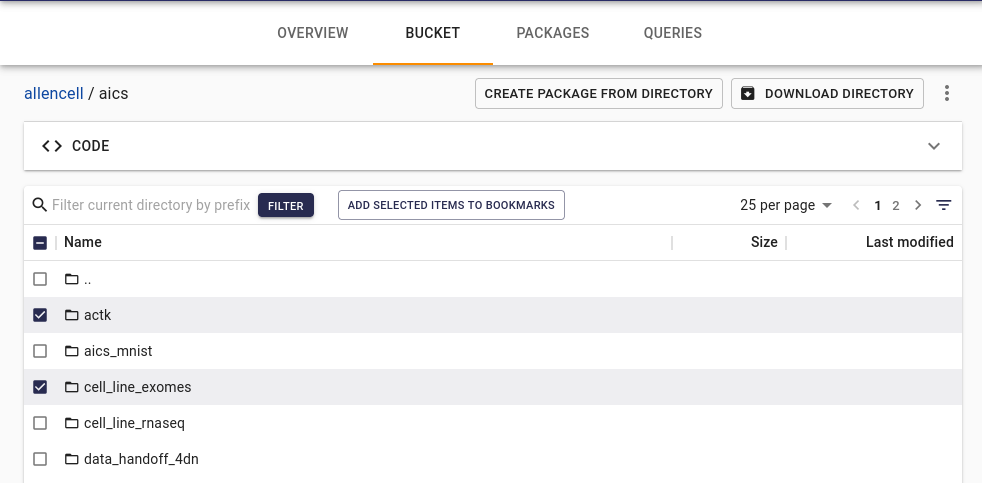
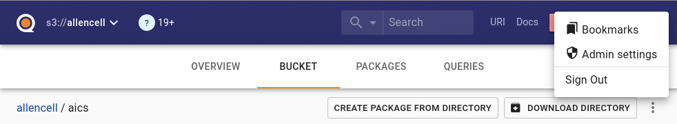
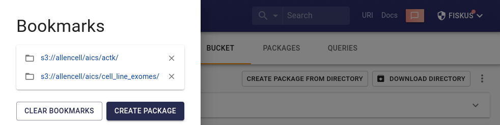
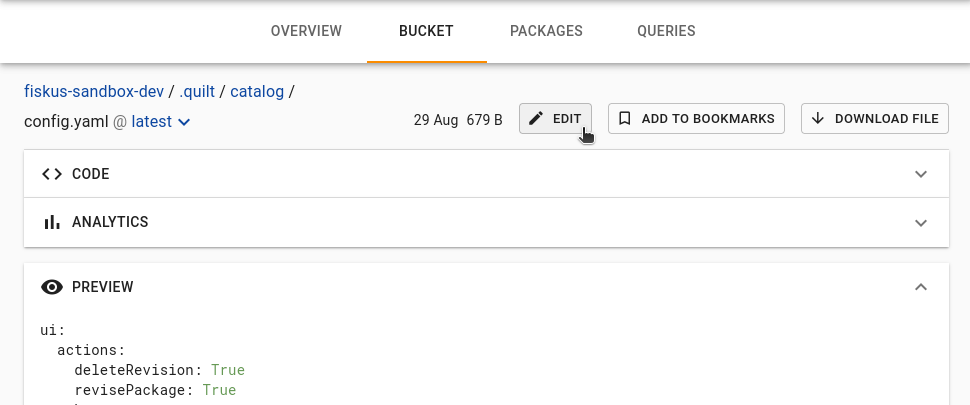
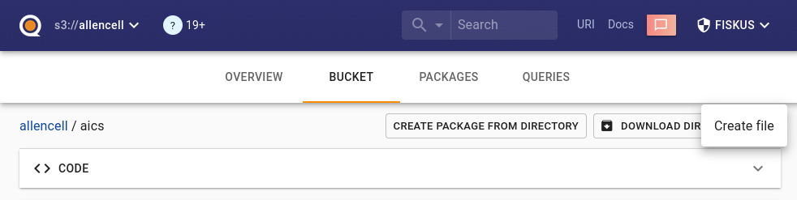
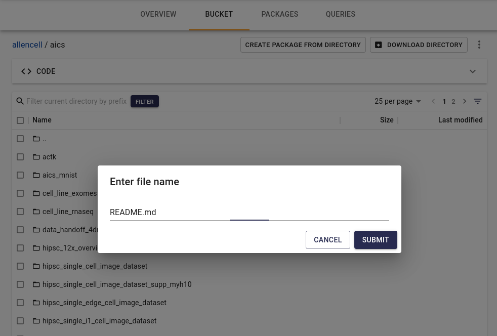
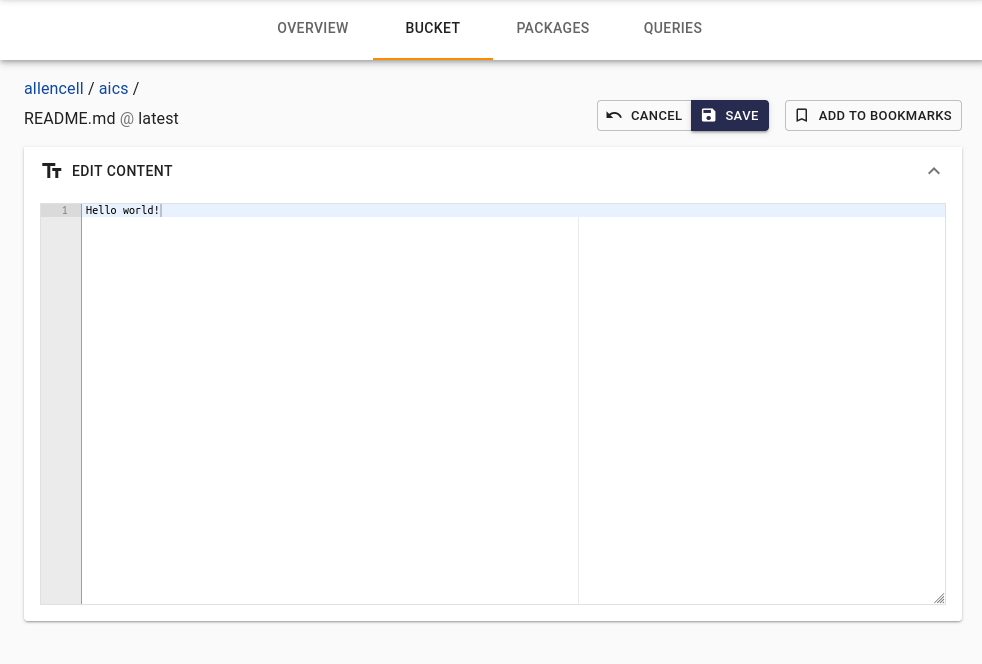

<!-- markdownlint-disable -->
Every S3 bucket attached to Quilt has a "Bucket" tab in the Catalog
that displays all files in the bucket.

> If desired, [this tab can be hidden](./Preferences.md).

## Bookmarks

To create a package that includes multiple files from different
directories in a single S3 bucket, or even across different S3
buckets attached to Quilt, you can browse and create a "bookmark"
of chosen files. Select files by checking the box and clicking "Add
selected items to bookmarks". You can also navigate to a specific
file and bookmark an individual file by clicking "Add to bookmarks".

Open the Bookmarks pane (listed in the User account menu) and
optionally create a new package from the bookmarked files.

## Text editor

Inline editing of plain text, Markdown, JSON and YAML file formats
is supported.

New text files can be created individually in editable file formats.
To create one, click the «kebab» menu (three vertical dots) located
in the far-right, above the file browser. Choose a file name and
format (the default is README.md), enter your content, and click save.

