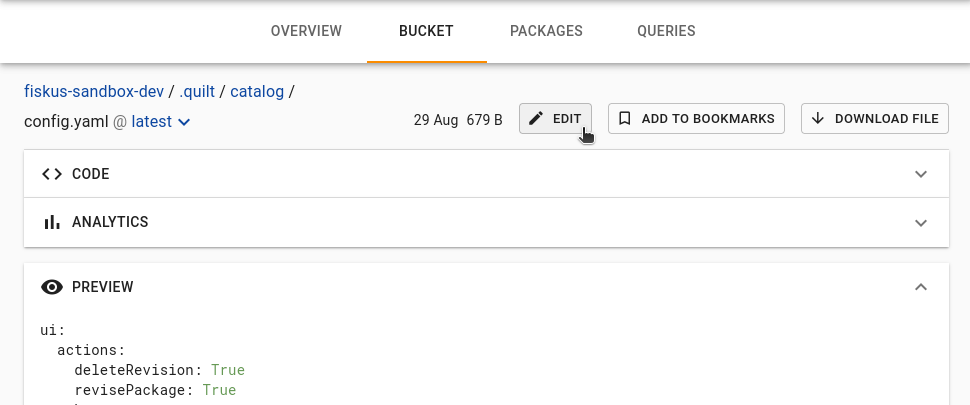
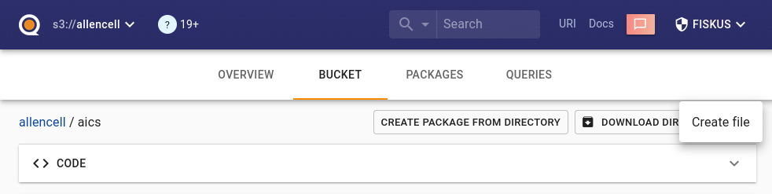
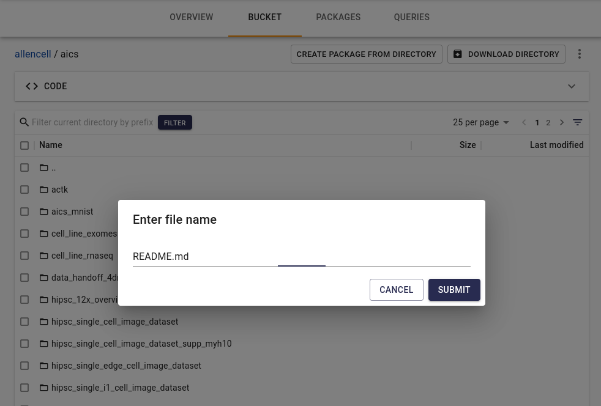
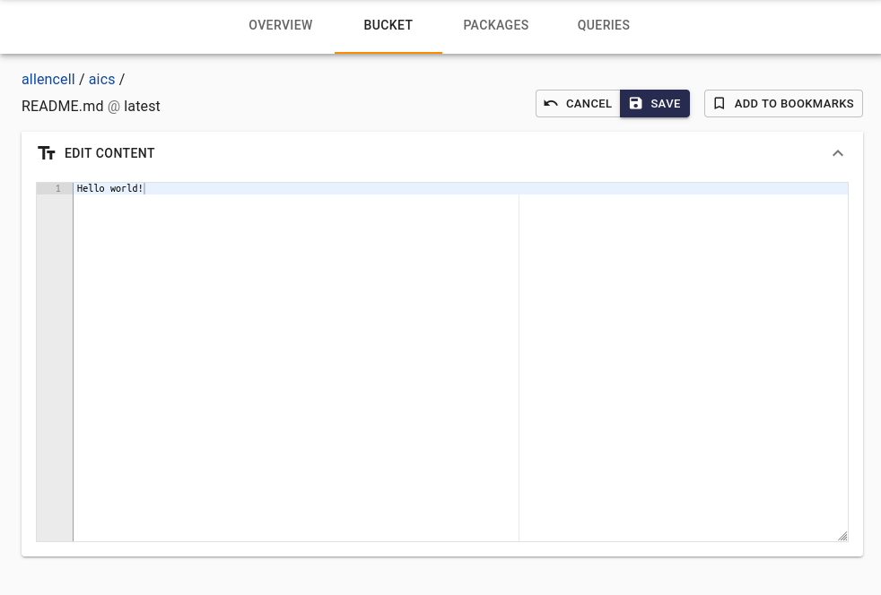

## Files manipulation in Catalog

### Files browser

Every bucket has "Bucket" tab where the user can see all files in his bucket.

See also [docs on how to hide this tab](./Preferences.md).

### Bookmarks

If you want to create a package including multiple files from different directories and even different buckets, you can browse files and bookmark needed files. You can select needed files and click "Add to bookmarks". You can also navigate to a specific file and bookmark an individual file from that file's page.

Then you can open the Bookmarks pane and a create package from all those bookmarks.

### Text editor

You can edit plain text, Markdown, JSON and YAML files.

You can also create new files in editable file formats. The button for creating text files is located above the file browser, in the far right «burger»-menu

