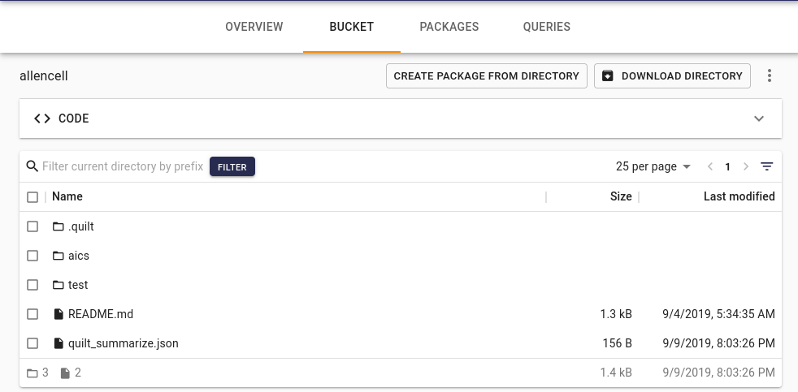
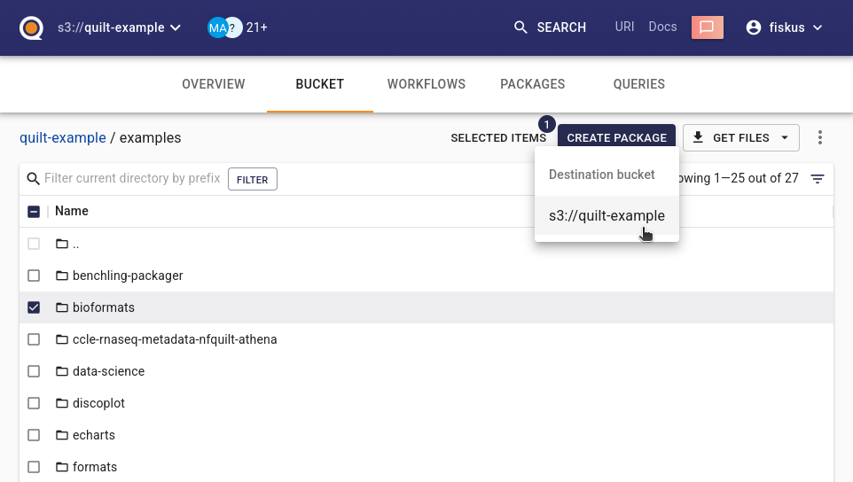
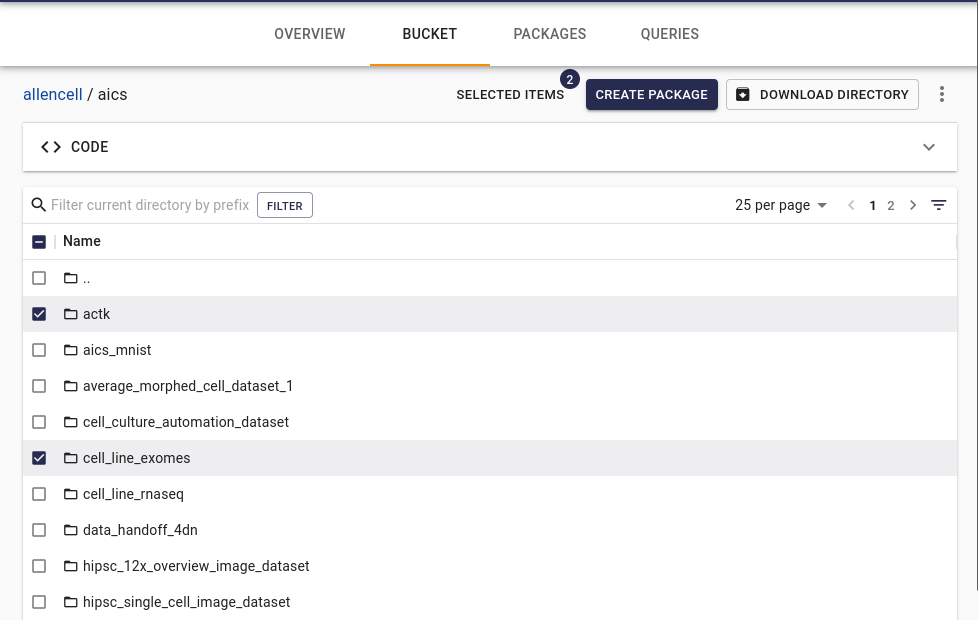
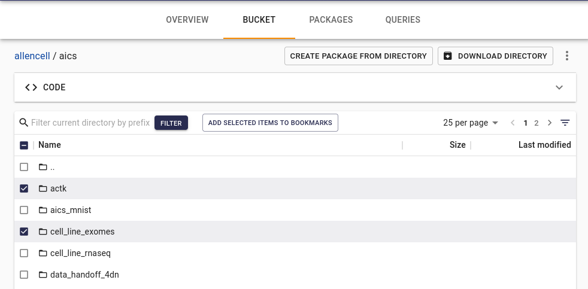
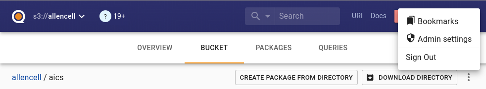
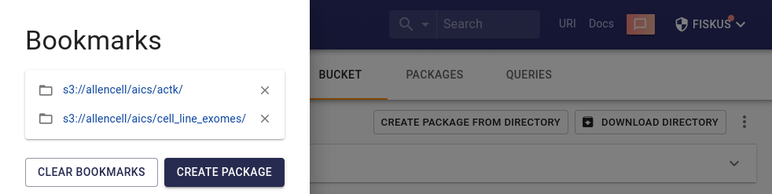
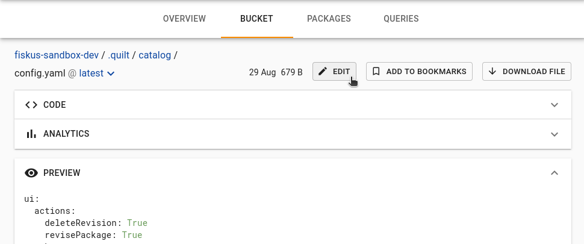
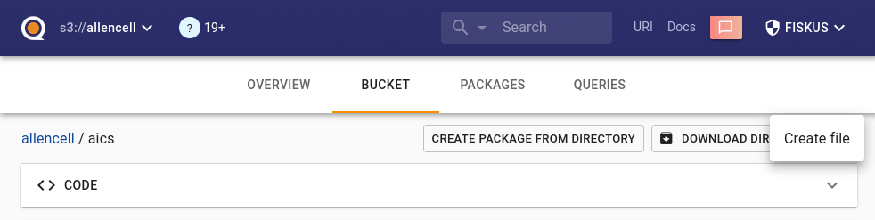
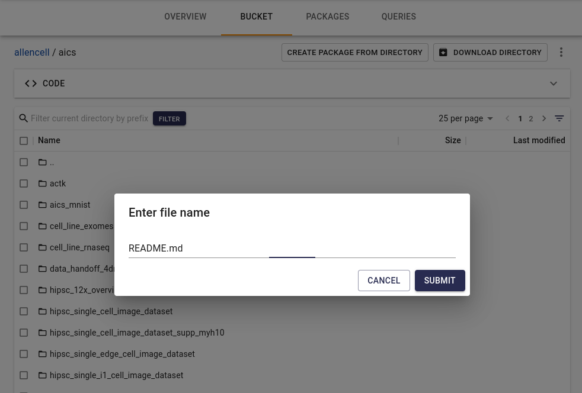
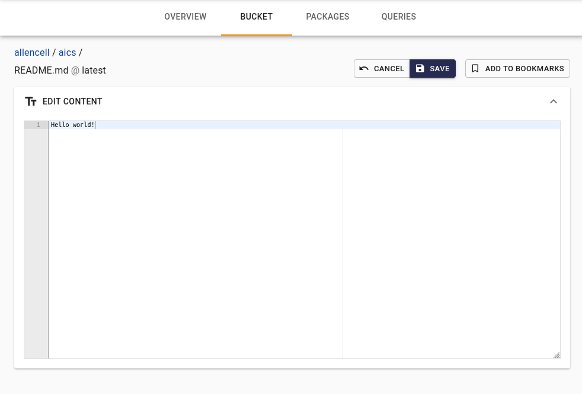

<!-- markdownlint-disable-next-line first-line-h1 -->
Every S3 bucket attached to Quilt has a "Bucket" tab in the Catalog
that displays all files in the bucket.

> If desired, [this tab can be hidden](./Preferences.md).

## Uploading and deleting files

You can upload files directly to a bucket by dragging them onto the file
listing or using the **Add Files** button (including into a new
subfolder). One or more files can also be deleted from the listing or via
the **Organize** menu without leaving the Catalog. Deletion adds a delete
marker to the latest version, so prior versions remain available from
packages.

File and directory delete buttons are hidden by default. Administrators
can enable them by setting `ui.actions.deleteObject` in the
[Catalog configuration](./Preferences.md).

## Creating packages from bucket files

You can create packages directly from files already stored in S3 buckets
without downloading and re-uploading them. Even without a workflow
configuration file, users can create packages from files in the current
bucket, either by selecting them directly or by using **Add Files from
Bucket** when revising a package. Administrators can disable this
zero-config behavior by creating a configuration file with no
`successors`.

Package creation uses the current bucket by default.
With workflow configuration,
only explicit `successors` are available as destinations. See
[workflow configuration](../advanced-features/workflows.md#cross-bucket-package-push-quilt-catalog)
for details.

## Bookmarks

To create a package that includes multiple files from different
directories in a single S3 bucket, or even across different S3
buckets attached to Quilt, you can browse and create a "bookmark"
of chosen files. Select files by checking the box and clicking "Add
to bookmarks". You can also navigate to a specific file and bookmark
an individual file by clicking "Add to bookmarks".

Open the Bookmarks pane (listed in the User account menu) and
optionally create a new package from the bookmarked files.

## Text editor

Inline editing of plain text, Markdown, JSON and YAML file formats
is supported.

New text files can be created individually in editable file formats.
To create one, click the «kebab» menu (three vertical dots) located
in the far-right, above the file browser. Choose a file name and
format (the default is README.md), enter your content, and click save.

## Copy URI button

Files and directories include a copy-URI action on the download button,
making it easy to copy an `s3://` URI for use in scripts, notebooks, and
CLI workflows.

## Working with Amazon S3 Glacier storage classes

Glacier storage classes are built for data archiving. Quilt is
compatible with S3 bucket lifecycle rules that transition S3 objects to
Glacier storage classes.

There are currently three types of S3 object archive storage class that
work differently with the Quilt Catalog, `quilt3` CLI and Python API.

1. **S3 Glacier Instant Retrieval:** Objects in this storage class are
available as normal in the Bucket and Packages tabs in the Quilt
Catalog.
1. **S3 Glacier Flexible Retrieval (formerly S3 Glacier):** Objects are
not immediately available and appear "grayed out" in the Catalog.
1. **S3 Glacier Deep Archive:** Objects are
not immediately available and appear "grayed out" in the Catalog.

Previewing a specific "glacierized" S3 object returns an "Object
Archived: Preview not available" message. To successfully preview
the S3 object, you need to restore it first.

> The AWS Glacier service is rapidly evolving and may impact the
functionality of the Quilt Catalog and/or API.
