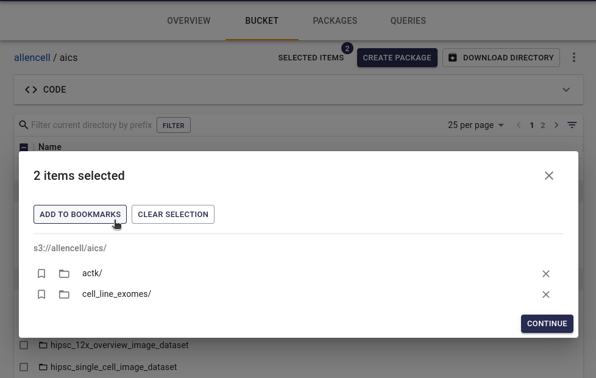

## Files manipulation in Catalog

### Files browser

Every bucket have "Bucket" tab where user can see all files in his bucket.

See also [docs on how to hide this tab](./Preferences.md).

### Bookmarks

If you need to collect multiple files from different directories and even different buckets, you can browse files and bookmark needed files. You can select needed files and click "Add to bookmarks". You can also navigate to specific file and bookmark individial file from file's page.

Then you can open Bookmarks pane and create package from all bookmarks.

### Text editor

You can edit plain text, JSON and YAML files.

You can also create new files of available to edit file formats. Button for creating text files is located above file browser in far right "burger"-menu

