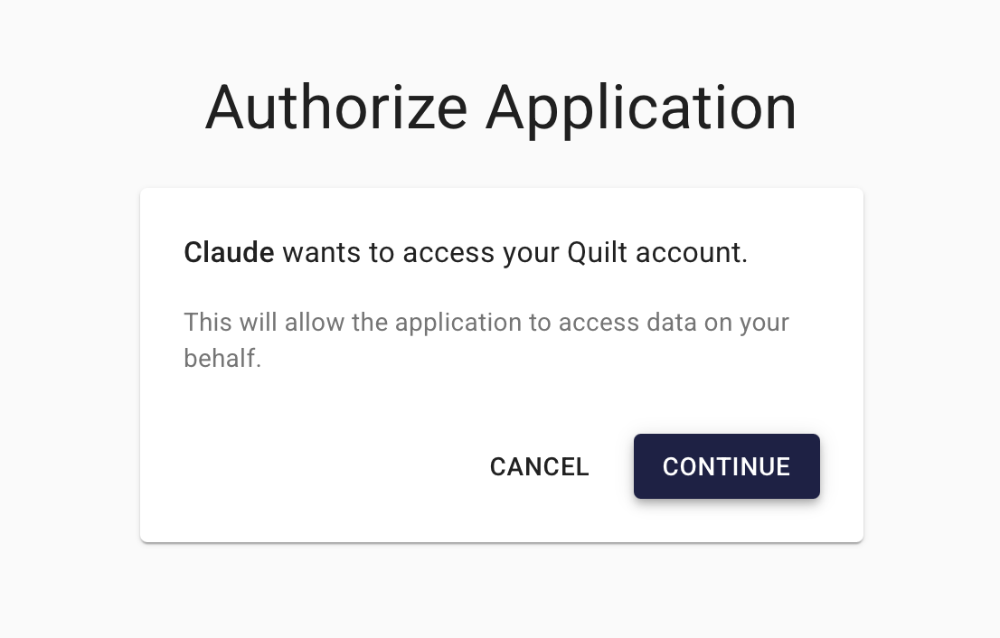
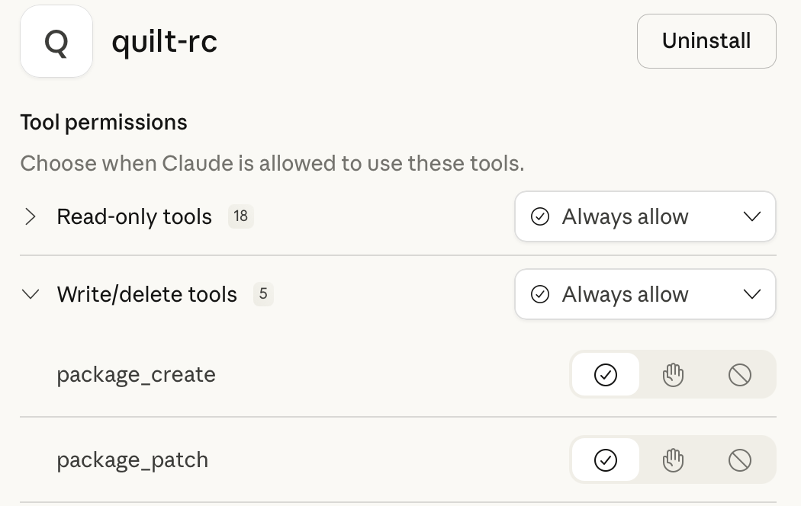

# Platform MCP Server

The **Quilt Platform MCP Server** lets AI assistants interact with your
organization's data through natural language. Built on the open
[Model Context Protocol](https://modelcontextprotocol.io/), it connects
Claude, Cursor, and other MCP-compatible clients directly to your Quilt
environment — so users can search, browse, read, create, and query data
without leaving their AI workflow.

All actions respect your existing Quilt roles and permissions. Data never
leaves your AWS environment.

## Capabilities at a Glance

<!-- markdownlint-disable line-length -->
| Category | What you can do |
| --- | --- |
| **Search** | Full-text search across packages and S3 objects with Elasticsearch query syntax |
| **Packages** | List, browse, inspect, create, and update versioned data packages |
| **S3 Objects** | List, read, inspect, download (presigned URL), and upload objects |
| **Athena** | Run SQL queries against your data lake and retrieve results |
| **Tabulator** | List, create, rename, and manage tabulator table definitions |
| **Catalog Links** | Generate shareable Quilt catalog URLs for any resource |

---

## Available Tools

### Search

#### `search_packages`

Search for packages by name, comment, metadata, or entry content using
Elasticsearch query string syntax.

| Parameter | Type | Required | Default | Description |
| --- | --- | --- | --- | --- |
| `query` | string | Yes | — | Elasticsearch query string (e.g. `"mouse RNA-seq"`, `"ptr_name:research/*"`) |
| `buckets` | string[] | No | all accessible | Restrict search to specific buckets |
| `latest_only` | boolean | No | `true` | Return only the latest revision of each package |
| `user_meta_filters` | object[] | No | — | Filter on package user metadata fields |
| `order` | string | No | `BEST_MATCH` | Sort order: `BEST_MATCH`, `NEWEST`, `OLDEST`, `LEX_ASC`, `LEX_DESC` |
| `page_size` | integer | No | `30` | Results per page |

#### `search_packages_more`

Fetch the next page of package search results.

| Parameter | Type | Required | Default | Description |
| --- | --- | --- | --- | --- |
| `cursor` | string | Yes | — | Pagination cursor from a previous search call |
| `page_size` | integer | No | `30` | Results per page |

#### `search_objects`

Search for S3 objects by key name or indexed content using Elasticsearch
query string syntax.

| Parameter | Type | Required | Default | Description |
| --- | --- | --- | --- | --- |
| `query` | string | Yes | — | Elasticsearch query string (e.g. `"ext:.csv"`, `"key:reports/2025/*"`) |
| `buckets` | string[] | No | all accessible | Restrict search to specific buckets |
| `order` | string | No | `BEST_MATCH` | Sort order: `BEST_MATCH`, `NEWEST`, `OLDEST`, `LEX_ASC`, `LEX_DESC` |
| `page_size` | integer | No | `30` | Results per page |

#### `search_objects_more`

Fetch the next page of object search results.

| Parameter | Type | Required | Default | Description |
| --- | --- | --- | --- | --- |
| `cursor` | string | Yes | — | Pagination cursor from a previous search call |
| `page_size` | integer | No | `30` | Results per page |

### Packages

#### `package_list`

List packages in a bucket. Use `filter` to narrow by name prefix.

| Parameter | Type | Required | Default | Description |
| --- | --- | --- | --- | --- |
| `bucket` | string | No | — | Bucket name |
| `uri` | string | No | — | Full `quilt+s3://` URI (alternative to `bucket`) |
| `filter` | string | No | — | Package name prefix filter |
| `page` | integer | No | `1` | Page number |
| `per_page` | integer | No | `30` | Results per page |

#### `package_browse`

Browse a package's file tree at a given directory path.

| Parameter | Type | Required | Default | Description |
| --- | --- | --- | --- | --- |
| `bucket` | string | No | — | Bucket name |
| `name` | string | No | — | Package name |
| `path` | string | No | `"/"` | Directory path to browse |
| `revision` | string | No | `"latest"` | Package revision |
| `uri` | string | No | — | Full `quilt+s3://` URI |

#### `package_revision`

Get detailed information about a specific package revision, including
metadata, message, and entry count.

| Parameter | Type | Required | Default | Description |
| --- | --- | --- | --- | --- |
| `bucket` | string | No | — | Bucket name |
| `name` | string | No | — | Package name |
| `revision` | string | No | `"latest"` | Revision hash or tag |
| `uri` | string | No | — | Full `quilt+s3://` URI |

#### `package_revisions`

List the full revision history of a package.

| Parameter | Type | Required | Default | Description |
| --- | --- | --- | --- | --- |
| `bucket` | string | No | — | Bucket name |
| `name` | string | No | — | Package name |
| `uri` | string | No | — | Full `quilt+s3://` URI |
| `page` | integer | No | `1` | Page number |
| `per_page` | integer | No | `10` | Revisions per page |

#### `package_create`

Create a new package (or push a new revision) from S3 objects and/or
inline content. Each entry maps a logical key to either a `uri` entry
(referencing an existing S3 object) or an `inline` entry (with content
provided directly).

| Parameter | Type | Required | Default | Description |
| --- | --- | --- | --- | --- |
| `entries` | object | Yes | — | Dict of logical keys to entry specs (see below) |
| `bucket` | string | No | — | Destination bucket |
| `name` | string | No | — | Package name |
| `uri` | string | No | — | Full `quilt+s3://` URI |
| `message` | string | No | — | Commit message |
| `meta` | object | No | — | User metadata |
| `workflow` | string | No | — | Workflow identifier for validation |

**Entry spec formats:**

- **URI entry:** `{"type": "uri", "uri": "s3://bucket/key"}`
- **Inline entry:** `{"type": "inline", "content": "# My README", "content_type": "text/markdown"}`

#### `package_patch`

Update an existing package by specifying only the changes — entries to
add, update, or delete — without rewriting the entire package.

| Parameter | Type | Required | Default | Description |
| --- | --- | --- | --- | --- |
| `bucket` | string | No | — | Bucket name |
| `name` | string | No | — | Package name |
| `uri` | string | No | — | Full `quilt+s3://` URI |
| `set` | object | No | — | Logical keys to add or update (same entry spec as `package_create`) |
| `delete` | string[] | No | — | Logical keys to remove |
| `message` | string | No | — | Commit message |
| `meta` | object | No | — | User metadata |
| `revision` | string | No | `"latest"` | Base revision to patch against |
| `workflow` | string | No | — | Workflow identifier for validation |

### S3 Objects

#### `s3_object_list`

List objects and common prefixes in an S3 bucket, with pagination support.

| Parameter | Type | Required | Default | Description |
| --- | --- | --- | --- | --- |
| `bucket` | string | Yes | — | Bucket name |
| `prefix` | string | No | `""` | Key prefix filter |
| `delimiter` | string | No | `"/"` | Delimiter for prefix grouping |
| `max_keys` | integer | No | `100` | Maximum keys per page |
| `continuation_token` | string | No | — | Pagination token from a previous call |

#### `object_read`

Read the contents of an S3 object or a file inside a package. Accepts
`s3://` or `quilt+s3://` URIs. Auto-detects content type (text, image,
binary) or use `type` to override.

| Parameter | Type | Required | Default | Description |
| --- | --- | --- | --- | --- |
| `uri` | string | Yes | — | `s3://bucket/key` or `quilt+s3://bucket#package=name&path=file` |
| `type` | string | No | auto-detect | Content type override |
| `max_bytes` | integer | No | `100000` | Maximum bytes to read |
| `include_data` | boolean | No | `false` | Include raw data in response |

#### `s3_object_info`

Get metadata for an S3 object (content type, size, last modified, etc.)
without downloading the body.

| Parameter | Type | Required | Default | Description |
| --- | --- | --- | --- | --- |
| `s3_uri` | string | No | — | Full `s3://` URI |
| `bucket` | string | No | — | Bucket name |
| `key` | string | No | — | Object key |
| `version_id` | string | No | — | S3 object version ID |

#### `s3_object_link`

Generate a presigned URL for downloading an S3 object. Useful for sharing
files or opening them in a browser.

| Parameter | Type | Required | Default | Description |
| --- | --- | --- | --- | --- |
| `s3_uri` | string | No | — | Full `s3://` URI |
| `bucket` | string | No | — | Bucket name |
| `key` | string | No | — | Object key |
| `version_id` | string | No | — | S3 object version ID |
| `expiration` | integer | No | `3600` | URL expiration in seconds |

#### `s3_object_put`

Upload text or base64-encoded content to an S3 object.

| Parameter | Type | Required | Default | Description |
| --- | --- | --- | --- | --- |
| `bucket` | string | Yes | — | Destination bucket |
| `key` | string | Yes | — | Object key |
| `content` | string | Yes | — | Content to upload |
| `content_encoding` | string | No | `"utf-8"` | Content encoding (`utf-8` or `base64`) |
| `content_type` | string | No | auto-detect | MIME type |

### Athena

#### `athena_query`

Run a SQL query on Amazon Athena and return results. For standard tables,
omit `catalog` (defaults to AwsDataCatalog). For tabulator tables, pass
`catalog` and `database` explicitly — see the `quilt-platform://athena`
resource for available databases and catalogs.

| Parameter | Type | Required | Default | Description |
| --- | --- | --- | --- | --- |
| `sql` | string | Yes | — | SQL query to execute |
| `database` | string | No | — | Athena database name |
| `catalog` | string | No | — | Athena catalog name |
| `max_rows` | integer | No | `100` | Maximum rows to return |

#### `athena_query_results`

Retrieve results from a previously submitted Athena query using its
execution ID. Useful for long-running queries where the initial call
returns before results are ready.

| Parameter | Type | Required | Default | Description |
| --- | --- | --- | --- | --- |
| `execution_id` | string | Yes | — | Athena query execution ID |
| `max_rows` | integer | No | `100` | Maximum rows to return |

### Tabulator

#### `tabulator_table_list`

List all tabulator table definitions for a bucket.

| Parameter | Type | Required | Default | Description |
| --- | --- | --- | --- | --- |
| `bucket` | string | Yes | — | Bucket name |

#### `tabulator_table_set`

Create, update, or delete a tabulator table definition. Pass `config: null`
to delete. The config is a YAML string with `schema` (column definitions),
`source` (package name and logical key patterns), and `parser` (format,
header, delimiter) sections.

| Parameter | Type | Required | Default | Description |
| --- | --- | --- | --- | --- |
| `bucket` | string | Yes | — | Bucket name |
| `table` | string | Yes | — | Table name |
| `config` | string \| null | No | — | YAML table configuration (null to delete) |

#### `tabulator_table_rename`

Rename an existing tabulator table.

| Parameter | Type | Required | Default | Description |
| --- | --- | --- | --- | --- |
| `bucket` | string | Yes | — | Bucket name |
| `table` | string | Yes | — | Current table name |
| `new_name` | string | Yes | — | New table name |

### Utilities

#### `catalog_link`

Generate a Quilt catalog web URL from a `quilt+s3://` or `s3://` URI, or
from individual parameters. Returns a link users can open in a browser to
view the resource in the Quilt catalog.

| Parameter | Type | Required | Default | Description |
| --- | --- | --- | --- | --- |
| `uri` | string | No | — | Full `quilt+s3://` or `s3://` URI |
| `bucket` | string | No | — | Bucket name |
| `package_name` | string | No | — | Package name |
| `revision` | string | No | — | Revision |
| `path` | string | No | — | Path within package |

#### `get_resource`

Read a platform resource by URI. Intended for MCP clients that do not
support native MCP resource reads.

| Parameter | Type | Required | Default | Description |
| --- | --- | --- | --- | --- |
| `uri` | string | Yes | — | Resource URI (e.g. `quilt-platform://search_syntax`) |

---

## Resources

The Platform MCP Server also exposes the following read-only resources
that provide context to AI assistants:

| Resource | URI | Description |
| --- | --- | --- |
| **Search Syntax** | `quilt-platform://search_syntax` | Elasticsearch query string syntax reference for search tools |
| **Athena** | `quilt-platform://athena` | Athena query configuration and available databases and catalogs |
| **Buckets** | `quilt-platform://buckets` | List of accessible buckets with names, titles, and descriptions |
| **Current User** | `quilt-platform://me` | Identity and role of the currently authenticated user |
<!-- markdownlint-enable line-length -->

---

## Getting Started

### Supported Clients

The Platform MCP Server works with any MCP-compatible AI client, including:

- **Claude.ai** (web)
- **Cursor** (desktop)
- **Any client** supporting the [Model Context Protocol](https://modelcontextprotocol.io/)

### Connecting Claude.ai

An Organization administrator adds Quilt as a connector:

1. Go to [Organization Settings -> Connectors](https://claude.ai/admin-settings/connectors)
2. Click **Add Custom Connector**
3. Enter your Connect Server URL: `https://<connect-host>/mcp/platform/mcp`

### Connecting Cursor and other desktop clients

Add the following to your MCP client configuration
(in Cursor: **Settings -> MCP -> Add new global MCP server**):

```json
{
  "mcpServers": {
    "quilt": {
      "url": "https://<connect-host>/mcp/platform/mcp"
    }
  }
}
```

> Your administrator must include the client's custom scheme (e.g. `cursor://`)
> in `ConnectAllowedHosts` for the OAuth flow to complete.

### User Authorization

Each user must authorize their MCP connection once:

**Web clients (e.g. Claude.ai):**

1. Log in to your Quilt stack as usual (e.g. via Okta SSO)
2. Go to [Settings -> Connectors](https://claude.ai/settings/connectors)
3. Click **Connect**

**Desktop clients (e.g. Cursor):** the OAuth flow starts automatically the
first time the client connects to the MCP server.

In both cases, you will see the Quilt authorization page at
`/connect/authorize`, showing the name of the AI client and what it is
requesting access to. Click **Continue** to grant access or **Cancel** to
deny it.

After authorizing, the AI assistant receives a session token scoped to your
Quilt user — it cannot access data beyond what your assigned Quilt role
permits. You do not need to re-authorize the same client unless your session
expires or the Quilt stack is redeployed.

Once authenticated, you may also need to authorize individual tools when
used. You can pre-authorize them by clicking **Configure** on the connector
page.





---

## Administrator Reference

The Platform MCP Server runs behind
[Quilt Connect Server](Connect.md), which handles OAuth authentication,
session tokens, and request routing within your AWS environment. See the
[Quilt Connect](Connect.md) page for CloudFormation parameters, DNS
configuration, and IP allowlisting.
