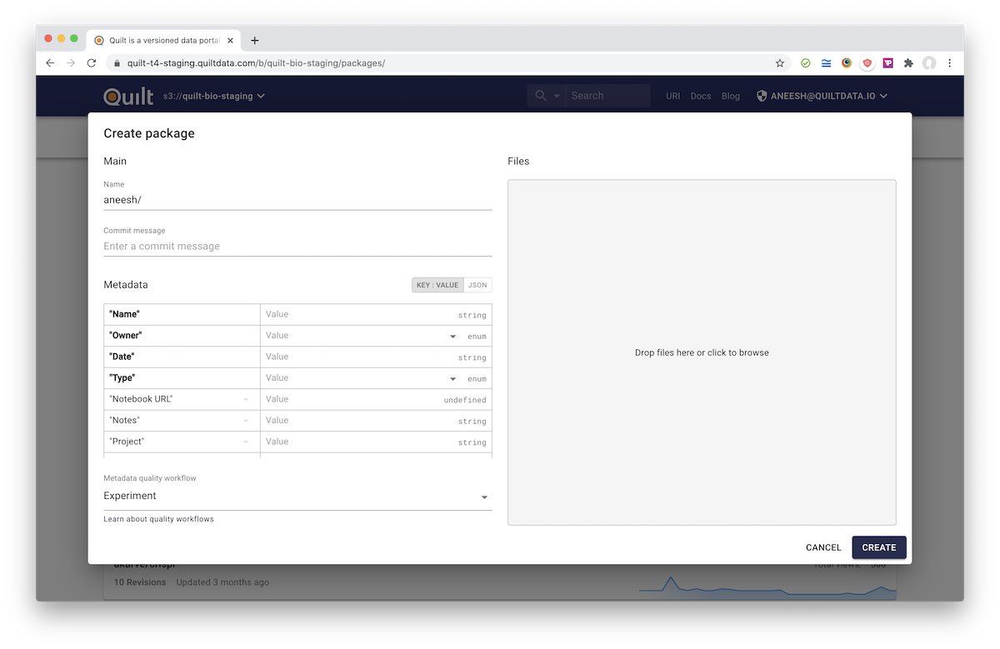

## Why metadata matters

Data without labels and documentation quickly become meaningless. In Quilt,
metadata are represented as dictionaries that can refer to specific objects
or entire packages.

Metadata solves the following problems:
* *Collaboration* — Metadata are the clues that enable developers, non-developers,
and code to create a shared understanding and vocabulary

* *Discoverability* — Quilt package-level metadata are searchable via ElasticSearch;
package-level and object-level metadata are queryable via AWS Athena

* *Trust* — Quilt metadata are screened against JSON schemas that you define to
ensure that annotations are complete and type-safe. (See
[Workflows](../advanced-features/workflows.md))

* *Understandability* - Metadata are a love letter to the future; with metadata
in hand, users can better understand what data mean, where they came from,
and how they might be used in the future

* *Longitudinal analysis* — Need to cut across packages and isolate data sets
based on varying dimensions? Metadata makes this possible.

### Metadata in Quilt

Quilt packages contain one of two types of metadata:
* *Object-level metadata* for each object or entry in the package
* *Package-level metadata* for each revision of the package

### The Goldilocks problem

If you require your users to input too much metadata, they'll avoid your system.
Too little metadata and it's hard to understand or trust your collection. Our
rule of thumbs are:

> Minimize human-entered metadata to less than a dozen fields

> Maximize machine-entered data to capture any facts or dimensions that might be useful in
> the future: date, author, etc. (by default, Quilt automatically captures metadata
> like file size and SHA-256 hash)

## Entering metadata

When you create or revise a package in Quilt, you can edit the package-level
metadata.



Metadata can be entered by hand, or you can drag and drop one of the following
file types on the Metadata section:
* CSV
* XLS
* XLSX
* XLSM
* ODS
* FODS

The keys of your dataset may be represented as either column headers, or as the
values of a single column. Quilt picks the orientation that best overlaps with
the workflow schema, be that orientation row-major or column-major.

### Spreadsheet example

Suppose your spreadsheet looks like this:

| Metal     | Color     | Price     |
|----------|----------|----------|
| gold | yellow | 1700 |
| silver | gray | 25 |
| rhodium | gray | 25000 |

When you drag and drop the spreadsheet, Quilt converts it:

```json
{
  "Metal": ["gold", "silver", "rhodium"],
  "Color": ["yellow", "gray", "gray"],
  "Price": [1700, 25, 25000]
}
```

> Note: empty cells have a value of `null`

### Supported types

Metadata may contain strings, numbers, objects, booleans, and dates.
Dates are converted to the YYYY-MM-DD format.

If your workflow Schema has `{ type: "array" }` for a cell,
Quilt converts this string to an array by splitting the cell on comma.
If your input file contains JSON fragments, such as `"{"a": 1, "b", 2}"`,
Quilt will convert those strings to objects.

## Limitations

Quilt recommends, and the APIs will soon enforce, that users limit each instance of
package-level and object-level metadata to 1MB or less so that your package
works well with S3 Select (1MiB row limit) and AWS Athena (32MB row limit), which
are by the Quilt backend.
