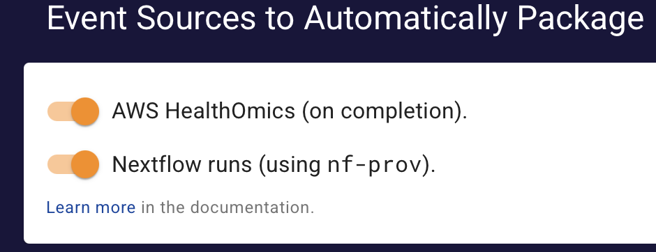

# Auto-Packaging

## Overview

Auto-Packaging in the Quilt Platform allows administrators and
developers to automate the process of creating Quilt packages from data stored
in Amazon S3. It serves as a key component in Quilt's SDMS (Scientific Data
Management System) strategy, enabling automated data ingestion and
standardization. It consists of:

1. Admin Settings GUI to enable package creation for:
   1. AWS Health Omics
   2. Nextflow workflows using  `nf-prov`'s WRROC (Workflow Run RO-Crate) format
2. An SQS queue that will process package descriptions
3. Documentation for creating custom EventBridge rules to invoke that queue

## Admin Settings

The simplest way to enable package creation is through the Admin Settings GUI,
which supports the following built-in event sources:



### AWS Health Omics

When enabled, this will create a package from the URI provided in any
`aws.omics` event with `detail.status` of "COMPLETED".  For example, if the
`runOutputUri` is `s3://quilt-example/omics-quilt/3395667`, the package will be
created in that same bucket with the name `omics-quilt/3395667`.

### Workflow Run RO-Crate

When enabled, this will create a package from any folder containing an
`ro-crate-manifest.json`. [RO-Crate](https://www.researchobject.org/ro-crate/)
is a metadata standard for describing research data.  The Workflow Run working
group adds three additional profiles, which are supported the latest versions of
[nf-prov](https://github.com/nextflow-io/nf-prov). You need to explicitly
configure it to use wrroc, using a `nextflow.config` file [like this](https://github.com/famosab/wrrocmetatest):

```groovy
plugins {
 id 'nf-prov@1.4.0'
}

prov {
 enabled = true
 formats {
   wrroc {
     file = "${params.outdir}/ro-crate-metadata.json"
     overwrite = true
     agent {
       name = "John Doe"
       orcid = "https://orcid.org/0000-0000-0000-0000"
     }
      license = "https://spdx.org/licenses/MIT"
      profile = "provenance_run_crate"
   }
 }
}
```

Note that Research Objects identify people using an ORCID iD, which anyone can
get for free at [the ORDiD website](https://orcid.org/).

The package will be created in the same bucket as the `outdir`, using the
last two path components as the package name. If there are fewer than two
components, it will use a default prefix or suffix.

## SQS Message Processing

The primary interface to the Auto-Packaging is through the
SQS queue in the same account and region as your Quilt stack,
listed in `PackagerQueue` under the Outputs. The queue URL will look something like:

```url
https://sqs.us-east-1.amazonaws.com/XXXXXXXXXXXX/PackagerQueue-XXXXXXXXXXXX
```

The body of the message is the stringified JSON of a package description.
There is only one required parameter:

```json
{
  "source_prefix": "s3://data_bucket/source/folder/metadata.json"
}
```

This will create a package in the same bucket as the source folder, with the
package name being the last two components of the source URI (e.g., `source/folder`).
By default, it will assume the last component is a metadata file, and
try to parse that as json.
If you are specifying a folder, you should instead end the URI with a `/`.

Optionally, you can control the package name, metadata, and other settings by
explicitly specifying any of the following fields:

```jsonc
{
  "source_prefix": "s3://data_bucket/source/folder/",
  "registry": "package_bucket",  // may be the same as `data_bucket`
  "package_name": "prefix/suffix",
  "metadata": { "key": "value" },  // dictionary
  "metadata_uri": "metadata.json", // alternative to `metadata`, relative or absolute
  "message": "Commit message for the package revision", // string
  "workflow": "alpha", // name of a valid metadata workflow
  "should_copy": false // boolean
  // false = point to data in the source bucket (default)
  // true = copy data to the package bucket
}
```

## Custom EventBridge Rules

You can write your own Rules that use Input Transformers to convert any
EventBridge event in your account(from any bus, in any region) into a
conforming SQS message.

### Example: Event-Driven Packaging (EDP)

EDP is a high-end add-on to Quilt that coalesces multiple S3 uploads into a
single `package-objects-ready` event, where it infers the appropriate top-level
folder.  EDP writes to its own EventBridge bus, so you need to
[Pipe](https://docs.aws.amazon.com/eventbridge/latest/userguide/eb-pipes.html)
it to the default bus to trigger the Auto-Packaging.

When ready, it creates an event like this:

```json
{
  "version":"0",
  "id":"XXXXXXXXXXXXXXXXXXXXXXXXXXXXXXXX",
  "detail-type":"package-objects-ready",
  "source":"com.quiltdata.edp",
  "account":"XXXXXXXXXXXX",
  "time":"2022-12-08T20:01:34Z",
  "region":"us-east-1",
  "resources":[
    "arn:aws:s3:::bucket-name"
  ],
  "detail":{
    "version":"0.1",
    "bucket":"bucket-name",
    "prefix":"prefix-path-1/prefix-path-2/"
  }
}
```

Here is an example of an EventBridge rule that will use the above event
to trigger packager queue:

```json
{
  "EventPattern": {
    "source": ["com.quiltdata.edp"],
    "detail-type": ["package-objects-ready"]
  },
  "State": "ENABLED",
  "Targets": [
    {
      "Id": "SQS_PackagerQueue",
      "Arn": "arn:aws:sqs:us-east-1:XXXXXXXXXXXX:PackagerQueue-XXXXXXXXXXXX",
      "InputTransformer": {
        "InputPathsMap": {
          "bucket": "$.detail.bucket",
          "prefix": "$.detail.prefix"
        },
        "InputTemplate": "{ \"source_prefix\":\"s3://<bucket>/<prefix>/\" }"
      }
    }
  ]
}
```

## Caveats

1. The package creation process is asynchronous, so you may need to wait a few
   minutes before the package is available (longer if the source data is large).
2. The SQS queue currently only accepts requests from EventBridge events via
   custom rules.  Contact us at `support@quiltdata.io` if you have a use case
   for which that is too restrictive.
3. If you send the same message multiple times, it will not actually create a
   new revision, since the content hash is the same.  However, it will waste
   computational cycles, so you should avoid it.
