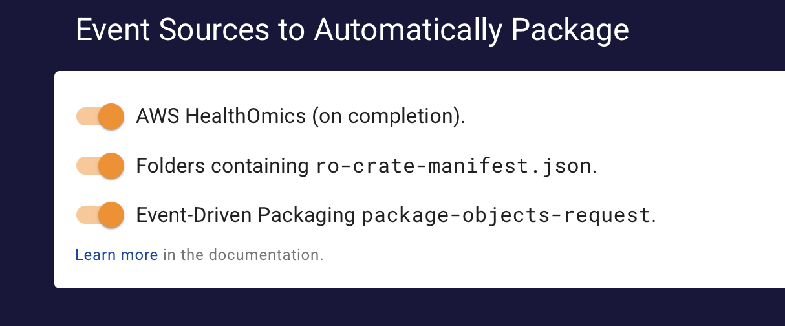

# Packaging Engine

> This feature requires Quilt Platform version 1.58.0 or higher

## Overview

The Quilt Packaging Engine in the Quilt Platform allows administrators and
developers to automate the process of creating Quilt packages from data stored
in Amazon S3. It serves as a key component of Quilt's functionality as a
Scientific Data Management System, enabling automated data ingestion and
standardization. It currently consists of:

1. Admin Settings GUI to enable package creation based on notifications from:
   1. AWS Health Omics
   2. Nextflow workflows using  the WRROC ([Workflow Run
      RO-Crate](https://www.researchobject.org/workflow-run-crate/)) format from
      [nf-prov](https://github.com/nextflow-io/nf-prov).
2. SQS queue that will process package descriptions
3. Documentation for creating custom EventBridge rules to invoke that queue

## Admin Settings

The simplest way to enable package creation is through the Admin Settings GUI,
which supports the following built-in event sources:



### AWS Health Omics

When enabled, this will create a package from the `runOutputUri` provided in a
`aws.omics` completion event. For example, if the `runOutputUri` is
`s3://quilt-example/omics-quilt/3395667`, the package will be created in that
same bucket with the name `omics-quilt/3395667`.

### Workflow Run RO-Crate

When enabled, this will create a package from the enclosing folder when an
`ro-crate-metadata.json` file is written to a bucket that is already part of the
stack.

[RO-Crate](https://www.researchobject.org/ro-crate/) is a metadata standard for
describing research data.  The Workflow Run working group adds three additional
profiles, which are supported in the latest versions of
[nf-prov](https://github.com/nextflow-io/nf-prov). You will need to explicitly
configure `nf-prov` to use `wrroc`, by using a `nextflow.config` file [like
this](https://github.com/famosab/wrrocmetatest):

```groovy
plugins {
 id 'nf-prov@1.4.0'
}

prov {
 enabled = true
 formats {
   wrroc {
     file = "${params.outdir}/ro-crate-metadata.json"
     overwrite = true
     agent {
       name = "John Doe"
       orcid = "https://orcid.org/0000-0000-0000-0000"
     }
      license = "https://spdx.org/licenses/MIT"
      profile = "provenance_run_crate"
   }
 }
}
```

Note that Research Objects identify people using an ORCID iD, which anyone can
get for free at [the ORCID website](https://orcid.org/).

The package will be created in the same bucket as the `outdir`, with the package
name inferred from the S3 key. For example, if the key is
`my/s3/folder/ro-crate-metadata.json`, the package name will be `my_s3/folder`.

## Architecture

The Quilt Packaging Engine is built on top of the existing packaging lambdas
used by the Quilt Platform, including the ability to parallelize creation of S3
Checksums for existing objects. We have exposed this functionality to customers
via an SQS queue, which is invoked by the EventBridge rules created by the Admin
Settings GUI.

### SQS Parameters

You can also send messages directly to the SQS queue, which is part of the Quilt
stack. The queue information will be listed as `PackagerQueueArn` and
`PackagerQueueUrl` under the `Outputs` tab in CloudFormation section of the AWS
Console. The URL will be something like:

```text
https://sqs.REGION.amazonaws.com/ACCOUNT_ID/stack-name-PackagerQueue-XXX
```

Where REGION and ACCOUNT_ID will be the same as for the Quilt stack.

The body of the message is the stringified JSON of a package description.
There is only one required parameter:

```json
{
  "source_prefix": "s3://data_bucket/source/folder/metadata.json"
}
```

This is assumed to be a folder if it ends in a `/`; otherwise, we will remove
the last component of the path to get the folder. The contents of the folder
will be used to create a package in the same bucket as the source folder, with
the package name being inferred from the source URI.

Optionally, you can control the package name, metadata, and other settings by
explicitly specifying any of the following fields:

```jsonc
{
  "source_prefix": "s3://data_bucket/source/folder/", // trailing '/' for folder
  "registry": "package_bucket", // may be the same as `data_bucket`
  "package_name": "prefix/suffix",
  "metadata": { "key": "value" }, // object (or metadata URI, but not both)
  "metadata_uri": "metadata.json", // S3 URI to read, relative or absolute
  "commit_message": "Commit message for the package revision", // string
  "workflow": "alpha", // name of a valid metadata workflow
}
```

The job will fail if you try to specify both `metadata` and `metadata_uri`.

### SendMessage API

If you have appropriate IAM permissions, and the SQS URL, you can send a message
to the queue using the AWS SDK or the AWS CLI. Here is an example using the AWS
CLI:

<!--pytest.mark.skip-->
```bash
export QUEUE_URL=https://sqs.us-east-1.amazonaws.com/XXX/PackagerQueue-XXX
aws sqs send-message --queue-url $QUEUE_URL \
--message-body '{"source_prefix":"s3://data_bucket/source/folder/"}'
```

### Custom EventBridge Rules

EventBridge rules can be used to transform EventBridge events from any bus in
your account into a conforming SQS message.

#### Example: Event-Driven Packaging (EDP)

[Event-Driven Packaging](../advanced-features/event-driven-packaging.md),
currently in private preview, coalesces multiple S3 uploads into a single
`package-objects-ready` event, which infers the appropriate top-level folder.
When ready, it creates an event like this on its own EventBridge bus:

```json
{
  "version":"0",
  "id":"XXXXXXXXXXXXXX",
  "detail-type":"package-objects-ready",
  "source":"com.quiltdata.edp",
  "account":"XXX",
  "time":"2022-12-08T20:01:34Z",
  "region":"us-east-1",
  "resources":[
    "arn:aws:s3:::bucket-name"
  ],
  "detail":{
    "version":"0.1",
    "bucket":"bucket-name",
    "prefix":"prefix-path-1/prefix-path-2/"
  }
}
```

The following Python code creates an EventBridge rule that targets the packager
queue when matching that event:

<!--pytest.mark.skip-->
```python
import boto3
import json

# AWS Region and Account Details
region = "us-east-1"
account_id = "XXXXXXXXXXXX"
sqs_queue_name = "PackagerQueue-XXXXXXXXXXXX"
sqs_arn = f"arn:aws:sqs:{region}:{account_id}:{sqs_queue_name}"

# Initialize AWS Clients
eventbridge = boto3.client("events", region_name=region)

# Step 1: Create EventBridge Rule

event_pattern = {
    "source": ["com.quiltdata.edp"],
    "detail-type": ["package-objects-ready"]
}

response = eventbridge.put_rule(
    Name="RouteEDPEventsToSQS",
    EventPattern=json.dumps(event_pattern),
    State="ENABLED",
    Description="Routes package-objects-ready events to SQS",
)

print(f"EventBridge Rule Created: {response['RuleArn']}")

# Step 2: Attach the SQS Target with Input Transformation

targets = [
    {
        "Id": "SQS_PackagerQueue",
        "Arn": sqs_arn,
        "InputTransformer": {
            "InputPathsMap": {
                "bucket": "$.detail.bucket",
                "prefix": "$.detail.prefix"
            },
            "InputTemplate": """{
                \"source_prefix\": \"s3://<bucket>/<prefix>metadata.json\"
            }"""
        }
    }
]

response = eventbridge.put_targets(
    Rule="RouteEDPEventsToSQS",
    Targets=targets
)

print("SQS Target Attached to EventBridge Rule:", response)
```

## Caveats

1. The package creation process is asynchronous, so you may need to wait a few
   minutes before the package is available (longer if the source data is large).
2. If you send the same message multiple times before the folder is updated, it
   will not actually create a new revision, since the content hash will be the
   same. However, that would still waste computational cycles, so you should
   avoid doing so.

## Scalability Limits

> This feature requires Quilt Platform version 1.59.0 or higher

Newer versions leverage increased concurrency to support
significantly larger packages within AWS’s 15-minute timeout limit.

To help you take full advantage of these improvements, the system no longer
enforces limits on number of files and their total size when calling the
Packaging Engine directly. The updated engine accepts arbitrarily large
requests, though some may still fail due to timeouts.

If a packaging operation fails, please review the logs for the packaging Lambda
function in CloudWatch (log group name follows the pattern
`/quilt/<stack-name>/PackagerLambda`) to determine whether a timeout occurred.
