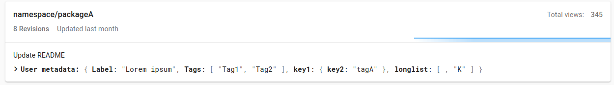

# Configuration

## Show and hide features in the Quilt catalog

You can use the configuration file to show or hide certain
tabs and buttons in the Quilt catalog. This gives you fine-grained control
over how users interact with the Quilt catalog. There is one catalog config file
per-bucket. The config file's path is `s3://BUCKET/.quilt/catalog/config.yaml`.

If there is no config.yaml, or your config.yaml file does not override the `ui`
key, then the following defaults are used:

```yaml
ui:
  nav:
    files: True
    packages: True
    queries: True
  actions:
    copyPackage: True
    createPackage: True
    deleteRevision: False
    revisePackage: True
  blocks:
    analytics: True
    browser: True
    code: True
    meta: True
  package_description:
    .*:
      message: True
```

### Properties

* `ui.nav.files: False` - hide Files tab
* `ui.nav.packages: False` - hide Packages tab
* `ui.nav.queries: False` - hide Queries tab
* `ui.actions.copyPackage: False` - hide buttons to push packages across buckets
* `ui.actions.createPackage: False` - hide buttons to create packages via
drag-and-drop or from folders in S3
* `ui.actions.deleteRevision: True` - show buttons to delete package revision
* `ui.actions.revisePackage: False` - hide the button to revise packages
* `ui.blocks.analytics: False` - hide Analytics block on file page
* `ui.blocks.browser: False` - hide files browser on both Bucket and Packages tab
* `ui.blocks.code: False` - hide Code block with quilt3 code boilerplate
* `ui.blocks.meta: False` - hide Metadata block on Package page
* `ui.sourceBuckets` - a dictionary of S3 bucket names that map to an empty object reserved for future enhancements;
buckets in this dictionary are the ones offered when the user clicks
Revise Package > Add files from Bucket; if the dictionary is not set or is empty the feature "Add files from Bucket" is disabled
* `ui.defaultSourceBucket` - source bucket from `ui.sourceBuckets` that is selected by default; if it doesn't match any bucket then it's ignored
* `ui.package_description` - a dictionary that maps package handle regular expressions or literals to JSONPath expressions of fields to show from package metadata in the package list view.
Strings display as paragraphs. Elements of a list display as tags.
* `ui.athena.defaultWorkgroup` - default workgroup to select on the Athena page

#### `ui.sourceBuckets` example

```yaml
ui:
  sourceBuckets:
    s3://bucket-a: {}
    s3://bucket-b: {}
    s3://bucket-c: {}
  defaultSourceBucket: s3://bucket-b
```

#### `ui.package_description` example
  

```yaml
ui:
  packages:
    # match all packages
    .*:
      # show the message
      message: True
      # show the .labels field
      user_meta:
        - $.labels
    # for any package with a handle prefix of foo
    foo/*:
      # JSONPath expressions to the fields to display
      user_meta:
        - $.key1.key2
        - $.key3
        - $.key4[0]
```



#### `ui.athena` example

```yaml
ui:
  athena:
    defaultWorkgroup: primary
```
