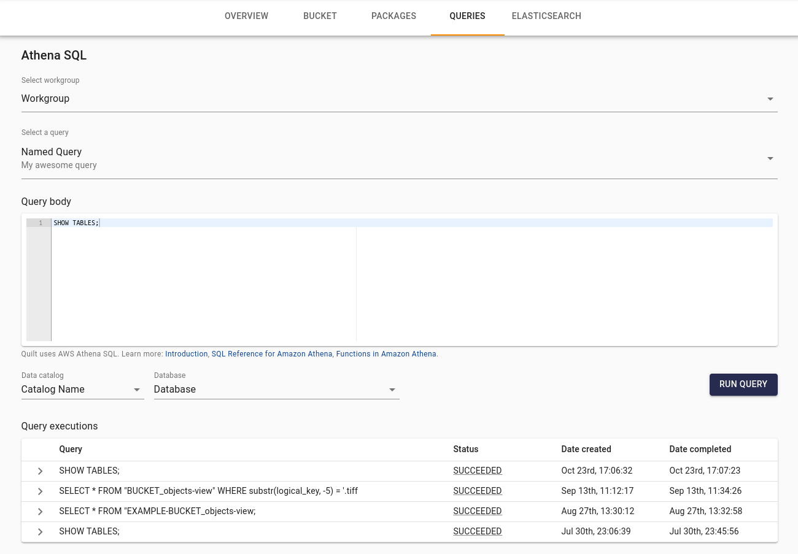

<!-- markdownlint-disable-next-line first-line-h1 -->
[Amazon Athena](https://aws.amazon.com/athena/) is an interactive query service
that makes it easy to analyze data in Amazon S3 using standard SQL. Athena is
serverless, so there is no infrastructure to manage, and you pay only for the
queries that you run.

The Catalog's Queries page — **Queries** in the left sidebar, at `/queries` —
allows you to run Athena queries against your S3 buckets, and any other data
sources your users have access to. There are prebuilt tables for packages and
objects, and you can create your own tables and views. See, for example,
[Tabulator](../advanced-features/tabulator.md).

The page is workspace-global rather than per-bucket: there is no longer a
Queries tab on a bucket. Old `/b/<BUCKET>/queries` links redirect here,
carrying the bucket along as a `?bucket=` scope parameter, which is what
surfaces that bucket's Tabulator tables as one-click chips.

Queries is Athena-only by default. The legacy [ElasticSearch query
console](Search.md#elasticsearch-query-console-legacy) is no longer enabled by
default; an administrator can keep it available by turning on the
**ElasticSearch query console** toggle under **Admin > Settings > Preview
features**, which adds an **ElasticSearch** tab alongside Athena.

NOTE: This page describes how to use Athena for precise querying of specific
tables and fields. For full-text searching using Elasticsearch, see the
[Search](Search.md) page.

## Basics

"Run query" executes the selected query and waits for the result. Individual
users also see their past queries under "Query executions", and can easily
re-run them.



## Example: query package-level metadata

Suppose we wish to find all packages produced by algorithm version 1.3 with a
cell index of 5. As of Quilt Platform version 1.70, package-level metadata
lives in the per-bucket [Iceberg `package_manifest`
table](../advanced-features/iceberg-tables.md), which replaced the old
`*_packages-view` Athena view:

```sql
SELECT * FROM "YOUR-BUCKET_package_manifest"
-- extract and query package-level metadata
WHERE json_extract_scalar(metadata,
  '$.user_meta.nucmembsegmentationalgorithmversion') LIKE '1.3%'
AND json_array_contains(json_extract(metadata, '$.user_meta.cellindex'), '5');
```

## Example: query object-level metadata

Suppose we wish to find all .tiff files produced by algorithm version 1.3
with a cell index of 5. Object-level (file entry) metadata is now in the
per-bucket [Iceberg `package_entry`
table](../advanced-features/iceberg-tables.md), which replaced the old
`*_objects-view` Athena view:

```sql
SELECT * FROM "YOUR-BUCKET_package_entry"
WHERE substr(logical_key, -5) = '.tiff'
-- extract and query object-level metadata
AND json_extract_scalar(metadata,
  '$.user_meta.nucmembsegmentationalgorithmversion') LIKE '1.3%'
AND json_array_contains(json_extract(metadata, '$.user_meta.cellindex'), '5');
```

## Configuration

Athena queries saved from the AWS Console for a given workgroup will be
available in the Quilt Catalog for all users to run.

The Queries page is workspace-global and always reachable from the left
sidebar; there is no per-bucket toggle that hides it. Setting `ui > nav >
queries: false` for a bucket ([learn more](./Preferences.md)) hides that
bucket's own entry points into this page — the tables stat in the bucket header
and the Tabulator tables section on the bucket's Overview tab — but not the
page itself.
