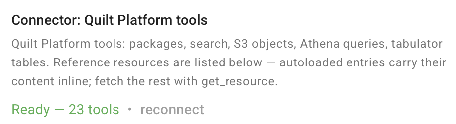
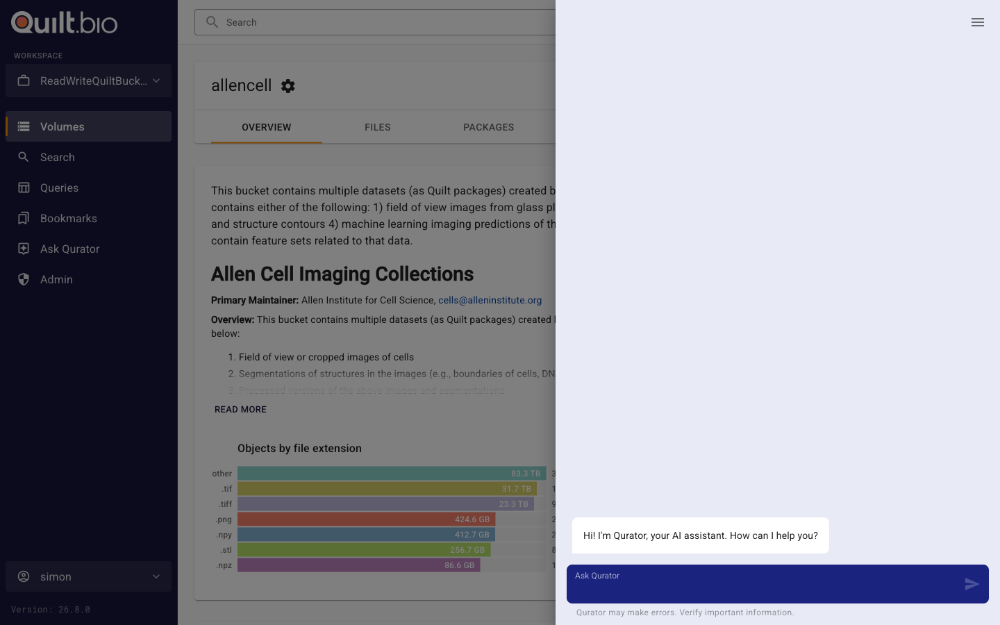

<!-- markdownlint-disable-next-line first-line-h1 -->
`Qurator Omni` is an always-available AI assistant embedded directly into the
Quilt web catalog. It allows users to interact with S3 buckets and search
functionality through natural language. Qurator Omni leverages advanced models
like Claude, integrated via Amazon Bedrock, enabling users to query, retrieve,
and summarize data instead of having to click through the GUI.

Qurator Omni is designed to streamline interaction with Quilt data by offering a
conversational interface. Instead of navigating through various tabs and menus,
or learning complicated search syntax, users can opt into the Qurator feature to
ask complex questions in plain language and receive structured, actionable
responses.

For example, users can ask for summaries of research on topics like "melanoma"
or request key insights from a specific dataset.

### Key Features

- **Natural Language Queries**: Ask complex questions like “What are the latest
  asthma treatments?” or “Summarize research on BRCA1 mutations.”
- **Instant Summaries**: Quickly digest scientific papers, datasets, or reports
  without reading everything.
- **Platform Tools via MCP**: Search packages and S3 objects, browse and create
  packages, read objects, run Athena SQL, and manage Tabulator tables — all
  through the same [Quilt Platform MCP Server](MCP-Server.md) used by external
  MCP clients. Available in-catalog without enabling Quilt Connect; tools
  execute under the user's catalog session and respect existing role and
  bucket permissions.
- **Fine-Grained Permissions with RAG**: Ensure Retrieval-Augmented Generation
  only queries the data you're authorized to access, ensuring compliance with
  strict organizational policies
- **Secure Cloud Environment**: Work within your private AWS cloud, ensuring
  data stays secure while using state-of-the-art AI models.

### Developer Tools

The Developer Tools menu (upper right of the Qurator chat window) provides:

- **Swappable Models**: Override the default Bedrock model by pasting a
  Bedrock Model ID or Inference Profile ID. The override is kept in your
  browser until you clear it, across sessions and reloads. The model must be
  enabled in the same region as your Quilt stack and support text, document,
  and image inputs. On a stack where an admin has approved a set of models
  (below), this field is replaced by a **Model** choice in the Qurator menu.
- **Session Recordings**: Record a portion of a Qurator session and download
  (or clear) the resulting JSON log. Useful for tuning or debugging prompts
  and capturing structured results.

### Approving Actions

Qurator runs tools that only read (search, browse, preview) on its
own. Before it runs a tool that changes data, such as creating or updating a
package, writing an S3 object, or changing a Tabulator table, it shows what it
wants to do and waits:

- **Run** — the tool runs under your own permissions.
- **Don't run** — nothing is written; Qurator is told you declined.

Tools their server marks destructive carry a warning. Approval is
asked for each call, and only you can give it: content Qurator reads cannot.

Athena queries run without asking because they can only read: the Platform
MCP Server refuses statements that create, change or delete tables or data.

### Connector Status

Qurator's chat input shows the live connection status of each tool backend
(e.g. the Platform MCP Server). When a backend is unhealthy the input is
gated and inline actions appear in the helper-text region:

- `connecting…` / `reconnecting…` — auto-progressing, no action required.
- `couldn't connect` — click **reconnect** to retry, or **continue without**
  to proceed with reduced tool access for the rest of the conversation. The
  latter dismisses the error and moves the connector to `unavailable`.
- `unavailable` — sticky; click **reconnect** to try again at any time.

## Getting Started

To enable Qurator Omni:

1. **Opt-In to Qurator**:  
   - Install Release 1.55 or later of the Quilt Platform CloudFormation template.
   - Set the `Qurator` parameter to `Enabled` in the CloudFormation template to
     enable the Qurator chatbot.

2. **Configure Claude Model**:
   - Log in to the Amazon Bedrock console.
   - Ensure that the Claude Sonnet 4.5
     (`us.anthropic.claude-sonnet-4-5-20250929-v1:0`) inference profile is
     available in the same region as your Quilt deployment. Check [Model support
     by AWS
     Region](https://docs.aws.amazon.com/bedrock/latest/userguide/models-regions.html)
     for details.
   - Enable the model by configuring it within your Bedrock environment.
   - Optionally, set the `QuratorDefaultModel` stack parameter to a different
     Bedrock model ID to override the built-in default.
   - Optionally, under **Admin > Settings > Qurator models**, tick the
     models in your account's Bedrock that users may choose from, add any
     other full model IDs one per line, and pick the default. Qurator then
     offers only those models, and the registry refuses to relay any other.
     Allow none to allow any model. A stack that sends Qurator through an AI
     gateway shows no checklist, since a gateway cannot list its models;
     enter the IDs your organization has approved.
   - Carefully monitor the model's cost implications. The Claude model is
     charged based on usage, so ensure that you have the necessary budget
     allocated. Initial estimates are roughly a penny per page for complex documents.

3. **Start Using Qurator**:  
   - Once activated, the Qurator chatbot will appear in the Quilt web catalog
     interface.
   - Click **Ask Qurator** in the left-hand navigation to open the chat
     interface. 
   - You can begin by typing questions into the chat interface. For example,
     queries like _“What are the key findings on small molecule delivery?”_ will
     prompt Qurator to search for relevant data and present a summarized
     overview.

### Example Use Cases

- **Search**: _“What are the latest papers on melanoma?”_  
  Qurator will search through the Quilt catalog using Elasticsearch and
  retrieve the most relevant data.
  
- **Summarize**: _“Summarize the key points of this BRCA1 research.”_  
  After selecting a specific document, Qurator will generate a clear, useful
  summary of the paper.

- **Quick Scan**: _“List some of the authors doing breast cancer research?”_  
  Qurator Omni will list authors and their contributions based on Quilt’s
  indexed datasets.

### Key Benefits

- **Enhanced Productivity**: Eliminate the need for manual search navigation,
  enabling faster access to critical information.
- **Improved Insights**: Gain deeper insights from large datasets with automatic
  summaries.
- **Streamlined Collaboration**: Leveraging AI chat to provide background and
  context when working across disciplines.

## Qurator mode (preview)

Qurator mode makes the chat the main page instead of a side panel. An admin
turns it on under **Admin > Settings > Preview features > Qurator mode**; a
**Qurator mode** row then appears in the left-hand navigation. It continues
the same conversation as the side panel.

Beside the chat, a pane lists the packages, files and buckets the session's
tools have touched, and **Save session as package** writes the conversation,
as you, to a bucket you choose. The package holds:

- `README.md`: the first prompt, counts of prompts and tool calls, and what was
  touched in the target bucket
- `transcript.md`: the conversation, readable
- `session.json`: every event, replayable
- package metadata under `qurator`: model, session id, counts and references

Images and documents are left out. Tool inputs that look like credentials are
redacted. When the session read other buckets, the form names them and warns
that readers of the target bucket will see what you save; the README and
metadata count them without naming them, and tool results are left out unless
you tick **Include tool results**. The transcript and `session.json` keep every
message and tool input as they were. Saving again from the same page adds a
revision; a name that belongs to another package is refused.
