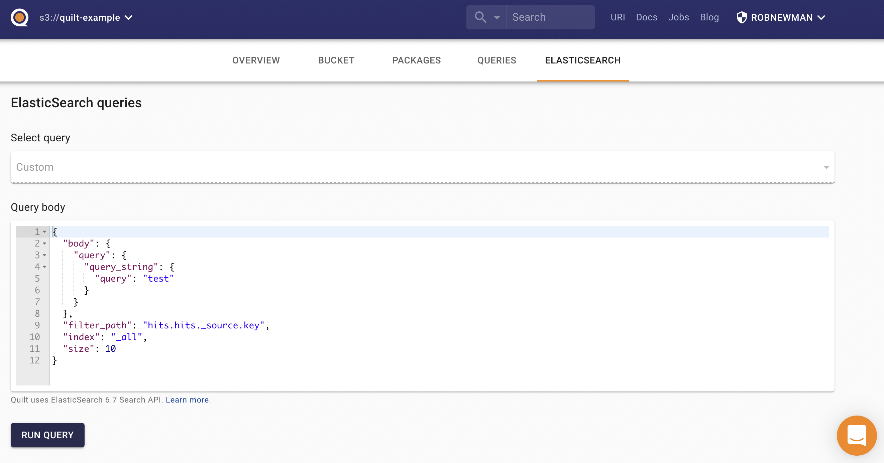

<!-- markdownlint-disable MD013 -->
<!-- markdownlint-disable-next-line first-line-h1 -->
Each Quilt stack includes an Elasticsearch cluster that indexes objects and
packages as documents. The objects in Amazon S3 buckets connected to Quilt are
synchronized to an Elasticsearch cluster, which provides Quilt's search and
package listing features.

NOTE: This page is about full-text searching using Elasticsearch. For precise querying of specific fields, see the [Queries](Query.md) page.

## Indexing

Quilt maintains a near-realtime index of the objects in your S3
bucket in Elasticsearch.  Each bucket corresponds to one or more
Elasticsearch indexes. As objects are mutated in S3, Quilt uses an
event-driven system (via SNS and SQS) to update Elasticsearch.

There are two types of indexing in Quilt:

* *shallow* indexing includes object metadata (such as the file name and size)
* *deep* indexing includes object contents. Quilt supports deep
indexing for the following file extensions:
  * .csv, .html, .json, .md, .rmd, .rst, .tab, .txt, .tsv (plain-text formats)
  * .fcs (FlowJo)
  * .ipynb (Jupyter notebooks)
  * .parquet
  * .pdf
  * .pptx
  * .xls, .xlsx

### Search page

The search page in the catalog, accessible from the search button in the top menu bar, provides a convenient
way for searching objects and packages in an Amazon S3
bucket.

NOTE: Quilt uses Elasticsearch 6.8 [query string
syntax](https://www.elastic.co/guide/en/elasticsearch/reference/6.8/query-dsl-query-string-query.html#query-string-syntax).

The following are all valid search parameters:

#### Object-specific Fields

| Name | Type | Description | Example |
| - | - | - | - |
| `content` | `text` | Object content | `content:Hello` |
| `ext` | `keyword` | Object extension | `ext:*.fastq.gz` |
| `key` | `keyword` | Object key | `key:phase*` |
| `key_text` | `text` | Analyzed object key | `key:"phase"` |
| `last_modified` | `date` | Last modified date | `last_modified:[2022-02-04 TO 2022-02-20]` |
| `size` | `long` | Object size in bytes | `size:>=4096` |
| `version_id` | `keyword` | Object version id | `version_id:t.LVVCx*` |

#### Package-specific Fields

All the package metadata is indexed in ES as three different types of documents:

* Manifests (`mnfst`) contain package metadata, including the hash, comment, and
  workflow information.
* Pointers (`ptr`) represent named package revisions, and associate Manifests
  with names and tags.
* Entries (`entry`) represent individual objects in the package with their metadata.

Top-level hits displayed by the search page are always Pointers, merged with the
corresponding Manifest and matching Entries.
A Pointer is considered a hit if it matches the search query, or if any of its
associated documents, i.e. Manifest or Entries (either metadata or contents),
match the search query.

| Name | Type | Description | Example |
| - | - | - | - |
| `ptr_name` | `keyword` | Package name | `ptr_name:examples\/metadata` |
| `ptr_name.text` | `text` | Analyzed version of the above | `ptr_name.text:examples` |
| `ptr_tag` | `keyword` | Package revision tag in S3; either "latest" or a timestamp (e.g. "1741661321") | `ptr_tag:latest` |
| `ptr_last_modified` | `date` | Package revision last modified date | `ptr_last_modified:[2022-02-04 TO 2022-02-20]` |
| `mnfst_hash` | `keyword` | Package manifest hash | `mnfst_hash:3192ac1*` |
| `mnfst_stats.total_bytes` | `long` | Package total bytes | `mnfst_stats.total_bytes:>1000000` |
| `mnfst_stats.total_files` | `long` | Package total files | `mnfst_stats.total_files:<100` |
| `mnfst_metadata` | `text` | Package metadata | `mnfst_metadata:dapi` |
| `mnfst_message` | `text` | Commit message / comment | `mnfst_message:TODO` |
| `mnfst_workflow.id` | `keyword` | Package workflow ID | `mnfst_workflow.id:verify-metadata` |
| `entry_lk` | `keyword` | Entry logical key | `entry_lk:examples\/metadata\/example.csv` |
| `entry_lk.text` | `text` | Analyzed version of the above | `entry_lk.text:example` |
| `entry_pk` | `keyword` | Entry physical key | `entry_pk:*example.csv` |
| `entry_pk.text` | `text` | Analyzed version of the above | `entry_pk.text:example` |
| `entry_pk_parsed.s3.bucket` | `keyword` | S3 bucket of the entry | `entry_pk_parsed.s3.bucket:my-bucket` |
| `entry_pk_parsed.s3.key` | `keyword` | S3 key of the entry | `entry_pk_parsed.s3.key:example.csv` |
| `entry_pk_parsed.s3.key.text` | `text` | Analyzed version of the above | `entry_pk_parsed.s3.key.text:example` |
| `entry_pk_parsed.s3.version_id` | `keyword` | S3 version ID of the entry | `entry_pk_parsed.s3.version_id:abc123*` |
| `entry_size` | `long` | Entry size in bytes | `entry_size:>1000000` |
| `entry_hash.type` | `keyword` | Entry hash type | `entry_hash.type:sha2-256-chunked` |
| `entry_hash.value` | `keyword` | Entry hash value | `entry_hash.value:T12mNNNsyfzayKFQQEXI6Ichf8AtuMbhw5c0oPg7fTo=` |
| `entry_metadata` | `text` | Entry metadata | `entry_metadata:example` |

#### Logical operators and grouping

| Syntax | Description | Example |
| - | - | - |
| `AND` | Conjunction | `a AND b` |
| `OR` | Disjunction | `a OR b` |
| `NOT` | Negation | `NOT a` |
| `_exists_` | Matches any non-null value for the given field | `_exists_: content` |
| `()` | Group terms | `(a AND b) NOT c` |

#### Wildcard and regular expressions

| Syntax | Description | Example |
| - | - | - |
| `*` | Zero or more characters, avoid leading `*` (slows performance) | `ext:config.y*ml` |
| `?` | Exactly one character | `ext:React.?sx` |
| `//` | Regular expression (slows performance) | `content:/lmnb[12]/` |

### ELASTICSEARCH tab

When you click into a specific bucket, you can access the Elasticsearch tab to
run more complex queries. The Elasticsearch tab provides a more powerful search
interface than the search bar, allowing you to specify the Elasticsearch index
and query parameters.

Quilt Elasticsearch queries support the following keys:

* `index` — comma-separated list of indexes to search ([learn
more](https://www.elastic.co/guide/en/elasticsearch/reference/6.8/multi-index.html))
* `filter_path` — to reducing response nesting, ([learn
more](https://www.elastic.co/guide/en/elasticsearch/reference/6.8/common-options.html#common-options-response-filtering))
* `_source` — boolean that adds or removes the `_source` field, or
a list of fields to return ([learn
more](https://www.elastic.co/guide/en/elasticsearch/reference/6.8/search-request-source-filtering.html))
* `size` — limits the number of hits ([learn
more](https://www.elastic.co/guide/en/elasticsearch/reference/6.8/search-uri-request.html))
* `from` — starting offset for pagination ([learn
more](https://www.elastic.co/guide/en/elasticsearch/reference/6.8/search-uri-request.html))
* `body` — the search query body as a JSON dictionary ([learn
more](https://www.elastic.co/guide/en/elasticsearch/reference/6.8/search-request-body.html))

### Secure Search

Secure Search adds object-level permission enforcement to search results. When enabled, it filters Elasticsearch hits by verifying the user's actual S3 permissions using HEAD requests. This ensures that users only see results they are authorized to access, providing stronger restrictions beyond just bucket-level indices.
