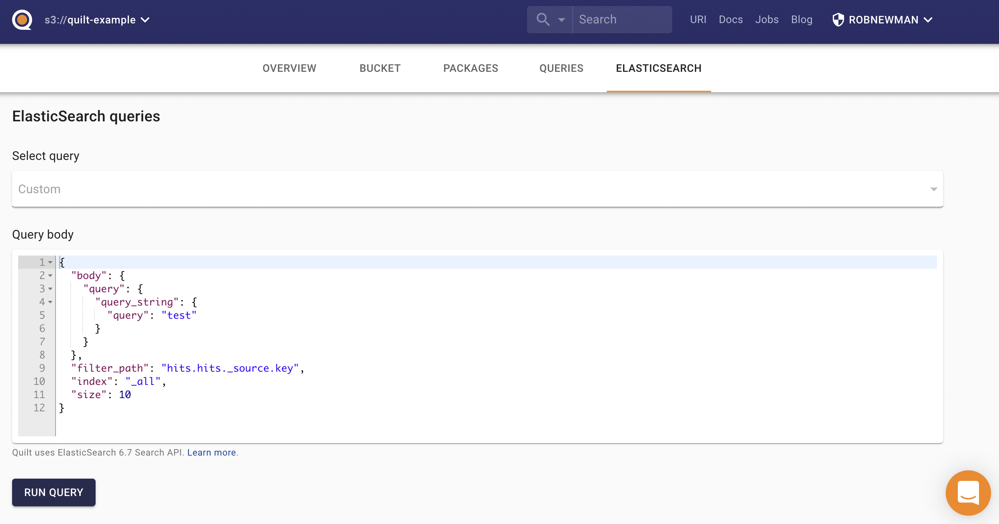

Out of the box, Quilt provides support for queries in the ElasticSearch DSL, as well as SQL queries in Athena (details forthcoming).

## ElasticSearch

The objects in S3 buckets connected to Quilt are synchronized to an ElasticSearch
cluster, which powers Quilt's search features. For custom queries, you can use the
Queries tab in the Quilt catalog to directly query ElasticSearch cluster.

Quilt uses ElasticsSearch 6.7
([docs](https://www.elastic.co/guide/en/elasticsearch/reference/6.7/index.html)).

### Indexing
Quilt maintains a near-realtime index of the objects in your S3 bucket in ElasticSearch.
Each bucket corresponds to one or more ElasticSearch indexes. As objects are mutated
in S3, Quilt uses an event-driven system (via SNS and SQS) to update ElasticSearch.

There are two types of indexing in Quilt:
* *shallow* indexing includes object metadata (such as the file name and size)
* *deep* indexing includes object contents. Quilt supports deep
indexing for the following file extensions:
  * .fcs (FlowJo)
  * .ipynb (Jupyter notebooks)
  * .parquet
  * .pdf
  * .html, .txt, .tsv, .csv, .md (plus many other plain-text formats)
  * .xls, .xlsx

### Queries



Quilt ElasticSearch queries support the following keys:
- `index` — comma-separated list of indexes to search ([learn more](https://www.elastic.co/guide/en/elasticsearch/reference/6.8/multi-index.html))
- `filter_path` — to reducing response nesting, ([learn more](https://www.elastic.co/guide/en/elasticsearch/reference/6.8/common-options.html#common-options-response-filtering))
- `_source` — boolean that adds or removes the `_source` field, or a list of fields to return ([learn more](https://www.elastic.co/guide/en/elasticsearch/reference/6.8/search-request-source-filtering.html))
- `size` — limits the number of hits ([learn more](https://www.elastic.co/guide/en/elasticsearch/reference/6.8/search-uri-request.html))
- `from` — starting offset for pagination ([learn more](https://www.elastic.co/guide/en/elasticsearch/reference/6.8/search-uri-request.html))
- `body` — the search query body as a JSON dictionary ([learn more](https://www.elastic.co/guide/en/elasticsearch/reference/6.8/search-request-body.html))

#### Saved queries
You can provide pre-canned queries for your users by providing a configuration file 
at `s3://YOUR_BUCKET/.quilt/queries/config.yaml`:

```yaml
version: "1"
queries:
  query-1:
    name: My first query
    description: Optional description
    url: s3://BUCKET/.quilt/queries/query-1.json
  query-2:
    name: Second query
    url: s3://BUCKET/.quilt/queries/query-2.json
```

The Quilt catalog displays your saved queries in a drop-down for your users to
select, edit, and execute.
