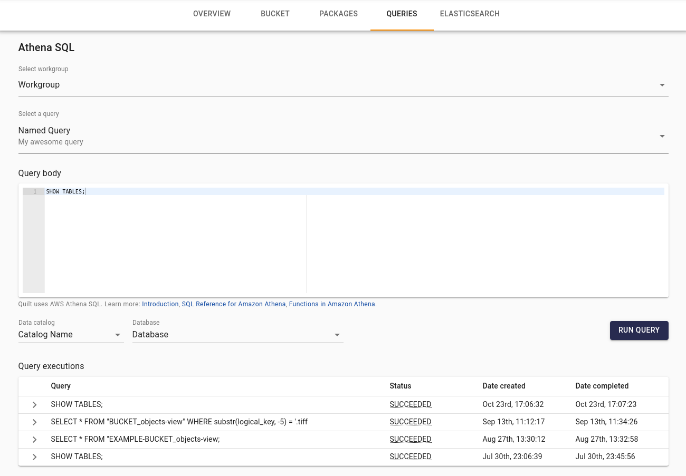
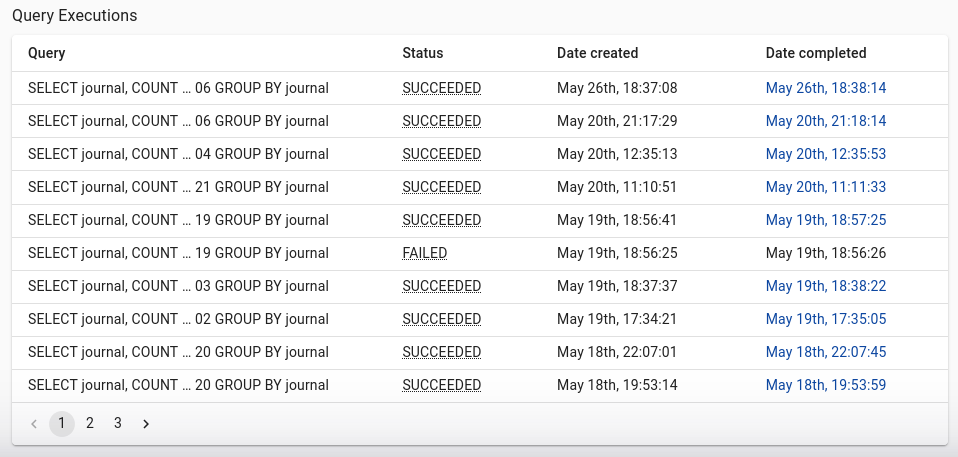

<!-- markdownlint-disable -->
Quilt provides support for queries in the ElasticSearch DSL, as
well as SQL queries in Athena.

## ElasticSearch

The objects in Amazon S3 buckets connected to Quilt are synchronized to
an ElasticSearch cluster, which provides Quilt's search features.
This is available directly in the navigation bar, or 
for custom queries you can use the **Queries** tab in the Quilt catalog
to directly query the ElasticSearch cluster.

Quilt uses ElasticSearch 6.7
([docs](https://www.elastic.co/guide/en/elasticsearch/reference/6.7/index.html)).

### Indexing
Quilt maintains a near-realtime index of the objects in your S3
bucket in ElasticSearch.  Each bucket corresponds to one or more
ElasticSearch indexes. As objects are mutated in S3, Quilt uses an
event-driven system (via SNS and SQS) to update ElasticSearch.

There are two types of indexing in Quilt:
* *shallow* indexing includes object metadata (such as the file name and size)
* *deep* indexing includes object contents. Quilt supports deep
indexing for the following file extensions:
  * .csv, .html, .json, .md, .rmd, .rst, .tab, .txt, .tsv (plain-text formats)
  * .fcs (FlowJo)
  * .ipynb (Jupyter notebooks and Voila dashboards)
  * .parquet
  * .pdf
  * .pptx
  * .xls, .xlsx


### Navigation Bar

The navigation bar on every page in the catalog provides a convenient
shortcut for searching all objects and packages in an Amazon S3
bucket.

> Quilt uses ElasticSearch 6.7 [query string
> syntax](https://www.elastic.co/guide/en/elasticsearch/reference/6.7/query-dsl-query-string-query.html#query-string-syntax).

The following are all valid search parameters:

**Fields**

- `comment`: Package comment. `comment: TODO`
- `content`: Object content. `content:Hello`
- `ext`: Object extension. `ext:*.fastq.gz`
- `handle`: Package name. `handle:examples\/metadata`
- `hash`: Package hash. `hash:3192ac1*`
- `key`: Object key. `key:phase*`
- `key_text`: Analyzed object key. `key:"phase"`
- `last_modified`: Last modified date. `last_modified:[2022-02-04 TO
  2022-02-20]`
- `metadata`: Package metadata. `metadata:dapi`
- `size`: Object size in bytes. `size:>=4096`
- `version_id`: Object version id. `version_id:t.LVVCx*`
- `pointer_file`: Package revision tag in S3; either "latest" or a top hash. `pointer_file: latest`
- `package_stats.total_files`: Package total files.
  `package_stats.total_files:>100`
- `package_stats.total_bytes`: Package total bytes.
  `package_stats.total_bytes:<100`

**Logical operators and grouping**

- `AND`: Conjunction. `a AND b`
- `OR`: Disjunction. `a OR b`
- `NOT`: Negation. `NOT a`
- `_exists_`: Matches any non-null value for the given field. `_exists_: content`
- `()`: Group terms. `(a AND b) NOT c`

**Wildcard and regular expressions**

- `*`: Zero or more characters, avoid leading `*` (slows performance).
  `ext:config.y*ml`
- `?`: Exactly one character. `ext:React.?sx`
- `//`: Regular expression (slows performance). `content:/lmnb[12]/`

### QUERIES > ELASTICSEARCH tab


Quilt ElasticSearch queries support the following keys:
- `index` — comma-separated list of indexes to search ([learn
more](https://www.elastic.co/guide/en/elasticsearch/reference/6.8/multi-index.html))
- `filter_path` — to reducing response nesting, ([learn
more](https://www.elastic.co/guide/en/elasticsearch/reference/6.8/common-options.html#common-options-response-filtering))
- `_source` — boolean that adds or removes the `_source` field, or
a list of fields to return ([learn
more](https://www.elastic.co/guide/en/elasticsearch/reference/6.8/search-request-source-filtering.html))
- `size` — limits the number of hits ([learn
more](https://www.elastic.co/guide/en/elasticsearch/reference/6.8/search-uri-request.html))
- `from` — starting offset for pagination ([learn
more](https://www.elastic.co/guide/en/elasticsearch/reference/6.8/search-uri-request.html))
- `body` — the search query body as a JSON dictionary ([learn
more](https://www.elastic.co/guide/en/elasticsearch/reference/6.8/search-request-body.html))

#### Saved queries
You can provide pre-canned queries for your users by providing a configuration file 
at `s3://YOUR_BUCKET/.quilt/queries/config.yaml`:

```yaml
version: "1"
queries:
  query-1:
    name: My first query
    description: Optional description
    url: s3://BUCKET/.quilt/queries/query-1.json
  query-2:
    name: Second query
    url: s3://BUCKET/.quilt/queries/query-2.json
```

The Quilt catalog displays your saved queries in a drop-down for your users to
select, edit, and execute.

## Athena

You can park reusable Athena Queries in the Quilt catalog so that your users can
run them. You must first set up you an Athena workgroup and Saved queries per
[AWS's Athena documentation](https://docs.aws.amazon.com/athena/latest/ug/getting-started.html).

### Configuration
You can hide the "Queries" tab by setting `ui > nav > queries: false` ([learn more](./Preferences.md)).

### Basics
"Run query" executes the selected query and waits for the result.



