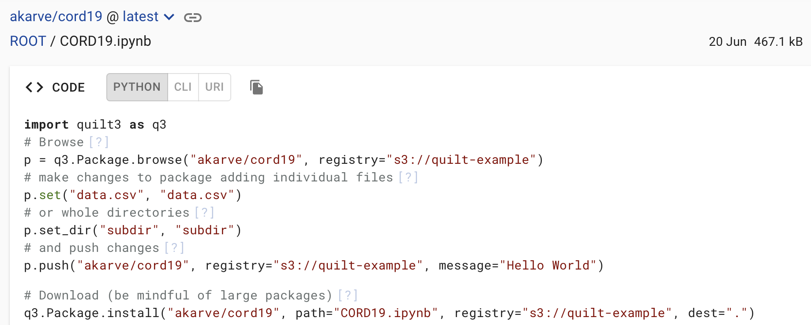
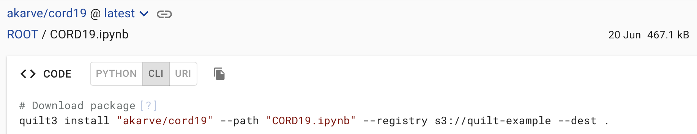
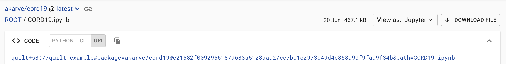
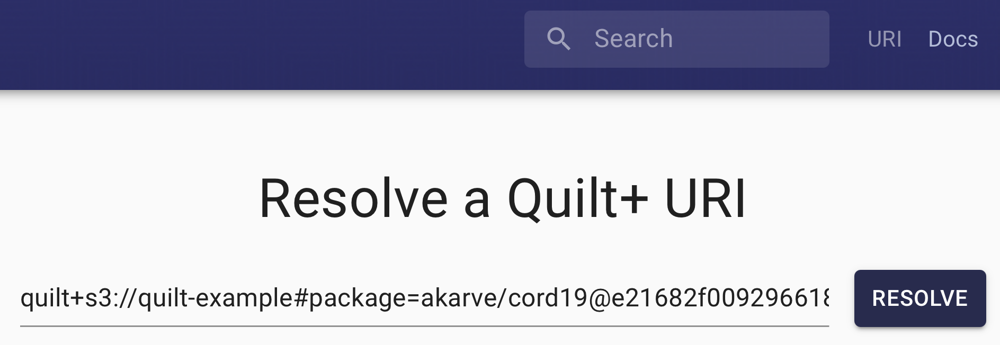

<!-- markdownlint-disable-next-line first-line-h1 -->
Every package and object in the Bucket and Packages views has a "CODE" pane,
which contains code snippets that can be used to download and upload a package
or object via either:

- Python (API)

    

- CLI (shell commands)

    

In addition, Packages have a third tab that returns a Quilt+ URI:

- URI (identifier)

    

They all have a `copy` button that copies the code to the clipboard.

## Quilt+ URIs

Quilt+ URIs are a way to uniquely identify a package or sub-package (e.g.,
folder or entry) in the Quilt catalog, relative to an S3 bucket. For example:

<!-- markdownlint-disable-next-line line-length -->
`quilt+s3://quilt-example#package=akarve/cord19@e21682f00929661879633a5128aaa27cc7bc1e2973d49d4c868a90f9fad9f34b&path=CORD19.ipynb`

The URI above references a specific version of the `CORD19.ipynb` notebook in
the `akarve/cord19` package of the `quilt-example` bucket.

### Python and CLI Usage

Pass a Quilt+ URI directly to `Package.browse()` or `Package.install()`:

<!--pytest.mark.skip-->

```python
import quilt3

uri = "quilt+s3://quilt-example#package=akarve/cord19:latest&path=CORD19.ipynb"
entry = quilt3.Package.browse(uri)
quilt3.Package.install(uri, dest="download")
```

For the CLI, use `--uri` and quote the entire URI. Quoting is required because
URI fragments can contain `&`, which shells otherwise interpret as an operator:

<!--pytest.mark.skip-->

```bash
quilt3 install --uri \
  'quilt+s3://quilt-example#package=akarve/cord19:latest&path=CORD19.ipynb' \
  --dest download
```

The bucket selects the package registry. The optional `catalog` parameter is
informational and does not change credentials or endpoints.

### Catalog Usage

URIs can be used to quickly navigate to a specific package or object from the
Catalog. If your window is wide enough, there will be a "URI" button to the
right of the search bar. Clicking this button will display a dialog where you
can paste a URI and "Resolve" it to navigate to the package or object it
references.



#### Redirects

If you want to invoke a Quilt+ URI via a standard HTTP URL,
you can use a redirect page from the Quilt catalog. For example:

`https://your-catalog-host/redir/quilt%2Bs3%3A%2F%2Fquilt-example%23package%3Dakarve%2Fcord19%40e21682f00929661879633a5128aaa27cc7bc1e2973d49d4c868a90f9fad9f34b%26path%3DCORD19.ipynb`.

### Syntax

A Quilt+ URI contains the following components:

- `quilt+<protocol>`: The scheme of the URI. This always begins with `quilt+`.
  Currently the only supported protocol is `s3`.
- `<bucket>`: The name of the bucket containing the package, e.g.
  `quilt-example`.
- `#package=<package_name[specifier]>`: A fragment for the name of the package,
  e.g. `akarve/cord19`, plus an optional specifier. The specifier identifies a
  particular revision, using either `@<top_hash>` (e.g.
  `@e21682f00929661879633a5128aaa27cc7bc1e2973d49d4c868a90f9fad9f34b`) or
  `:<tag>` (defaults to `:latest` when omitted). You may not specify both a
  top_hash and a tag.
- `&path=<path>`: An optional fragment after the package, specifying the path to
  a particular subpackage (i.e., folder or entry) within the package. This is
  always a relative path, e.g. `CORD19.ipynb` in the example.
- `&catalog=<catalog>`: An optional fragment specifying the DNS name of the
  catalog that generated the URI. This is used to help clients generate the
  human-readable URL for that package.

#### Percent-encoding

Fragment values are percent-encoded **exactly once**. A producer encodes the
value once (`50%_sample.csv` is written as `path=50%25_sample.csv`), and a
consumer decodes it once. Encoding is required for any character that would
otherwise be read as structure — `&`, `=`, `#` — and recommended for `%` and
any character outside the unreserved set.

Consumers are lenient about malformed input, following the same rules as
Python's `urllib.parse.unquote`: a `%` that is not followed by two hexadecimal
digits is treated as a literal `%` rather than an error. This keeps URIs from
producers that do not encode their paths readable:

| `path=` value       | decodes to       |
| ------------------- | ---------------- |
| `50%25_sample.csv`  | `50%_sample.csv` |
| `50%_sample.csv`    | `50%_sample.csv` |
| `a%2zb`             | `a%2zb`          |
| `a%20b`             | `a b`            |
| `a%2520b`           | `a%20b`          |

A directory path may carry a trailing slash (`path=subdir%2F`); consumers must
accept it.

Leniency covers malformed escapes, not undecodable ones. A *well-formed* escape
whose bytes are not valid UTF-8 (e.g. `%FF`) is rejected as a malformed URI,
because unlike a stray `%` it has no correct reading — substituting the Unicode
replacement character would produce a path that cannot match any entry. Paths
are UTF-8, so an S3 key holding bytes that are not valid UTF-8 cannot be
addressed by a Quilt+ URI.
