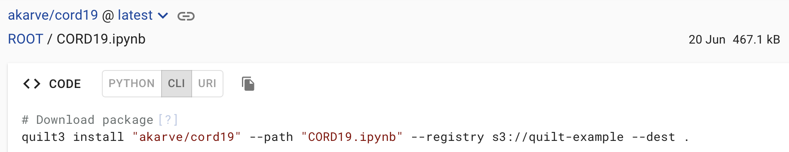

<!-- markdownlint-disable-next-line first-line-h1 -->
Every package and object in the Bucket and Packages views has a "CODE" pane,
which contains code snippets that can be used to download and upload a package
or object via either:

- Python (API)

    

- CLI (shell commands)

    

In addition, Packages have a third tab that returns a Quilt+ URI:

- URI (identifier)

    

They all have a `copy` button that copies the code to the clipboard.

## Quilt+ URIs

Quilt+ URIs are a way to uniquely identify a package or sub-package (e.g.,
folder or entry) in the Quilt catalog, relative to an S3 bucket. For example:

<!-- markdownlint-disable-next-line line-length -->
`quilt+s3://quilt-example#package=akarve/cord19@e21682f00929661879633a5128aaa27cc7bc1e2973d49d4c868a90f9fad9f34b&path=CORD19.ipynb`

The URI above references a specific version of the `CORD19.ipynb` notebook in
the `akarve/cord19` package of the `quilt-example` bucket.

### Catalog Usage

URIs can be used to quickly navigate to a specific package or object from the
Catalog. If your window is wide enough, there will be a "URI" button to the
right of the search bar. Clicking this button will display a dialog where you
can paste a URI and "Resolve" it to navigate to the package or object it
references.

#### Redirects

If you want to invoke a Quilt+ URI via a standard HTTP URL,
you can use a redirect page from the Quilt catalog. For example:

`https://your-catalog-host/redir/quilt%2Bs3%3A%2F%2Fquilt-example%23package%3Dakarve%2Fcord19%40e21682f00929661879633a5128aaa27cc7bc1e2973d49d4c868a90f9fad9f34b%26path%3DCORD19.ipynb`.

### Syntax

A Quilt+ URI contains the following components:

- `quilt+<protocol>`: The scheme of the URI. This always begins with `quilt+`.
  Currently the only supported protocol is `s3`.
- `<bucket>`: The name of the bucket containing the package, e.g.
  `quilt-example`.
- `#package=<package_name[specifier]>`: A fragment for the name of the package,
  e.g. `akarve/cord19`, plus an optional specifier. The specifier identifies a
  particular revision, using either `@<top_hash>` (e.g.
  `@e21682f00929661879633a5128aaa27cc7bc1e2973d49d4c868a90f9fad9f34b`) or
  `:<tag>` (defaults to `:latest` when omitted). You may not specify both a
  top_hash and a tag.
- `&path=<path>`: An optional fragment after the package, specifying the path to
  a particular subpackage (i.e., folder or entry) within the package. This is
  always a relative path, e.g. `CORD19.ipynb` in the example.
- `&catalog=<catalog>`: An optional fragment specifying the DNS name of the
  catalog that generated the URI. This is used to help clients generate the
  human-readable URL for that package.
