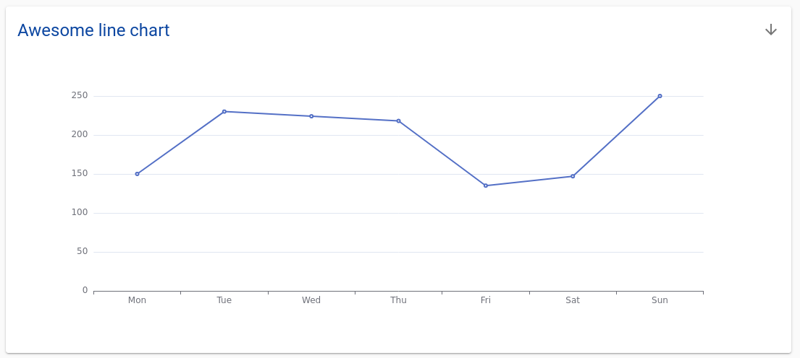

# Visualization and Dashboards with the Quilt catalog

Quilt packages are not only reproducible units of data and metadata, but units of
*reporting*.  You can use the following features to include interactive visualizations
and light applications inside of packages.

Importantly, relative references to data are resolved relative to the parent package.
This means that all of your reports are backed by immutable, versioned data, providing
a common frame of reference that is lacking in BI applications that read from
fast-moving databases and file systems.

In addition to rendering a wide variety of images, binary files, and text 
files, the Quilt catalog supports the following libraries for visualization and
exploration:
* [Vega](https://vega.github.io/vega/),
* [Vega-lite](https://vega.github.io/vega-lite/),
* [ECharts](https://echarts.apache.org/en/index.html),
* [Voila](https://github.com/voila-dashboards/voila) (Developer preview).
* [Perspective](https://perspective.finos.org),

The above systems provide you with hundreds of charts out of the box.


## `quilt_summarize.json`
`quilt_summarize.json` is a configuration file that renders one or more dashboard
elements in both Bucket view and Packages view. The contents of `quilt_summarize.json`
are a JSON array of files that you wish to preview in the catalog. Each file may
be represented as a string or, if you wish to provide more configuration, as an
object.

The simplest summary is a list of relative paths to files that you wish to preview:
```json
// quilt_summarize.json
[
  "file1.json",
  "file2.csv",
  "file3.ipynb"
]
```

By default, each list element renders in its own row.


For multi-column layouts, you can provide an array instead of a string for a given
row:

```json
// quilt_summarize.json
[
  "file1.json",
  [{
    "path": "file2.csv",
    "width": "200px"
  }, {
    "path": "file3.ipynb",
    "title": "Scientific notebook",
    "description": "[See docs](https://docs.com)"
  }]
]
```


Each element of an array in `quilt_summarize.json` can either be a path string
or an object with one or more of the following properties:

- `path` - file path relative to `quilt_summarize.json`
- `title` - title rendered instead of file path
- `description` - description in markdown format
- `width` - column width either in pixels or ratio (default is ratio `1`)
- `types` - a list of rendering types; currently only singleton list values are supported:
    - `["echarts"]` to render JSON as an EChart
    - `["voila"]` to render a Jupyter notebook as an interactive Voila dashboard

If you need to control the height of an element (useful for Voila dashboards),
use the following extended syntax:

```json
// quilt_summarize.json
[
  {
    "path": "file1.json",
    "types": [
      {
        "name": "echarts",
        "style": { "height": "1000px" }
      }
    ]
  }
]
```

At present `height` is the only supported `style` element.

## Vega and Vega-lite
The Quilt catalog uses vega-embed, vega, and vega-lite.
See [package.json](https://github.com/quiltdata/quilt/blob/master/catalog/package.json)
for specific library versions and compatibility.

In order to display a Vega or Vega-Lite visualization, simply reference a JSON
file with a library-compatible schema in a JSON file as follows in your
`quilt_summarize.json` file:

```json
[
    "relative/path/to/my/vega.json",
    "optionally/some/other/file.csv"
]
```

For both Vega and Vega Lite you may specify relative paths to package files
as data sources and the Quilt catalog will resolve the same.

### Altair
The easiest way to create Vega-lite visualizations for Quilt packages is with
[Altair](https://altair-viz.github.io/).

Here's a simple example:
```python
import altair as alt

df = pd.read_csv("file.csv")

alt.Chart(df).mark_area(
    color="gray",
    opacity=.2
).encode(
    x="score:Q",
    y='density:Q',
    tooltip=['count(score):Q']
).save("vega.json")
```

## ECharts
To render an EChart, you provide a JSON file (a dictionary that
specifies the ECharts [option parameter](https://echarts.apache.org/en/option.html))
and you set the `"types"` property to `[ "echarts" ]`.

```json
// quilt_summarize.json
[
  {
    "path": "echarts-option-file.json",
    "title": "Awesome line chart",
    "types": ["echarts"]
  }
]
```

### Example

The following example is a
[simple line chart from the ECharts documentation](https://echarts.apache.org/examples/en/editor.html?c=line-simple).

```json
// echarts.json
{
  "dataset": {
    "source": [
      ["Mon", 150],
      ["Tue", 230],
      ["Wed", 224],
      ["Thu", 218],
      ["Fri", 135],
      ["Sat", 147],
      ["Sun", 250]
    ]
  },
  "xAxis": {
    "type": "category"
  },
  "yAxis": {
    "type": "value"
  },
  "series": [
    {
      "type": "line"
    }
  ]
}
```



### External files

As with Vega, you can provide either a relative path or URL to the dataset file.

```json
// echarts.json
{
  "dataset": {
    "source": "./dataset.csv"
  },
  "xAxis": {
    "type": "category"
  },
  "yAxis": {
    "type": "value"
  },
  "series": [
    {
      "type": "line"
    }
  ]
}
```

Relative paths are resolved relative to your echarts.json file and relative to the
parent package.

### Limitations

At present, ECharts in Quilt does not support custom JavaScript. You are therefore
limited to JSON types (numbers, strings, objects, arrays, etc.). Functions like [`symbolSize`](https://echarts.apache.org/en/option.html#series-scatter.symbolSize)
are not available.

## Voila
*This feature is a Developer preview, details are subject to change.*

Enterprise deployments of Quilt support interactive Jupyter notebooks
with [Voilà](https://github.com/voila-dashboards/voila).

In brief, a Voila dashboard version of your notebook will
display all of the output cells and none of the input cells from the underlying
notebook. This enables you to create interactive, Jupyter-driven apps for your
Quilt catalog users.

The Voila libraries execute a remote Jupyter Kernel and stream the results to the
browser with tornado. Jupyter kernels run on a single EC2 instance (`t3.small` by default)
in Linux containers that have network access but do not have access to persistent
storage. The catalog users's AWS credentials are passed to Jupyter kernel as
[environment variables](https://docs.aws.amazon.com/cli/latest/userguide/cli-configure-envvars.html#envvars-list).

## Environment variables
When you have a Voila dashboard inside of a Quilt package, you may wish to reference files
*in the current package revision*. The Quilt catalog sets the following environment variables
and passes them to the Voila kernel:

* `QUILT_PKG_BUCKET`
* `QUILT_PKG_NAME`
* `QUILT_PKG_TOP_HASH`

You can access these variables in Python and browse the package:
```python
import io
import os

import pandas as pd
import quilt3 as q3

bucket = os.environ.get("QUILT_PKG_BUCKET")
handle = os.environ.get("QUILT_PKG_NAME")
top_hash = os.environ.get("QUILT_PKG_TOP_HASH")

pkg = q3.browse(handle, registry=f"s3://{bucket}", top_hash=top_hash)
# Read data.csv from the current package from Voila
df = pkg["data.csv"].deserialize()
```


### Included Python packages
By default, Quilt Voila containers provide the following modules:
```
altair
bqplot
ipykernel
ipyvolume
ipywidgets
pandas
perspective-python
PyYAML
quilt3
scipy
```

## Perspective

Quilt renders tabular data formats into a Perspective Datagrid, including the
following file extensions: .csv, .xls, .xlsx, .jsonl, .parquet, and .tsv. 

For speed, Quilt loads a small preview of the rows stored in S3. You can click
Load More to fetch up to about 6MB of zipped data. Beyond this size, click Download
to see the entire file contents.

In order to open the analysis and visualization capabilities of Perspecitve,
click the vertical ellipsis, upper left. Click, drag, and drop columns to explore
the data.


