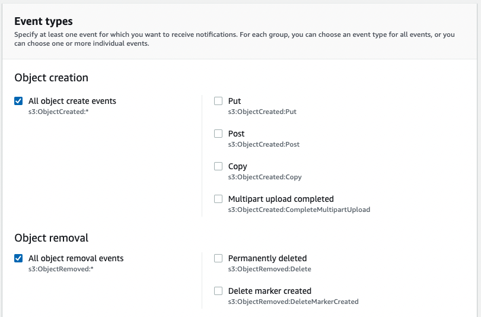
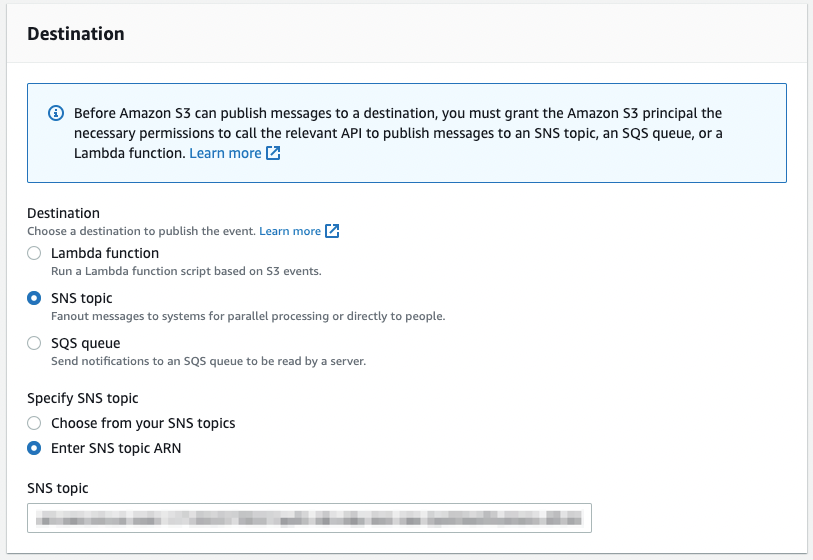

<!-- markdownlint-disable -->
# Cross-account access

It is often desirable to run the Quilt control plane (CloudFormation stack)
in a separate account from your data plane (S3 buckets).

Assume that we have two accounts, *ControlAccount* (containing the Quilt
CloudFormation stack) and *DataAccount* (containing the desired S3 buckets).

## Object ownership

If you want *DataAccount* to have access to S3 objects put by *ControlAccount*
(and you probably do), you need to ensure that S3 bucket has `ObjectOwnership`
set to `BucketOwnerEnforced`, see
[the AWS docs](https://docs.aws.amazon.com/AmazonS3/latest/userguide/about-object-ownership.html)
for details.

## Bucket policies

To ensure that the Quilt stack in the *ControlAccount* can access and administer 
S3 buckets in the *DataAccount*, you can apply a bucket policy similar to the
following to buckets in your *DataAccount*.

> Quilt admins can still control which users do and do not have access to the 
> following bucket via Admin panel Roles and Policies.

```json
{
    "Version": "2012-10-17",
    "Statement": [
        {
            "Effect": "Allow",
            "Principal": {
                "AWS": "arn:aws:iam::CONTROL_ACCOUNT:root"
            },
            "Action": [
                "s3:GetObject",
                "s3:GetObjectTagging",
                "s3:GetObjectVersion",
                "s3:GetObjectVersionTagging",
                "s3:ListBucket",
                "s3:ListBucketVersions",
                "s3:DeleteObject",
                "s3:DeleteObjectVersion",
                "s3:PutObject",
                "s3:PutObjectTagging",
                "s3:GetBucketNotification",
                "s3:PutBucketNotification"
            ],
            "Resource": [
                "arn:aws:s3:::bucket-in-data-account",
                "arn:aws:s3:::bucket-in-data-account/*"
            ]
        }
    ]
}
```

## CloudTrail

For security, auditing, and user-facing analytics, it is recommended that all
S3 buckets in Quilt enable logging via CloudTrail. For cross-account buckets
you must provide an existing trail to Quilt when you deploy the CloudFormation
template, and you must add the buckets in question to CloudTrail.

## Cross-account Simple Notification Service (Amazon SNS) topics

To monitor events in an additional Amazon S3 bucket located in
another account, *DataAccountTwo*, from the *ControlAccount*, you'll
need to grant the *ControlAccount* access to *DataAccountTwo* bucket event
notifications.

This is done by adding a new IAM policy in the
relevant *DataAccountTwo* Amazon S3 bucket that provides permissions
to write to an existing SNS topic in the *ControlAccount*.

1. Create a S3 bucket policy in the *DataAccountTwo* account that
allows the *ControlAccount* access to all S3 events. This is the
same as the policy above with just the `Resource` block altered to
the S3 bucket in the *DataAccountTwo*:

```json
"Resource": [
    "arn:aws:s3:::DATA_ACCOUNT_TWO_BUCKET_NAME"
    "arn:aws:s3:::DATA_ACCOUNT_TWO_BUCKET_NAME/*"
]
```

2. Update the existing Quilt SNS Access Policy in the *ControlAccount*
to allow *DataAccountTwo* to publish to the Quilt SNS topic:

To do this, provide the SNS topic ARN (`SNS_TOPIC_ARN`), bucket
name, and *DataAccountTwo* bucket owner's account ID:

```json
{
    "Version": "2008-10-17",
    "Statement": [
        {
            "Sid": "ExistingQuiltAccountSnsPolicy",
            "Effect": "Allow",
            "Principal": {
                "Service": "s3.amazonaws.com"
            },
            "Action": "sns:Publish",
            "Resource": "SNS_TOPIC_ARN",
            "Condition": {
                "ArnLike": {
                    "aws:SourceArn": "arn:aws:s3:::DATA_ACCOUNT_TWO_BUCKET_NAME"
                },
                "StringEquals": {
                    "aws:SourceAccount": "DATA_ACCOUNT_TWO_ACCOUNT_ID"
                }
            }
        }
    ]
}
```

Make a note of the SNS topic ARN, which will be in format

`arn:aws:sns:aws-region:account-id:topic-name`

3. Enable notifications on the relevant *DataAccountTwo* S3 bucket
using the Amazon S3 console:

Open the Amazon S3 console in *DataAccountTwo* and select the bucket
to enable events for. Choose **Properties**, navigate to the **Event
Notifications** section and click the **Create event notification**
button. In the General configuration section, specify a descriptive
event name for your event notification. In the Event types section,
check the `All object create events` and `All object removal events`
boxes:



In the Destination section, choose SNS topic and specify the relevant SNS
topic either from your list of SNS topics or by entering it manually:



Once you hit `Save changes`, Amazon S3 will send a test message to the event notification destination.

[AWS docs](https://docs.aws.amazon.com/AmazonS3/latest/userguide/enable-event-notifications.html)
