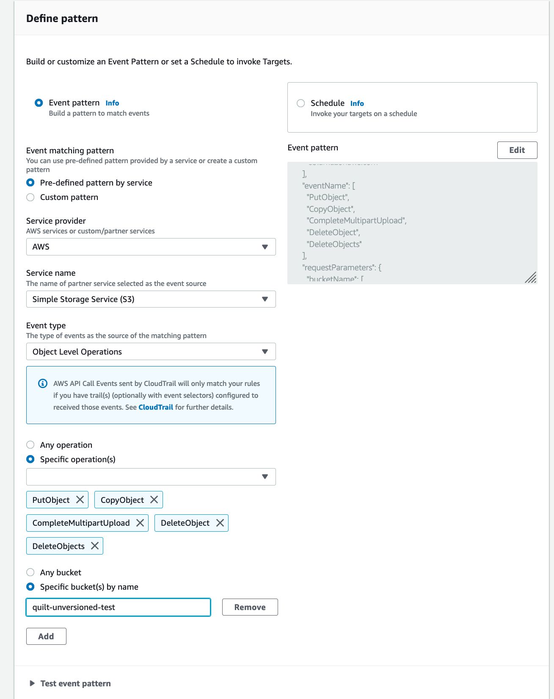
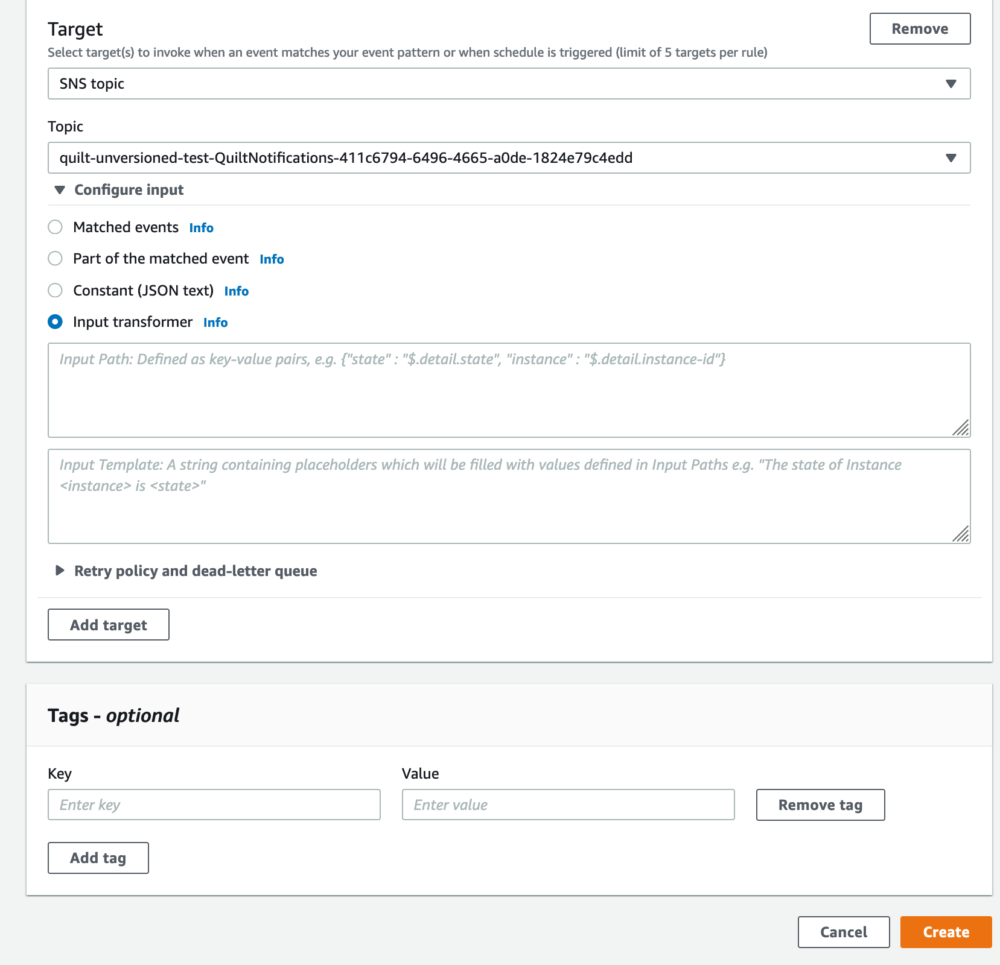
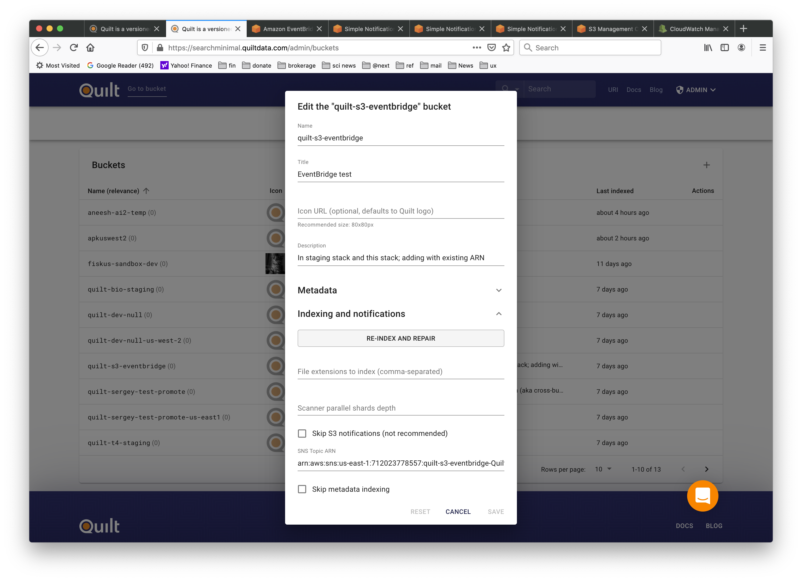

<!-- markdownlint-disable -->
# EventBridge Integration: Resolving S3 Event Conflicts

When using Quilt alongside other AWS services that consume S3 events (like FSx, Lambda triggers, or custom applications), you may encounter conflicts because **S3 only allows one event notification configuration per bucket**. This guide shows you how to resolve these conflicts using AWS EventBridge.

## 🎯 Understanding the Problem

### How Quilt Uses S3 Events

By default, Quilt automatically creates S3 Event Notifications to:
- Keep its managed Elasticsearch index up-to-date
- Track changes to bucket contents in real-time
- Maintain package metadata and search functionality

**Default Quilt Event Flow:**
```
S3 Bucket → S3 Event Notification → SNS Topic → SQS Queue → Lambda → Elasticsearch
```

### The S3 Event Limitation

**AWS S3 Limitation**: Each S3 bucket can only have **one event notification configuration**. This means:

❌ **This Won't Work:**
```
S3 Bucket ──┬── Quilt Event Notification
            └── FSx Event Notification     ← CONFLICT!
```

✅ **This Will Work:**
```
S3 Bucket → EventBridge → ┬── Quilt SNS Topic
                          └── FSx Event Handler
```

## 🛠️ Solution Options

### Option 1: SNS Fanout (Recommended)
Use SNS to distribute events to multiple consumers:
- **Best for**: Multiple AWS services needing S3 events
- **Complexity**: Medium
- **Reliability**: High
- **Guide**: [AWS Fanout Pattern](https://aws.amazon.com/blogs/compute/fanout-s3-event-notifications-to-multiple-endpoints/)

### Option 2: EventBridge Routing (This Guide)
Use EventBridge to create synthetic S3 events:
- **Best for**: Complex event routing and transformation
- **Complexity**: Medium-High  
- **Reliability**: High
- **Flexibility**: Highest

### Option 3: Just-in-Time Resources
Spin up resources only when needed:
- **Best for**: Batch processing workloads
- **Complexity**: Low
- **Cost**: Lowest
- **Limitation**: Not suitable for real-time use cases

## 🚀 EventBridge Implementation Guide

This section provides a complete step-by-step guide to set up EventBridge routing for S3 events to resolve conflicts between Quilt and other services.

### Prerequisites

Before starting, ensure you have:
- ✅ AWS CLI or Console access with appropriate permissions
- ✅ A Quilt deployment already running
- ✅ The S3 bucket you want to add to Quilt
- ✅ CloudTrail enabled for the bucket (Quilt requirement)

### Step-by-Step Implementation

#### Step 1: Create SNS Topic

Create an SNS topic in the **same region** as your S3 bucket:

<!-- pytest-codeblocks:skip -->
```bash
# Using AWS CLI
aws sns create-topic \
    --name quilt-eventbridge-notifications \
    --region us-east-1

# Note the TopicArn from the response
```

**Console Steps:**
1. Navigate to **SNS Console** → **Topics** → **Create topic**
2. **Type**: Standard
3. **Name**: `quilt-eventbridge-notifications`
4. **Region**: Same as your S3 bucket
5. Click **Create topic** and note the ARN

#### Step 2: Verify CloudTrail Configuration

Quilt requires CloudTrail for S3 data events. Check your CloudFormation stack:

**Option A: Quilt-Managed Trail**
- Go to **CloudFormation** → **Your Quilt Stack** → **Resources**
- Look for a CloudTrail resource
- Quilt will automatically add your bucket to this trail

**Option B: Existing Trail**
- Go to **CloudFormation** → **Your Quilt Stack** → **Parameters**  
- Find the CloudTrail bucket parameter
- Manually add your bucket to the existing trail in CloudTrail console

#### Step 3: Create EventBridge Rule

Create an EventBridge rule to capture S3 events:

**Console Steps:**
1. Navigate to **EventBridge Console** → **Rules** → **Create rule**
2. **Name**: `quilt-s3-events-rule`
3. **Event bus**: default
4. **Rule type**: Rule with an event pattern

#### Step 4: Configure Event Pattern

Set up the event pattern to capture S3 operations:

**Event source**: AWS services
**AWS service**: Simple Storage Service (S3)
**Event type**: Specific operation(s)

**Select these operations:**
- ✅ `PutObject`
- ✅ `CopyObject` 
- ✅ `CompleteMultipartUpload`
- ✅ `DeleteObject`
- ✅ `DeleteObjects`

**Bucket specification:**
- Select **Specific bucket(s) by name**
- Enter your bucket name: `your-bucket-name`

**Example Event Pattern JSON:**
```json
{
  "source": ["aws.s3"],
  "detail-type": ["AWS API Call via CloudTrail"],
  "detail": {
    "eventSource": ["s3.amazonaws.com"],
    "eventName": [
      "PutObject",
      "CopyObject", 
      "CompleteMultipartUpload",
      "DeleteObject",
      "DeleteObjects"
    ],
    "requestParameters": {
      "bucketName": ["your-bucket-name"]
    }
  }
}
```



#### Step 5: Configure Event Target

Set the SNS topic as the target for EventBridge events:

1. **Target type**: AWS service
2. **Select a target**: SNS topic
3. **Topic**: Select the SNS topic created in Step 1



#### Step 6: Set Up Input Transformer

Configure the input transformer to convert EventBridge events to S3 event format:

**Input Path:**
```json
{
  "awsRegion": "$.detail.awsRegion",
  "bucketName": "$.detail.requestParameters.bucketName", 
  "eventName": "$.detail.eventName",
  "eventTime": "$.detail.eventTime",
  "isDeleteMarker": "$.detail.responseElements.x-amz-delete-marker",
  "key": "$.detail.requestParameters.key",
  "versionId": "$.detail.responseElements.x-amz-version-id"
}
```

**Input Template:**
```json
{
  "Records": [
    {
      "awsRegion": <awsRegion>,
      "eventName": <eventName>, 
      "eventTime": <eventTime>,
      "s3": {
        "bucket": {
          "name": <bucketName>
        },
        "object": {
          "eTag": "",
          "isDeleteMarker": <isDeleteMarker>,
          "key": <key>,
          "versionId": <versionId>
        }
      }
    }
  ]
}
```

#### Step 7: Save and Test the Rule

1. Click **Create rule** to save the EventBridge configuration
2. Test by uploading a file to your S3 bucket
3. Check CloudWatch Logs for the EventBridge rule to verify events are being processed

#### Step 8: Configure Quilt

Add the bucket to Quilt using the SNS topic:

1. Open **Quilt Admin Panel** → **Buckets**
2. Click **Add Bucket** or edit existing bucket
3. **Bucket Name**: `your-bucket-name`
4. **SNS Topic ARN**: Paste the ARN from Step 1
5. **Important**: Leave S3 Event Notifications **disabled**



#### Step 9: Initial Indexing

Perform initial bucket indexing:

1. In Quilt Admin Panel, find your bucket
2. Click **Re-Index and Repair**
3. **⚠️ IMPORTANT**: Do **NOT** check the "Repair" checkbox
   - Repair would attempt to create S3 event notifications
   - This would conflict with your existing service (FSx, etc.)
4. Click **Start Re-Index**

### 🧪 Testing Your Setup

#### Verify Event Flow

Test that events are flowing correctly:

<!-- pytest-codeblocks:skip -->
```bash
# Upload a test file
aws s3 cp test.txt s3://your-bucket-name/test.txt

# Check EventBridge metrics
aws events describe-rule --name quilt-s3-events-rule

# Check SNS topic metrics  
aws sns get-topic-attributes --topic-arn YOUR_SNS_TOPIC_ARN
```

#### Validate Quilt Integration

1. Upload a file to your S3 bucket
2. Wait 1-2 minutes for processing
3. Check Quilt catalog to see if the file appears
4. Search for the file in Quilt's search interface

## 🔧 Troubleshooting

### Common Issues and Solutions

#### Issue 1: Events Not Appearing in Quilt

**Symptoms:**
- Files uploaded to S3 don't appear in Quilt catalog
- Search doesn't find recently uploaded files

**Troubleshooting Steps:**
1. **Check EventBridge Rule Status**
   <!-- pytest-codeblocks:skip -->
```bash
aws events describe-rule --name quilt-s3-events-rule
```
   - Ensure `State` is `ENABLED`

2. **Verify CloudTrail is Logging S3 Events**
   - Go to CloudTrail Console → Event history
   - Filter by Event source: `s3.amazonaws.com`
   - Confirm events are being logged

3. **Check SNS Topic Metrics**
   - Go to SNS Console → Your topic → Monitoring
   - Look for "Messages published" metrics

4. **Validate Input Transformer**
   - Test the EventBridge rule with a sample event
   - Check CloudWatch Logs for transformation errors

#### Issue 2: Permission Errors

**Symptoms:**
- EventBridge rule shows errors in CloudWatch
- SNS topic not receiving messages

**Solution:**
Ensure EventBridge has permission to publish to SNS:

```json
{
  "Version": "2012-10-17",
  "Statement": [
    {
      "Effect": "Allow",
      "Principal": {
        "Service": "events.amazonaws.com"
      },
      "Action": "sns:Publish",
      "Resource": "arn:aws:sns:region:account:quilt-eventbridge-notifications"
    }
  ]
}
```

#### Issue 3: Duplicate Events

**Symptoms:**
- Files appear multiple times in Quilt
- Excessive processing in Quilt logs

**Solution:**
- Check for multiple EventBridge rules targeting the same bucket
- Ensure you haven't enabled both S3 Event Notifications AND EventBridge

### Performance Considerations

#### Event Latency
- **EventBridge Latency**: ~1-5 seconds additional delay vs direct S3 events
- **CloudTrail Dependency**: Events only trigger after CloudTrail processes them
- **Batch Processing**: Consider batching for high-volume buckets

#### Cost Optimization
<!-- pytest-codeblocks:skip -->
```bash
# Monitor EventBridge usage
aws events describe-rule --name quilt-s3-events-rule --query 'EventPattern'

# Check SNS costs
aws sns get-topic-attributes --topic-arn YOUR_TOPIC_ARN --attribute-names All
```

### Known Limitations

#### EventBridge-Specific Limitations

1. **Bulk Delete Operations**
   - The `delete-objects` API (used by AWS Console bulk delete) doesn't generate individual `delete-object` events
   - **Workaround**: Use individual delete operations or manual re-indexing
   - **Impact**: Bulk deletes may not be reflected in Quilt immediately

2. **Event Transformation Complexity**
   - EventBridge events have different structure than native S3 events
   - Input transformer may not capture all S3 event metadata
   - **Mitigation**: Test thoroughly with your specific use cases

#### General S3 Event Limitations

1. **Lifecycle Policy Deletions**
   - S3 lifecycle deletions are **not** captured by CloudTrail or S3 Events
   - **AWS Documentation**: [Supported Event Types](https://docs.aws.amazon.com/AmazonS3/latest/userguide/notification-how-to-event-types-and-destinations.title.html)
   
   > You do not receive event notifications from automatic deletes from lifecycle policies or from failed operations.

2. **CloudTrail Dependency**
   - EventBridge S3 events require CloudTrail data events
   - **AWS Documentation**: [Lifecycle and Logging](https://docs.aws.amazon.com/AmazonS3/latest/userguide/lifecycle-and-other-bucket-config.html#lifecycle-general-considerations-logging)
   
   > Amazon S3 Lifecycle actions are not captured by AWS CloudTrail object level logging. CloudTrail captures API requests made to external Amazon S3 endpoints, whereas S3 Lifecycle actions are performed using internal Amazon S3 endpoints.

### Best Practices

#### Security
- ✅ Use least-privilege IAM policies
- ✅ Enable SNS topic encryption
- ✅ Monitor EventBridge rule metrics
- ✅ Set up CloudWatch alarms for failed events

#### Reliability  
- ✅ Test event flow end-to-end before production
- ✅ Set up dead letter queues for failed events
- ✅ Monitor CloudWatch metrics for all components
- ✅ Have a rollback plan to direct S3 events if needed

#### Cost Management
- ✅ Monitor EventBridge and SNS costs
- ✅ Consider event filtering to reduce volume
- ✅ Use appropriate SNS delivery retry policies
- ✅ Clean up test resources after implementation

## 📚 Additional Resources

- **[AWS EventBridge Documentation](https://docs.aws.amazon.com/eventbridge/)**
- **[S3 Event Notifications](https://docs.aws.amazon.com/AmazonS3/latest/userguide/NotificationHowTo.html)**
- **[SNS Fanout Pattern](https://aws.amazon.com/blogs/compute/fanout-s3-event-notifications-to-multiple-endpoints/)**
- **[CloudTrail S3 Data Events](https://docs.aws.amazon.com/awscloudtrail/latest/userguide/logging-data-events-with-cloudtrail.html)**

---

**Need help?** Contact Quilt support or join our [Slack community](https://join.slack.com/t/quiltusers/shared_invite/zt-2k7jszthh-rtAWEIDKgaYva4y9x8isSw) for assistance with EventBridge integration.
