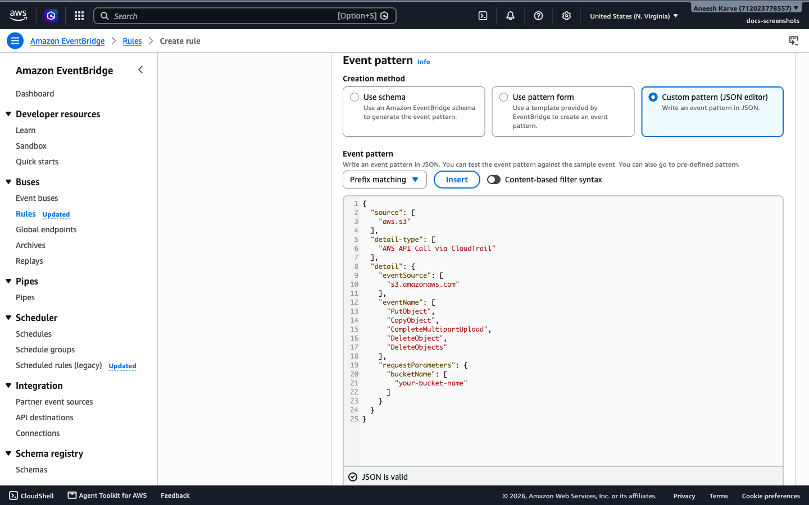
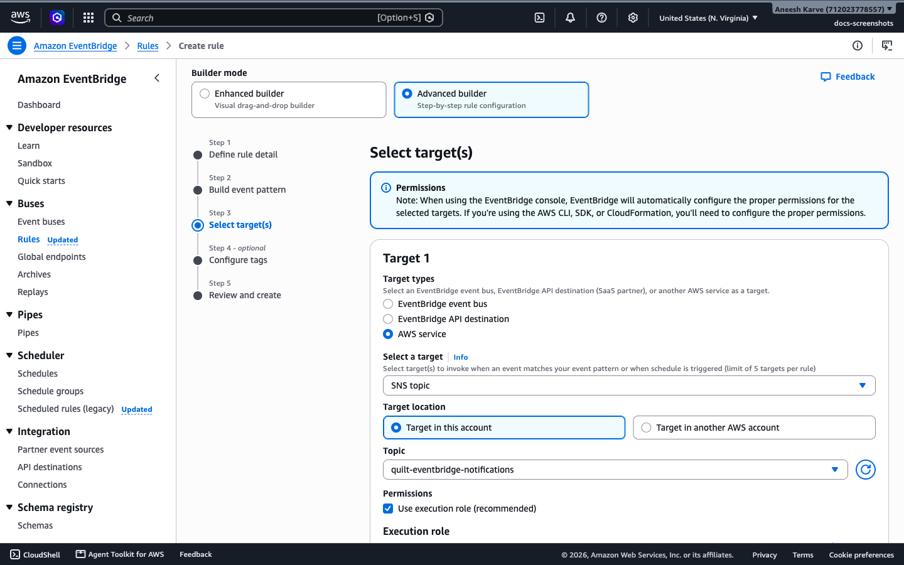
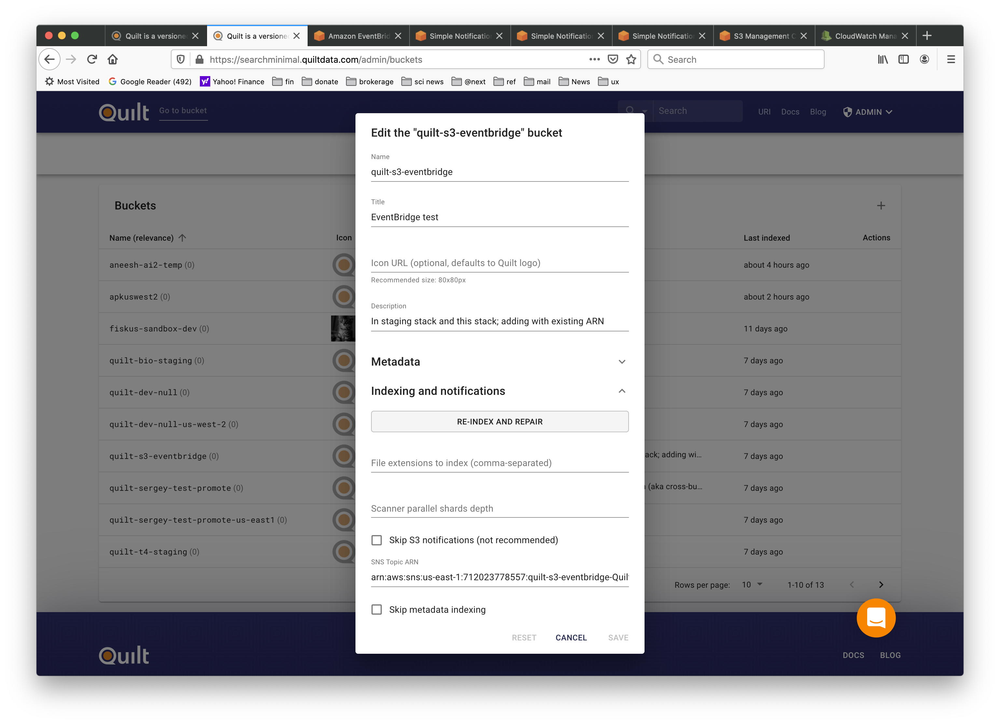

<!-- markdownlint-disable -->
# S3 Events via EventBridge

Quilt keeps search, package events and your own EventBridge rules up to date
from a bucket's S3 events. By default it does that with an SNS topic that it
writes into the bucket's notification configuration. When another service
(FSx, a Lambda trigger, your own pipeline) already owns that configuration,
wire the bucket through **native S3 EventBridge** instead. The Admin panel
generates the commands.

This path:

- leaves the bucket's existing SNS, SQS and Lambda notification targets alone;
- needs no SNS topic and no CloudTrail data events;
- captures bulk deletes: S3 sends one `Object Deleted` event per key that a
  `DeleteObjects` call removes;
- works for buckets in the stack's account and in other accounts.

## How it works

```
S3 bucket → default event bus (bucket's account and region)
          → rule quilt-<stack>-<hash> → this stack's event bus
          → normalizer → search indexer, package events, stack event bus
```

The normalizer turns each native event into the S3 notification record that
the SNS path delivers today, so everything downstream reads the same shape.

## Wire a bucket

You need a stack whose template supports EventBridge wiring. On an older stack
the panel says *This stack doesn't support EventBridge wiring yet*; use the
[CloudTrail recipe](#appendix-older-stacks) instead.

1. In **Admin → Buckets**, add the bucket with **Skip S3 notifications**, so
   Quilt creates no SNS topic. A bucket that already has a topic would get its
   events twice.
2. Open the bucket's admin page and click **Event wiring** next to
   **Notifications**.
3. Enter the bucket's AWS account ID. It defaults to the stack's account.
4. For a bucket in another account, click **Admit account**. This lets rules
   in that account put events on the stack's event bus. **Remove** takes the
   permission back.
5. Copy the three commands and run them as an admin of the bucket's account,
   in the bucket's region, with the AWS CLI and `jq`:
   1. Turn on EventBridge for the bucket. The command reads the bucket's
      notification configuration and adds `EventBridgeConfiguration` to it, so
      the existing targets stay.
   2. In another account, create the forwarding role
      `quilt-eventbridge-forwarder` and give it a policy for this stack's event
      bus. The role is shared by every stack the account feeds; if it already
      exists, `create-role` fails and the policy is still added. In the stack's
      account the rule uses the stack's own forwarding role.
   3. Create the rule and point it at the stack's event bus.
6. Write an object to the bucket. **Events received (24h)** in the panel counts
   the events the stack received from the bucket. It reads a CloudWatch metric,
   so allow a few minutes. *unknown* means the metric could not be read.
7. Run **Re-index and repair** to index the objects already in the bucket.

If the bucket's access is granted by prefix, the rule matches only those
prefixes and `.quilt/`, so writes elsewhere reach search only on a bulk scan.

### Unwire a bucket

In the bucket's account and region:

<!-- pytest.mark.skip -->
```bash
aws events remove-targets --rule RULE_NAME --ids quilt-stack-bus
aws events delete-rule --name RULE_NAME
```

`RULE_NAME` is the one the panel shows. Click **Remove** for the account once
no bucket in it is wired to the stack.

## Troubleshooting

If **Events received (24h)** stays at 0 after a write:

1. EventBridge is on for the bucket: `aws s3api
   get-bucket-notification-configuration --bucket BUCKET` shows
   `"EventBridgeConfiguration": {}`.
2. The rule exists in the bucket's region and is `ENABLED`: `aws events
   describe-rule --name RULE_NAME`.
3. For a bucket in another account, the panel shows the account as admitted,
   and `quilt-eventbridge-forwarder` allows `events:PutEvents` on the stack's
   event bus.
4. The rule's `FailedInvocations` metric in CloudWatch is 0. A non-zero count
   points at the role or the stack bus permission.

## Appendix: older stacks

A stack without EventBridge wiring can still take events from a bucket whose
notification configuration belongs to another service, through CloudTrail
data events, an EventBridge rule and an SNS topic. This path does not capture
bulk deletes: a `DeleteObjects` call produces one CloudTrail event without the
keys.

1. Make sure the stack's CloudTrail trail logs data events for the bucket.
2. Create a standard SNS topic in the bucket's region, with a policy that lets
   `events.amazonaws.com` publish to it.
3. Create a rule on the default event bus with this pattern:

   ```json
   {
     "source": ["aws.s3"],
     "detail-type": ["AWS API Call via CloudTrail"],
     "detail": {
       "eventSource": ["s3.amazonaws.com"],
       "eventName": [
         "PutObject",
         "CopyObject",
         "CompleteMultipartUpload",
         "DeleteObject",
         "DeleteObjects"
       ],
       "requestParameters": {"bucketName": ["your-bucket-name"]}
     }
   }
   ```

   

4. Target the SNS topic through an input transformer that builds an S3
   notification record:

   

   Input path:

   ```json
   {
     "awsRegion": "$.detail.awsRegion",
     "bucketName": "$.detail.requestParameters.bucketName",
     "eventName": "$.detail.eventName",
     "eventTime": "$.detail.eventTime",
     "isDeleteMarker": "$.detail.responseElements.x-amz-delete-marker",
     "key": "$.detail.requestParameters.key",
     "versionId": "$.detail.responseElements.x-amz-version-id"
   }
   ```

   Input template:

   ```json
   {
     "Records": [
       {
         "awsRegion": <awsRegion>,
         "eventName": <eventName>,
         "eventTime": <eventTime>,
         "s3": {
           "bucket": {"name": <bucketName>},
           "object": {
             "eTag": "",
             "isDeleteMarker": <isDeleteMarker>,
             "key": <key>,
             "versionId": <versionId>
           }
         }
       }
     ]
   }
   ```

5. In **Admin → Buckets**, set the bucket's SNS topic ARN to the topic.

   

6. Run **Re-index and repair** with **Repair** unchecked.

## Additional resources

- [Amazon S3 events in EventBridge](https://docs.aws.amazon.com/AmazonS3/latest/userguide/EventBridge.html)
- [S3 Event Notifications](https://docs.aws.amazon.com/AmazonS3/latest/userguide/NotificationHowTo.html)
- [Cross-account setup](CrossAccount.md)
