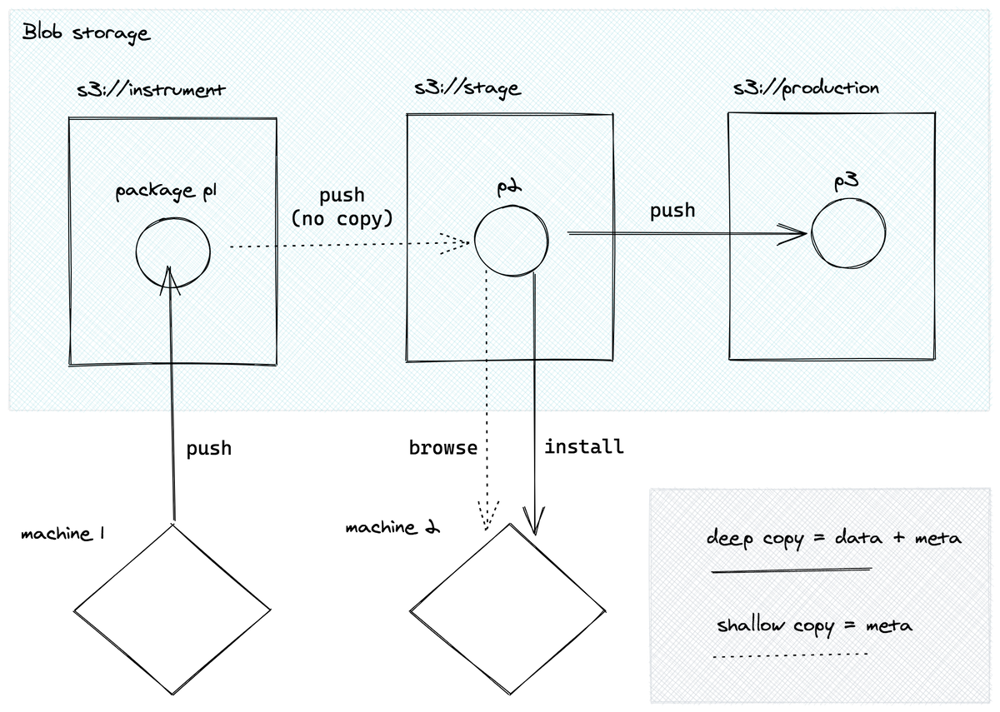

# Mental model for a Quilt package

Quilt represents datasets as *packages*. A package is an immutable collection of
related files with a handle of the form `AUTHOR/DESCRIPTION`, a cryptographic
*top-hash* (or hash of hashes) that uniquely identifies package contents,
and a backing *manifest*.

The manifest is serialized as file that contains *entries*.
Manifest entries are tuples of the following form:

`(LOGICAL_KEY, PHYSICAL_KEYS, HASH, METADATA)`

*Logical keys* are user-facing friendly names, like `"README.md"`.
*Physical keys* are fully qualified paths to bytes on disk, or bytes in S3.
A *hash* is a digest of the physical key's contents, usually SHA-256.
*Metadata* are a dictionary that may contain user-defined keys for metadata
like bounding boxes, labels, or provenance information
(e.g. {"algorithm_version": "4.4.1"} to indicate how a given file was created).

Package manifests are stored in *registries*.
Quilt supports both local disk and Amazon S3 buckets as registry.
A registry may store manifests as well as the primary data.
S3 was chosen for its widespread adoption, first-class versioning support,
and cost/performance profile.
The Quilt roadmap includes plans to support more storage formats in the future
(e.g. GCP, Azure, NAS, etc.).

By way of illustration first entry of a package manifest for the COCO machine learning
dataset are shown below.

```json
{
    "logical_key": "annotations/captions_train2017.json",
    "physical_keys":
    ["s3://quilt-ml-data/data/raw/annotations/captions_train2017.json?versionId=UtzkAN8FP4irtroeN9bfYP1yKzX7ko3G"],
    "size": 91865115,
    "hash": {
    "type": "SHA256",
    "value":
    "4b62086319480e0739ef390d04084515defb9c213ff13605a036061e33314317"},
    "meta": {}
}
```

## Buckets are branches

In Quilt, S3 buckets are analogous to branches in git. Each bucket is a self-contained
registry for one or more packages. As package data and schemas are refined, you
can promote a package to a new bucket to signify its increased data quality.

We generally recommend a minimum of three buckets for the data lifecycle:
* Raw
* Stage
* Production




See [Quilt workflows](advanced-features/workflows.md) for more on how you can
control data quality with schemas.
