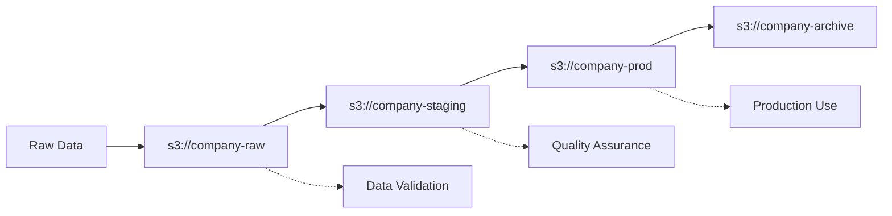

<!-- markdownlint-disable -->
# Understanding Quilt: Core Concepts and Mental Model

This guide explains the fundamental concepts behind Quilt's data management system. Think of it as your roadmap to understanding how Quilt organizes, versions, and manages data.

## 🎯 The Big Picture

Quilt treats data like code - with versioning, immutability, and collaboration built-in. Instead of managing individual files scattered across storage systems, you work with **packages** that bundle related data together with metadata and provenance.

```
Traditional Approach          →    Quilt Approach
├── file1.csv                      📦 myteam/customer-data
├── file2.json                     ├── 📄 customers.csv
├── file3.parquet                  ├── 📄 transactions.json  
└── README.txt                     ├── 📄 analytics.parquet
                                   ├── 📄 README.md
                                   └── 🏷️  metadata + version hash
```

## 📦 Core Concept: Packages

### What is a Package?

A **package** is Quilt's fundamental unit of data organization. Think of it as a versioned, immutable collection of related files with a clear identity and history.

**Key Properties:**
- **Immutable**: Once created, package contents never change
- **Versioned**: Each change creates a new version with a unique hash
- **Named**: Human-readable names like `myteam/customer-analytics`
- **Tracked**: Complete history and provenance of all changes

### Package Anatomy

Every package consists of:

```
📦 Package: myteam/customer-data
├── 🏷️  Name: "myteam/customer-data"
├── 🔐 Hash: "a1b2c3d4..." (unique version identifier)
├── 📋 Manifest: (maps logical → physical locations)
├── 📁 Files:
│   ├── customers.csv
│   ├── transactions.json
│   └── README.md
└── 📊 Metadata: {"description": "Q3 customer analysis", "version": "2.1"}
```

### Real-World Example

```python
import quilt3

# Load a package (using public example)
pkg = quilt3.Package.browse("examples/hurdat", "s3://quilt-example")

# Package info
print(f"Package hash: {pkg.top_hash}")     # Unique version identifier
print(f"Files: {len(pkg)}")                # Number of files in package

# List available files
for key in pkg:
    print(f"File: {key}")
```

## 🗂️ The Manifest System

### Understanding Manifests

The **manifest** is Quilt's "table of contents" - it maps user-friendly names to actual file locations and includes integrity information.

**Manifest Entry Structure:**
```
(LOGICAL_KEY, PHYSICAL_KEYS, HASH, METADATA)
```

### Logical vs Physical Keys

| Aspect | Logical Key | Physical Key |
|--------|-------------|--------------|
| **Purpose** | User-friendly name | Actual storage location |
| **Example** | `"data/customers.csv"` | `"s3://bucket/a1b2c3/customers.csv?versionId=xyz"` |
| **Stability** | Stable across versions | Changes with storage |
| **Usage** | Code references | Internal system use |

### Example Manifest Entry

```json
{
    "logical_key": "data/customers.csv",
    "physical_keys": [
        "s3://company-data/datasets/customers_v2.csv?versionId=abc123"
    ],
    "size": 1048576,
    "hash": {
        "type": "SHA256",
        "value": "e3b0c44298fc1c149afbf4c8996fb92427ae41e4649b934ca495991b7852b855"
    },
    "meta": {
        "schema_version": "2.1",
        "last_updated": "2024-08-26",
        "data_quality": "validated"
    }
}
```

**Why This Matters:**
- ✅ **Portability**: Move data between storage systems without breaking code
- ✅ **Integrity**: Cryptographic hashes ensure data hasn't been corrupted
- ✅ **Metadata**: Rich context about each file's purpose and properties
- ✅ **Versioning**: Track exactly what changed between package versions

## 🏢 Registries: Where Packages Live

### Registry Concept

A **registry** is where Quilt stores package manifests and optionally the data itself. Think of it as a "database" of packages.

**Supported Registry Types:**
- 🌐 **S3 Buckets**: Cloud-native, scalable, with built-in versioning
- 💻 **Local Disk**: For development and testing
- 🔮 **Future**: GCP, Azure, NAS (on roadmap)

### Registry Examples

```python
import quilt3

# Different registry types
local_packages = quilt3.list_packages()                    # Local registry
cloud_packages = quilt3.list_packages("s3://my-bucket")   # S3 registry
public_data = quilt3.list_packages("s3://quilt-example")  # Public registry
```

## 🌊 Buckets as Branches

### The Git Analogy

In Quilt, **S3 buckets function like Git branches** - each represents a different stage or environment in your data lifecycle.

```
Git Workflow              →    Quilt Workflow
├── feature-branch             ├── s3://dev-bucket
├── develop                    ├── s3://staging-bucket  
├── staging                    ├── s3://prod-bucket
└── main                       └── s3://archive-bucket
```

### Recommended Bucket Strategy


```mermaid
graph LR
    A[Raw Data] --> B[s3://company-raw]
    B --> C[s3://company-staging] 
    C --> D[s3://company-prod]
    D --> E[s3://company-archive]
    
    B -.-> F[Data Validation]
    C -.-> G[Quality Assurance]
    D -.-> H[Production Use]
```

**Three-Bucket Minimum:**

1. **🔴 Raw Bucket** (`s3://company-raw`)
   - Ingested data, minimal processing
   - Experimental datasets
   - Temporary analysis results

2. **🟡 Staging Bucket** (`s3://company-staging`)
   - Validated and cleaned data
   - Ready for testing and QA
   - Pre-production datasets

3. **🟢 Production Bucket** (`s3://company-prod`)
   - Fully validated, production-ready data
   - Used by live applications and dashboards
   - Strict access controls and governance

### Package Promotion Workflow

<!-- pytest.mark.skip -->
```python
# Promote a package through environments
import quilt3

# 1. Start in raw environment
raw_pkg = quilt3.Package()
raw_pkg.set("data.csv", "raw_data.csv")
raw_pkg.push("myteam/dataset", registry="s3://company-raw")

# 2. Validate and promote to staging
staging_pkg = quilt3.Package.browse("myteam/dataset", registry="s3://company-raw")
# ... perform validation ...
staging_pkg.push("myteam/dataset", registry="s3://company-staging")

# 3. Final promotion to production
prod_pkg = quilt3.Package.browse("myteam/dataset", registry="s3://company-staging")
# ... final checks ...
prod_pkg.push("myteam/dataset", registry="s3://company-prod")
```

## 🔄 Immutability and Versioning

### Why Immutability Matters

**Immutable packages** mean that once created, a package version never changes. This provides:

- ✅ **Reproducibility**: Analyses can be exactly repeated
- ✅ **Audit Trail**: Complete history of all changes
- ✅ **Rollback Safety**: Easy to revert to previous versions
- ✅ **Parallel Work**: Teams can work simultaneously without conflicts

### Version Management

```python
# Working with package versions
import quilt3

# Get latest version (using public example)
latest = quilt3.Package.browse("examples/hurdat", "s3://quilt-example")
print(f"Latest hash: {latest.top_hash}")

# Get specific version
specific = quilt3.Package.browse("examples/hurdat", "s3://quilt-example", top_hash=latest.top_hash)
print(f"Specific version")

# Compare versions
if latest.top_hash == specific.top_hash:
    print("Same version")
```

### How a Revision Pins S3 Object Versions

Package immutability rests on S3 object versioning. When you push to a bucket
that has versioning enabled, Quilt records each object's S3 `VersionId` in the
manifest alongside the logical key — that is the `?versionId=` suffix on the
physical keys shown under [Logical vs Physical Keys](#logical-vs-physical-keys).

The two levels of versioning do different jobs:

| Level | Unit | Identifier | Answers |
|-------|------|------------|---------|
| **S3 object version** | One object | `VersionId` | "What did this file contain at that point?" |
| **Quilt revision** | A whole collection | `top_hash` | "Which set of file versions made up this dataset?" |

A revision is therefore a *pinned set* of object versions. Overwriting an object
in S3 creates a new `VersionId` and leaves earlier ones in place, so a revision
pushed before the overwrite keeps resolving the bytes it was built from. This is
what makes a `top_hash` reproducible rather than merely a label.

It is strongly recommended — though not required — that you enable object
versioning on buckets you push packages to. Pushes to an unversioned bucket
succeed, and `Package.set()` / `Package.set_dir()` accept `unversioned=True` to
skip recording `VersionId` even on a versioned bucket. See the
[caveat below](#caveat-unversioned-buckets) for what you give up.

#### Overwriting objects under a revision

This is the case that surprises people: files are updated in place, yet an older
revision still resolves the old data.

<!-- pytest.mark.skip -->
```python
import quilt3

# 1. Publish a revision from objects in a versioned bucket
pkg = quilt3.Package()
pkg.set_dir("raw/", "s3://company-raw/incoming/")
first = pkg.push("myteam/dataset", registry="s3://company-prod")
first_hash = first.top_hash

# 2. Overwrite the same S3 keys in place (aws s3 sync, a pipeline, the Catalog).
#    Each overwrite mints a new VersionId; earlier versions remain.

# 3. Publish a second revision over the new object versions
updated = quilt3.Package()
updated.set_dir("raw/", "s3://company-raw/incoming/")
second = updated.push("myteam/dataset", registry="s3://company-prod")

# 4. The first revision still resolves the versions it pinned
old = quilt3.Package.browse("myteam/dataset", "s3://company-prod", top_hash=first_hash)
for logical_key, entry in old.walk():
    print(logical_key, entry.physical_key)  # ...?versionId=<pinned at step 1>

assert second.top_hash != first_hash
```

Step 4 is the payoff: the physical keys carry the `versionId` captured at step 1,
not the current contents of the bucket. Incremental updates and reproducibility
coexist — new revisions move forward while old ones stay readable.

#### Caveat: unversioned buckets

On a bucket without versioning there is no `VersionId` to pin, so the manifest
records a bare `s3://bucket/key` physical key. An overwrite replaces those bytes
permanently and every revision pointing at that key — including revisions pushed
long before — now resolves the new contents. The `top_hash` still describes what
the package contained at push time, so a hash check will fail, but the original
data is gone.

The same asymmetry shows up in the Catalog: on versioning-enabled buckets a
delete adds a delete marker and prior versions remain available from packages,
while on unversioned buckets the object is permanently removed (see
[File Browser](Catalog/FileBrowser.md#uploading-and-deleting-files)).

Passing `unversioned=True` to `Package.set()` or `Package.set_dir()` has the same
effect on a versioned bucket: those entries lose the pin, and with it the
reproducibility guarantee.

## 🎯 Practical Mental Model

### Think of Quilt Like...

| If you're familiar with... | Think of Quilt as... |
|----------------------------|----------------------|
| **Git** | Git for data - versioning, branching (buckets), immutable commits (packages) |
| **Docker** | Container images for data - immutable, portable, with manifests |
| **Package Managers** | npm/pip for datasets - named packages, versions, dependencies |
| **Databases** | Schema-aware data warehouse with built-in versioning and lineage |

### Key Principles to Remember

1. **📦 Package-Centric**: Always think in terms of related collections, not individual files
2. **🔒 Immutable**: Versions never change - create new versions instead of modifying
3. **🏷️ Named & Hashed**: Every package has a human name and cryptographic identity
4. **🌊 Bucket Workflows**: Use different buckets for different data lifecycle stages
5. **📋 Manifest-Driven**: Logical names abstract away physical storage details

## 🚀 Next Steps

Now that you understand Quilt's mental model:

1. **Try It**: Follow the [Quick Start](Quickstart.md) to create your first package
2. **Learn Workflows**: Explore [package workflows](walkthrough/uploading-a-package.md)
3. **Set Up Team Access**: Configure [team access and roles](Catalog/Admin.md)
4. **Advanced Topics**: Learn about [schemas and validation](advanced-features/workflows.md)

---

**Remember**: Quilt transforms chaotic data management into organized, versioned, collaborative workflows. The mental model is simple - treat your data like code, and Quilt handles the complexity!
