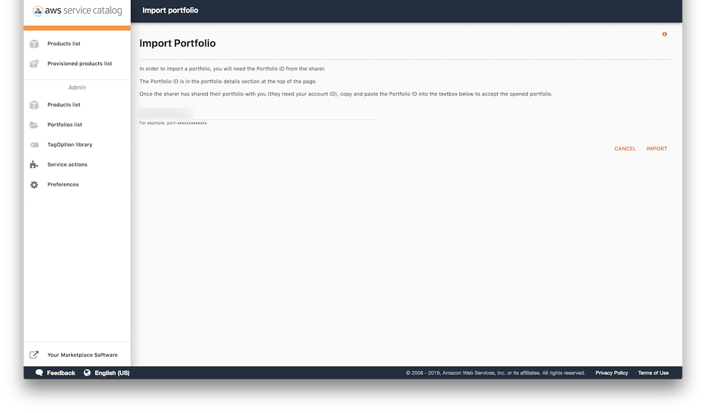
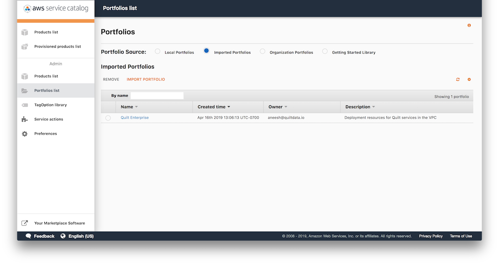
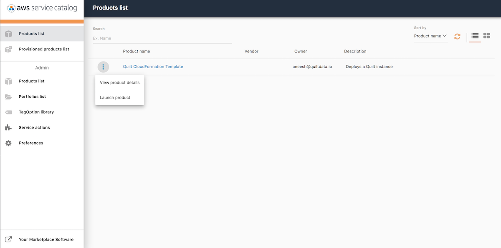
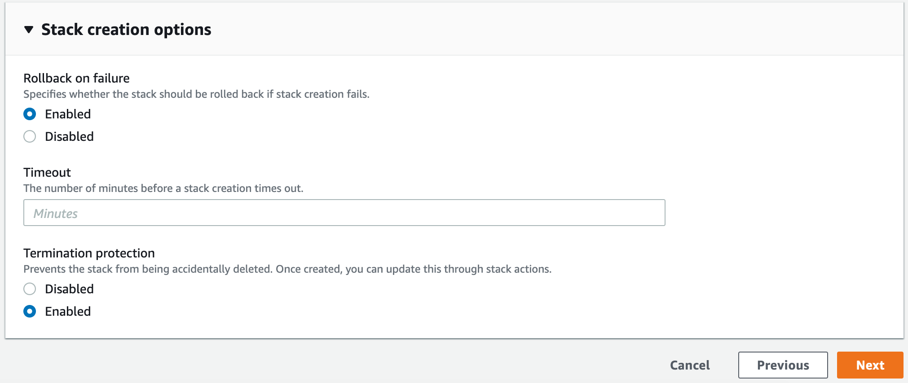
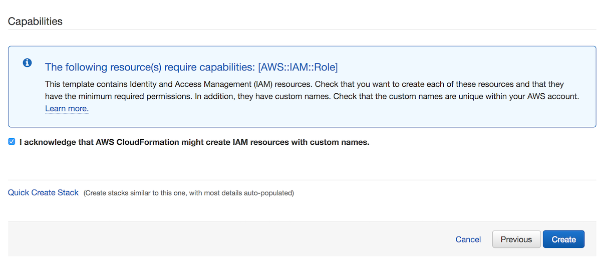

## Deploy a private Quilt instance on AWS

Quilt is a data collaboration platform. A Quilt _instance_ is a private hub that
runs in your virtual private cloud (VPC).
Each instance consists of a password-protected web catalog on your domain,
backend services, a secure server to manage user identities, and a Python API.

The following instructions use AWS CloudFormation to deploy a private Quilt instance
in your AWS account.


## Before you install Quilt

You will need the following:

1. **An AWS account**

1. **IAM Permissions** to run the CloudFormation template (or Add products in
Service Catalog).
The `AdministratorAccess` policy is sufficient. (Quilt creates and manages a
VPC, containers, S3 buckets, a database, and more.)
If you wish to create a service role for the installation, visit
`IAM > Roles > Create Role > AWS service > CloudFormation` in the AWS console.
The following service role is equivalent to `AdministratorAccess`:
    ```json
    {
        "Version": "2012-10-17",
        "Statement": [
            {
                "Effect": "Allow",
                "Action": "*",
                "Resource": "*"
            }
        ]
    }
    ```

1. The **ability to create DNS entries**, such as CNAME records,
for your company's domain.

1. **An SSL certificate in the us-east-1 region** to secure the domain where
your users will access your Quilt instance. For example,
to make your Quilt catalog available at `https://quilt.mycompany.com`,
you require a certificate for `*.mycompany.com` in the [AWS Certificate Manager](https://aws.amazon.com/certificate-manager/).
You may either [create a new certificate](https://docs.aws.amazon.com/acm/latest/userguide/gs-acm-request-public.html), or
[import an existing certificate](https://docs.aws.amazon.com/acm/latest/userguide/import-certificate.html).

1. **An SSL certificate in the same region as your Quilt instance**, for
the elastic load balancer of the Quilt server. See the above for details.

1. For maximum security, Quilt requires **a region that supports [AWS Fargate](https://aws.amazon.com/about-aws/global-infrastructure/regional-product-services/)**. As of this writing, all U.S. regions support Fargate.

1. **An S3 Bucket** for your team data. This may be a new or existing bucket.
The bucket should not have any notifications attached to it
(S3 Console > Bucket > Properties > Events).
Quilt will need to install its own notifications.
Installing Quilt will modify the following Bucket characteristics:
    * Permissions > CORS configuration (will be modified for secure web access)
    * Properties > Versioning (will be enabled)
    * Properties > Object-level logging (will be enabled)
    * Properties > Events (will add one notification)
    
1. If you are not using AWS Marketplace, you require **a license key**.
Email [contact@quiltdata.io](mailto:contact@quiltdata.io), with the subodomain that you wish to access Quilt on
(e.g. https://quilt.example.com) to obtain a license key.

1. An **subdomain that is as yet not mapped in DNS** where users will access Quilt on the web. For example `quilt.mycompany.com`.

1. Available **CloudTrail Trails** in the region where you wish to host your stack
([learn more](https://docs.aws.amazon.com/awscloudtrail/latest/userguide/WhatIsCloudTrail-Limits.html)).

### AWS Service Catalog

1. Email [contact@quiltdata.io](mailto:contact@quiltdata.io)
with your AWS account ID to request access to Quilt through the 
AWS Service Catalog.

1. Click the service catalog link that you received from Quilt. Arrive at the Service Catalog.
Click IMPORT, lower right.

    

1. Navigate to Admin > Portfolios list > Imported Portfolios. Click Quilt Enterprise.

    

1. On the Portfolio details page, click ADD USER, GROUP OR ROLE. Add any users,
**including yourself**, whom you would like to be able to install Quilt.

    

1. Click Products list, upper left. Click the menu to the left of Quilt CloudFormation
Template. Click Launch product. (In the future, use the same menu to upgrade
Quilt when a new version is released.)

    

1. Continue to the [CloudFormation](#CloudFormation) section.
Note: the following screenshots may differ slightly fromm what
you see in Service Catalog.

### CloudFormation

1. Specify stack details in the form of a stack _name_ and CloudFormation
_parameters_. Refer to the descriptions displayed above each
text box for further details. Service Catalog users require a license key. See
[Before you install Quilt](#before-you-install-quilt) for how to obtain a license key.

    

1. Serivce Catalog users, skip this step. On the Options screen that follows, go to the Advanced > Termination Protection and click Enable.

    

    This protects the stack from accidental deletion. Click Next.

1. Serivce Catalog users, skip this step. Check the box asking you to acknowledge that CloudFormation may create IAM roles, then click Create.

    

1. CloudFormation takes about 30 minutes to create the resources
for your stack. You may monitor progress under Events.
Once the stack is complete, you will see `CREATE_COMPLETE` as the Status for
your CloudFormation stack.

    

1. To finish the installation, you will want to view the stack Outputs.

    

    In a separate browser window, open the DNS settings for your domain.
    Create the following two `CNAME` records. **Replace italics** with the
    corresponding stack Outputs.

    | CNAME | Value |
    |------|-------|
    | _QuiltWebHost_  | _CloudfrontDomain_ | 
    | _RegistryHostName_  | _LoadBalancerDNSName_ | 

1. Quilt is now up and running. You can click on the _QuiltWebHost_ value
in Outputs and log in with your administrator password to invite users.

____________________

## Known limitations

* Supports a single bucket
* Search is only enabled for *new objects* added to the bucket after Quilt is installed.

## Advanced configuration

The default Quilt settings are adequate for most use cases. The following section
covers advanced customization options.

### Bucket search

#### Custom file indexing

This section describes how to configure which files are searchable in the catalog.

By default, Quilt uses the following configuraiton:

```json
{
    "to_index": [
        ".ipynb",
        ".md",
        ".rmd"
    ]
}
```

To customize which file types are indexed, add a `.quilt/config.json` file to your S3 bucket. `.quilt/config.json` is referenced every time a new object lands in the parent bucket. For example, if you wished to index all `.txt` files (in addition the Quilt defaults), you'd upload the following to `.quilt/config.json`:
```json
{
    "to_index": [
        ".ipynb",
        ".md",
        ".rmd",
        ".txt"
    ]
}
```
It is highly recommended that you continue to index all of the default files, so that users can get the most out of search. center/elasticsearch-scale-up/).

#### Search limitations

* Queries containing the tilde (~), forward slash (/), back slash, and angle bracket ({, }, (, ), [, ]) must be quoted. For example search for `'~foo'`, not `~foo`.
* The search index will only pick up objects written to S3 _after_ T4 was enabled on that bucket.
* Files over 10 MB in size may cause search to fail.
* Indexing large or numerous files may require you to [scale up your search domain](https://aws.amazon.com/premiumsupport/knowledge-

#### Publicly accessible search

By default, Quilt bucket search is only available to authorized Quilt users and is scoped to a single S3 bucket. Search users can see extensive metadata on the objects in your Quilt bucket. Therefore _be cautious when modifying search permissions_.

This section describes how to make your search endpoint available to anyone with valid AWS credentials.

Go to your AWS Console. Under the `Services` dropdown at the top of the screen, choose `Elasticsearch Service`. Select the domain corresponding to your T4 stack.

Note the value of the `Domain ARN` for your search domain.

In the row of buttons at the top of the pane, select `Modify Access Policy`. Add two statements to the Statement array:

```json
{
  "Effect": "Allow",
    "Principal": {
      "AWS": "*"
    },
    "Action": "es:ESHttpGet",
    "Resource": "$YOUR_SEARCH_DOMAIN_ARN/*"
},
{
  "Effect": "Allow",
  "Principal": {
    "AWS": "*"
  },
  "Action": "es:ESHttpPost",
  "Resource": "$YOUR_SEARCH_DOMAIN_ARN/drive/_doc/_search*"
}
```

Select `Submit` and your search domain should now be open to the public.

### Federations and bucket config

In this section we will discuss how you can configure your catalog instance using _federations_ and _bucket config_.

When you create your T4 stack, you specify a *ConfigBucketName* in your stack parameters. This bucket will be created and populated with two files -- `config.json` and `federation.json`. `config.json` is the main navigator config file, and contains things that are specific to your navigator, like `defaultBucket` and `signInRedirect`. It also includes one or more references to federations, including your `federation.json`. `federation.json` is your default federation. It includes an inline bucket config for your T4 bucket.

A **federation** is just a list of bucket configurations. Your catalog will specify one or more federations from which it sources its bucket configs. Federations are a convenient way to manage collections of buckets that are useful in groups, like all the T4 buckets owned by a specific group or all public T4 buckets pertaining to a certain field. Each bucket configuration in a federation can be either a hyperlink (possibly relative) to a JSON file containing the bucket config, or an object containing the bucket config itself. 

An example:

```json
{
  "buckets": [
    {
      "... inline bucket config ..."
    },
    "link/to/bucket/config.json",
    "..."
  ]
}
```

A **bucket config**, meanwhile, is a JSON object that describes metadata associated with a T4 bucket. It is of the following form:

```json
{
  "name": "name of s3 bucket",
  "title": "friendly title to be displayed in the catalog drop-down",
  "icon": "square icon to be displayed in the catalog drop-down",
  "description": "short description of the bucket to be displayed in the catalog drop-down",
  "searchEndpoint": "url of the search endpoint for your T4 bucket"
}
```

A bucket config can be included inline in a federation, or it can be a standalone JSON file that is linked from a federation.

### Preparing an AWS Role for use with T4

These instructions document how to set up an existing role for use with T4. If the role you want to use doesn't exist yet, create it now.

Go to your T4 stack in CloudFormation. Go to `Outputs`, then find `RegistryRoleARN` and copy its value. It should look something like this: `arn:aws:iam::000000000000:role/stackname-ecsTaskExecutionRole`.

Go to the IAM console and navigate to `Roles`. Select the role you want to use. Go to the `Trust Relationships` tab for the role, and select `Edit Trust Relationship`. The statement might look something like this:

```json
{
  "Version": "2012-10-17",
  "Statement": [
    "... one or more statements"
  ]
}
```

Add an object to the beginning of the Statement array with the following contents:

```json
{
  "Effect": "Allow",
  "Principal": {
    "AWS": "$YOUR_REGISTRY_ROLE_ARN"
  },
  "Action": "sts:AssumeRole"
},
```

Note the comma after the object. Your trust relationship should now look something like this:

```json
{
  "Version": "2012-10-17",
  "Statement": [
    {
      "Effect": "Allow",
      "Principal": {
        "AWS": "$YOUR_REGISTRY_ROLE_ARN"
      },
      "Action": "sts:AssumeRole"
    },
    "... whatever was here before"
  ]
}
```

You can now configure a Quilt Role with this role (using the Catalog's admin panel, or `t4.admin.create_role`).
