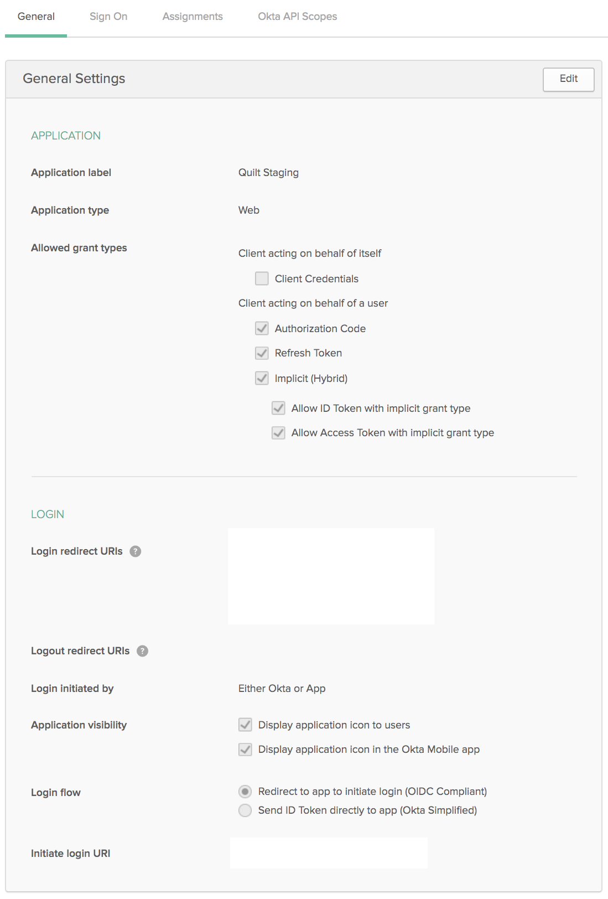

# Run Quilt in Your AWS Account

Quilt is a versioned data portal for AWS.
A Quilt _instance_ is a private portal that runs in your virtual private cloud (VPC).
Each instance consists of a password-protected web catalog on your domain,
backend services, a secure server to manage user identities, and a Python API.

## Installation Instructions

We encourage users to contact us before deploying Quilt.
We will make sure that you have the latest version of Quilt,
and walk you through the CloudFormation deployment.

We recommend that all users do one or more of the following:
* [Schedule a Quilt engineer](https://www.meetingbird.com/m/quilt-install)
to guide you through the installation

* [Join Quilt on Slack](https://slack.quiltdata.com/) to ask questions and
connect with other users

* [Email Quilt](mailto://contact@quiltdata.io)

## Before you install Quilt

You will need the following:

1. **An AWS account**

1. **IAM Permissions** to run the CloudFormation template (or Add products in
Service Catalog).
The `AdministratorAccess` policy is sufficient. (Quilt creates and manages a
VPC, containers, S3 buckets, a database, and more.)
If you wish to create a service role for the installation, visit
`IAM > Roles > Create Role > AWS service > CloudFormation` in the AWS console.
The following service role is equivalent to `AdministratorAccess`:
    ```json
    {
        "Version": "2012-10-17",
        "Statement": [
            {
                "Effect": "Allow",
                "Action": "*",
                "Resource": "*"
            }
        ]
    }
    ```

1. The **ability to create DNS entries**, such as CNAME records,
for your company's domain.

1. **An SSL certificate in the same region as your Quilt instance** to secure the domain where your users will access your Quilt instance.
For example, to make your Quilt catalog available at `https://quilt.mycompany.com`,
you require a certificate for either `*.mycompany.com` *or* for the following 3 domains:
`quilt.mycompany.com`, `quilt-registry.mycompany.com` and `quilt-s3-proxy.mycompany.com`
in the [AWS Certificate Manager](https://aws.amazon.com/certificate-manager/). 
You may either [create a new certificate](https://docs.aws.amazon.com/acm/latest/userguide/gs-acm-request-public.html), or
[import an existing certificate](https://docs.aws.amazon.com/acm/latest/userguide/import-certificate.html).
The ARN for this certificate or set of certificates is required for use as the `CertificateArnELB` CloudFormation parameter.

1. For maximum security, Quilt requires **a region that supports [AWS Fargate](https://aws.amazon.com/about-aws/global-infrastructure/regional-product-services/)**. As of this writing, all U.S. regions support Fargate.

1. **An S3 Bucket** for your team data. This may be a new or existing bucket.
The bucket should not have any notifications attached to it
(S3 Console > Bucket > Properties > Events).
Quilt will need to install its own notifications.
Installing Quilt will modify the following Bucket characteristics:
    * Permissions > CORS configuration (will be modified for secure web access)
    * Properties > Object-level logging (will be enabled)
    * Properties > Events (will add one notification)

Buckets in Quilt may choose to enable versioning or disable versioning, but it
is recommended that you avoid enabling versioning followed by disabling versioning
as this can cause bugs in the object statistics for the bucket, shown in the Quilt
catalog, due to inconsistent semantics of `ObjectRemoved:DeleteMarkerCreated`.

1. A **subdomain that is as yet not mapped in DNS** where users will access Quilt on the web. For example `quilt.mycompany.com`.

1. Available **CloudTrail Trails** in the region where you wish to host your stack
([learn more](https://docs.aws.amazon.com/awscloudtrail/latest/userguide/WhatIsCloudTrail-Limits.html)).

1. An active subscription to Quilt Business on AWS Marketplace. Click `Continue to Subscribe` on the [Quilt Business Listing](https://aws.amazon.com/marketplace/pp/B07QF1VXFQ) to subscribe then return to this page for installation instructions. **The CloudFormation template and instructions on AWS Marketplace are infrequently updated and may be missing critical bugfixes.**

### AWS Marketplace

You can install Quilt via AWS Marketplace. As indicated above, we recommend that you [contact us first](#installation-instructions).


### AWS Service Catalog

1. Email [contact@quiltdata.io](mailto:contact@quiltdata.io)
with your AWS account ID to request access to Quilt through the 
AWS Service Catalog and to obtain a license key.

1. Click the service catalog link that you received from Quilt. Arrive at the Service Catalog.
Click IMPORT, lower right.

    

1. Navigate to Admin > Portfolios list > Imported Portfolios. Click Quilt Enterprise.

    

1. On the Portfolio details page, click ADD USER, GROUP OR ROLE. Add any users,
**including yourself**, whom you would like to be able to install Quilt.

    

1. Click Products list, upper left. Click the menu to the left of Quilt CloudFormation
Template. Click Launch product. (In the future, use the same menu to upgrade
Quilt when a new version is released.)

    

1. Continue to the [CloudFormation](#CloudFormation) section.
Note: the following screenshots may differ slightly fromm what
you see in Service Catalog.

### CloudFormation

1. Specify stack details in the form of a stack _name_ and CloudFormation
_parameters_. Refer to the descriptions displayed above each
text box for further details. Service Catalog users require a license key. See
[Before you install Quilt](#before-you-install-quilt) for how to obtain a license key.

    

    If you wish to use a service role, specify it as follows:

    


1. Service Catalog users, skip this step. Under Stack creation options, enable termination protection.

    

    This protects the stack from accidental deletion. Click Next.

1. Service Catalog users, skip this step. Check the box asking you to acknowledge that CloudFormation may create IAM roles, then click Create.

    

1. CloudFormation takes about 30 minutes to create the resources
for your stack. You may monitor progress under Events.
Once the stack is complete, you will see `CREATE_COMPLETE` as the Status for
your CloudFormation stack.

    

1. To finish the installation, you will want to view the stack Outputs.

    

    In a separate browser window, open the DNS settings for your domain.
    Create the following `CNAME` records. **Replace italics** with the
    corresponding stack Outputs.

    | CNAME | Value |
    |------|-------|
    | _QuiltWebHost Key_  | _LoadBalancerDNSName_ | 
    | _RegistryHostName Key_  | _LoadBalancerDNSName_ |
    | _S3ProxyHost Key_  | _LoadBalancerDNSName_ | 

1. Quilt is now up and running. You can click on the _QuiltWebHost_ value
in Outputs and log in with your administrator password to invite users.

## Advanced configuration

The default Quilt settings are adequate for most use cases. The following section
covers advanced customization options.

### Single sign-on (SSO)

#### Google

You can enable users on your Google domain to sign in to Quilt.
Refer to [Google's instructions on OAuth2 user agents](https://developers.google.com/identity/protocols/OAuth2UserAgent)
and create authorization credentials to identify your Quilt stack to Google's OAuth 2.0 server.


In the template menu (CloudFormation or Service Catalog), select Google under *User authentication to Quilt*. Enter the domain or domains of your Google apps account under *SingleSignOnDomains*. Enter the *Client ID* of the OAuth 2.0 credentials you created into the field labeled *GoogleClientId*


#### Okta

1. Go to Okta > Admin > Applications
1. Click `Add Application`
1. Select type `Web` 
1. Name the app `Quilt` or something similar
1. Configure the app as shown below
1. Add `<QuiltWebHost>` to `Login redirect URIs` and
`Initiate login URI`
1. Copy the `Client ID` to a safe place
1. Go to API > Authorization servers
1. You should see a default URI that looks something like this
`https://<MY_COMPANY>.okta.com/oauth2/default`; copy it to a
safe place
1. Proceed to [Enabling SSO](#enabling-sso-in-cloudformation)



#### OneLogin

1. Go to Administration : Applications > Custom Connectors
1. Click `New Connector`
    1. Name the connector *Quilt Connector* or something similar
    1. Set `Sign on method` to `OpenID Connect`
    1. Set `Login URL` to `https://<QuiltWebHost>/oauth-callback`
    1. Save
1. Go back to Applications > Custom Connectors
1. Click `Add App to Connector`
1. Save the app (be sure to save it for the Organization)
1. Go to Applications > Applications > *Your new app* > SSO
    1. Click SSO. Copy the *Client ID* and *Issuer URL V2* to a safe place.
1. Add *Your new app* to the users who need to access
Quilt
1. Proceed to [Enabling SSO](#enabling-sso-in-cloudformation)


#### Enabling SSO in CloudFormation

Now you can connect Quilt to your SSO provider.
In the Quilt template
(AWS Console > CloudFormation > *Quilt stack* > Update >
Use current template > Next > Specify stack details), set the following parameters:

* *AuthType*: Enabled
* *AuthClientId*: *Client ID*
* *AuthBaseUrl*: *Issuer URL V2*

### Preparing an AWS Role for use with Quilt

These instructions document how to set up an existing role for use with Quilt. If the role you want to use doesn't exist yet, create it now.

Go to your Quilt stack in CloudFormation. Go to `Outputs`, then find `RegistryRoleARN` and copy its value. It should look something like this: `arn:aws:iam::000000000000:role/stackname-ecsTaskExecutionRole`.

Go to the IAM console and navigate to `Roles`. Select the role you want to use. Go to the `Trust Relationships` tab for the role, and select `Edit Trust Relationship`. The statement might look something like this:

```json
{
  "Version": "2012-10-17",
  "Statement": [
    "... one or more statements"
  ]
}
```

Add an object to the beginning of the Statement array with the following contents:

```json
{
  "Effect": "Allow",
  "Principal": {
    "AWS": "$YOUR_REGISTRY_ROLE_ARN"
  },
  "Action": "sts:AssumeRole"
},
```

Note the comma after the object. Your trust relationship should now look something like this:

```json
{
  "Version": "2012-10-17",
  "Statement": [
    {
      "Effect": "Allow",
      "Principal": {
        "AWS": "$YOUR_REGISTRY_ROLE_ARN"
      },
      "Action": "sts:AssumeRole"
    },
    "... whatever was here before"
  ]
}
```

You can now configure a Quilt Role with this role (using the Catalog's admin panel, or `quilt3.admin.create_role`).
