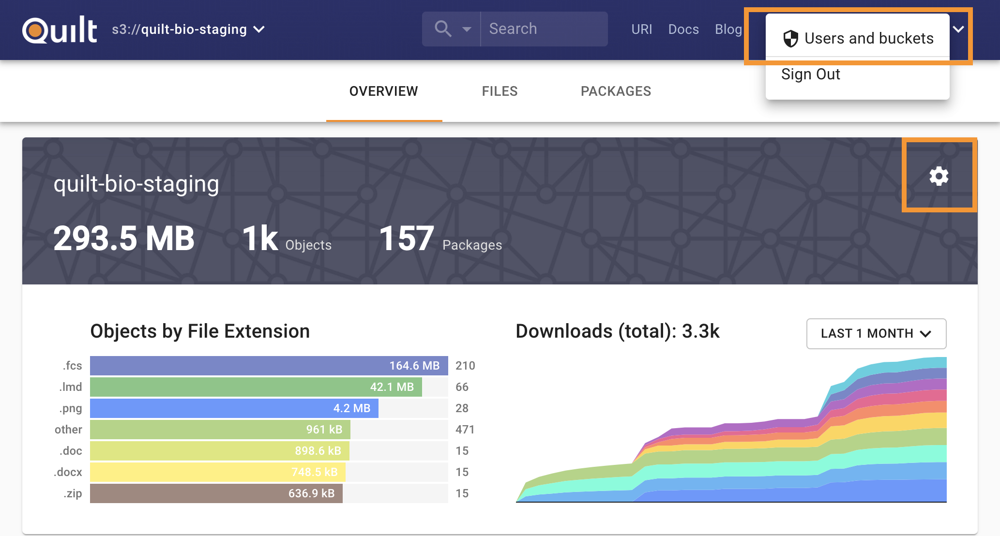

## Catalog Overview stats (objects, packages) seem incorrect or aren't updating
## Catalog Packages tab doesn't work
## Catalog packages or stats are missing or are not updating

If you recently added the bucket or upgraded the stack, if search volume is high,
or if the bucket is under rapid modification, wait a few minutes and try again.

### Re-index the bucket

1. Open the bucket in the Quilt catalog

1. Click the gear icon (upper right), or navigate to Users and buckets > Buckets
and open the bucket in question
    

1. Under "Indexing and notifications", click "Re-index and Repair". Optional:
if and only if bucket notifications were deleted or are not working,
check "Repair S3 notifications".

1. Wait a few minutes while bucket statistics and packages repopulate

### Diagnose issues with ElasticSearch

1. Go to CloudFormation > Stacks > YourQuiltStack > Resources
1. Search for "domain"
1. Click on the link for "Search" under "Physical ID"
1. You are now under ElasticSearch > Dashboards
1. Set the time range to include the period before and after when you noticed
any issues
1. Screenshot the dashboard stats for your domain
1. Click into your domain and then navigate to "Cluster health"
1. Screenshot Summary, Overall Health, and Key Performance Indicator sections
1. Send screenshots to [Quilt support](mailto:support@quiltdata.io).
1. It is not recommended that you adjust ElasticSearch via Edit domain, as these
changes will be lost the next time that you update Quilt
