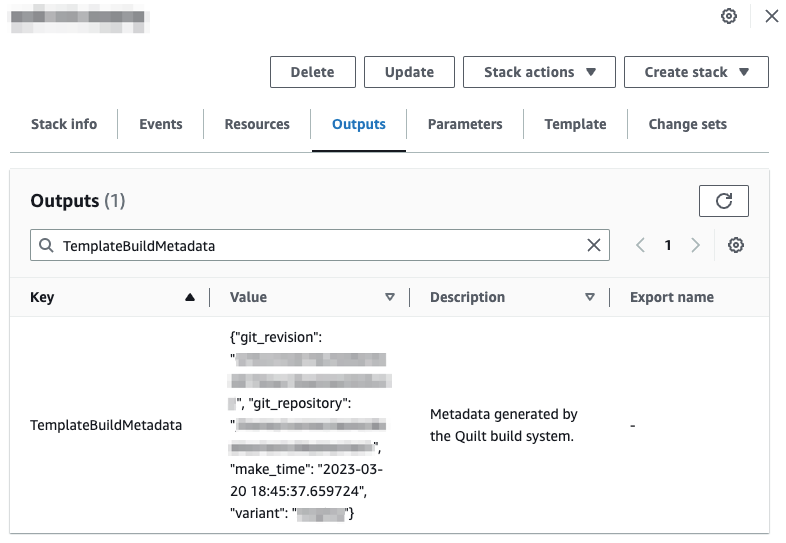
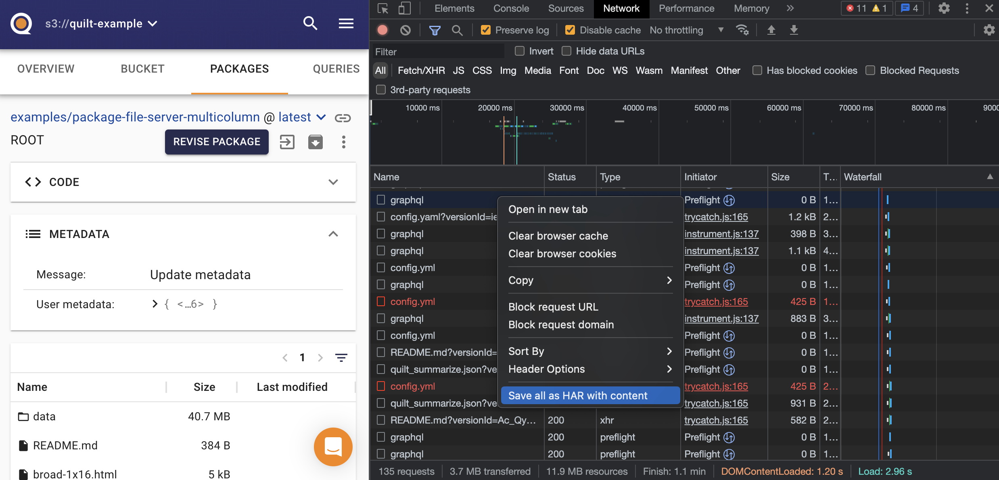

<!-- markdownlint-disable -->
## Catalog Overview stats (objects, packages) seem incorrect or aren't updating
## Catalog Packages tab doesn't work
## Catalog packages or stats are missing or are not updating

If you recently added the bucket or upgraded the stack, if search volume is high,
or if the bucket is under rapid modification, wait a few minutes and try again.

### Re-index the bucket

1. Open the bucket in the Quilt catalog

1. Click the gear icon (upper right), or navigate to Users and buckets > Buckets
and open the bucket in question
    

1. Under "Indexing and notifications", click "Re-index and Repair". Optional:
if and only if bucket notifications were deleted or are not working,
check "Repair S3 notifications".

1. Wait a few minutes while bucket statistics and packages repopulate

### Diagnose issues with ElasticSearch

1. Go to CloudFormation > Stacks > YourQuiltStack > Resources
1. Search for "domain"
1. Click on the link for "Search" under "Physical ID"
1. You are now under ElasticSearch > Dashboards
1. Set the time range to include the period before and after when you noticed
any issues
1. Screenshot the dashboard stats for your domain
1. Click into your domain and then navigate to "Cluster health"
1. Screenshot Summary, Overall Health, and Key Performance Indicator sections
1. Send screenshots to [Quilt support](mailto:support@quiltdata.io).
1. It is not recommended that you adjust ElasticSearch via Edit domain, as these
changes will be lost the next time that you update Quilt

## Missing metadata when working with Quilt packages via the API

> `Package.set_dir()` on the package root (".") overrides package-level metadata.
> If you do not provide `set_dir(".", foo, meta=baz)` with a value for `meta=`,
> `set_dir` will set package-level metadata to `None`.

A common pattern is to `Package.browse()` to get the most recent
version of a package, and then `Package.push()` updates.
You can preserve package-level metadata when calling `set_dir(".", ...)`
as follows:

<!--pytest.mark.skip-->
```python
import quilt3

p = quilt3.Package.browse(
    "user-packages/geodata", 
    registry="s3://bucket_1"
)

p.set_dir(
    ".",
    "s3://bucket_2/path/to/new/geofiles",
    meta=p.meta
)

# Push changes to the S3 registry
p.push(
    "user-packages/geodata",
    registry="s3://bucket_1",
    message="Updating package geodata source data"
)
```

- [Reference](https://docs.quiltdata.com/api-reference/package#package.set_dir).

## "Session expired" notice in the Catalog

There are two reasons for encountering the "Session expired" notice
after clicking the `RELOAD` button in the Quilt Catalog.

1. Your browser cache is out of date, in which case you need to:
    1. Delete session storage
    1. Delete local storage
    1. Delete cookies
1. Your Quilt user Role has been corrupted. You will need a Quilt Admin
user to reset your Quilt user Role to a default (**and valid**) Role.

If you accidentally broke the Role for your _only_ Quilt Admin user,
then you (or your AWS Cloud Administrator) need to:

1. Log in to your AWS account Console.
1. Go to the CloudFormation service and select your Quilt stack.
1. Click the `Update` button (top-right) to access the "Update stack" page
1. In "Prerequisite - Prepare template" select "Use current template". Click "Next".
1. In the "Specify stack details > Parameters > Administrator web credentials" section:
    1. Change the `AdminUsername` field to a new value **that has never been used before**.
    1. Change the `AdminEmail` field to a new email address **that
    has never been used before**. It may be helpful to use the `+`
    sign in the new email address, followed by any text - it will
    successfully deliver to your inbox. For example, `sarah+admin@...`
    will still be sent to `sarah@...`.
    1. Click "Next".
1. **(Optional & preferred)** In the "Configure stack options > Stack
failure options" section, specify `Roll back all stack resources`.
Click "Next".
1. In the "Review <stack-name> > Change set preview" section, verify
that any changes are not disruptive. For each resource the "Action"
field value will be `Modify` and the "Logical ID" field value will
be `Migration` for approximately four resources. Click the "Submit"
button.

After the deployment update is successfully completed, login to the
Catalog with the new administrator credentials. Create other Admin
users as needed.

### Additional support
To have your Quilt stack changeset reviewed by a Quilt support agent, or
if you have further questions, please email support@quiltdata.io
with the subject line "Quilt Admin user Role issue" and the body
containing screenshots of the proposed changeset.

## General stack update failure steps

On rare occasions, Quilt stack deployment updates might fail. This can happen for several
reasons. To expedite resolution of stack deployment issues, it's helpful to 
have the following data and output from the following [AWS CLI](https://aws.amazon.com/cli/) 
commands when contacting support@quiltdata.io.

1. Installed Quilt stack template metadata: This is located in the
CloudFormation Quilt stack Outputs tab with the Key `TemplateBuildMetadata`
and is a JSON object generated by the Quilt build system.



2. Quilt stack drift:

    `$ aws cloudformation describe-stack-resource-drifts --stack-name QUILT_STACK_NAME`

3. Recent events for the Quilt stack:

    `$ aws cloudformation describe-stack-events --stack-name QUILT_STACK_NAME`

## Collect logs to report a bug

To expedite the resolution of any errors encountered while using
Quilt, please capture the following logs and attach share them with Quilt support:

### Browser Network logs

1. Go to the affected page in your Quilt Catalog.
1. Open the browser Developer tools:
    - Google Chrome: Press **F12**, **Ctrl+Shift+I** or from the
    Chrome menu select **More tools > Developer tools**.
1. Select the **Network** tab.
1. Ensure the session is recorded:
    - Google Chrome: Check the red button in the upper left corner is set to **Record**.
1. Ensure **Preserve Log** is enabled.
1. Click the **Clear** button to clear out existing logs.
1. Perform the action that triggers the error (e.g. clicking the `Download package` button).
1. Export the logs as HAR format.
    - Google Chrome: **Ctrl + Click** anywhere on the grid of
    network requests and select **Save all as HAR with content**.
1. Save the HAR-formatted file to your localhost.
    

### Browser Console logs

1. Go to the affected page in your Quilt Catalog.
1. Open the browser Developer tools:
    - Google Chrome: Press **F12**, **Ctrl+Shift+I** or from the
    Chrome menu select **More tools > Developer tools**.
1. Select the **Console** tab.
1. Click the **Clear** button to clear out existing logs.
1. Perform the action that triggers the error (e.g. clicking the `Download package` button).
1. Export the logs.
    - Google Chrome: **Ctrl + Click** anywhere on the grid of
    network requests and select **Save as...**.
1. Save the log file to your localhost.

### Elastic Container Service (ECS) logs

1. Find the name of your Quilt stack from querying all deployed
stacks (in your default region, which is listed in your
`~/.aws/config` file):
    <!--pytest.mark.skip-->
    ```bash
    aws cloudformation list-stacks
    ```
1. Run the `aws logs` command to filter all Quilt ECS containers log entries for
the last 30 minutes (assumes Mac BSD `date` command syntax):
    <!--pytest.mark.skip-->
    ```bash
    aws logs filter-log-events \
        --log-group-name YOUR_QUILT_STACK_NAME
        --start-time "$(( $(date -u -v-30M +%s) * 1000 ))" \
        --end-time "$(( $(date -u +%s) * 1000 ))" > log-quilt-ecs-events.json
    ```
