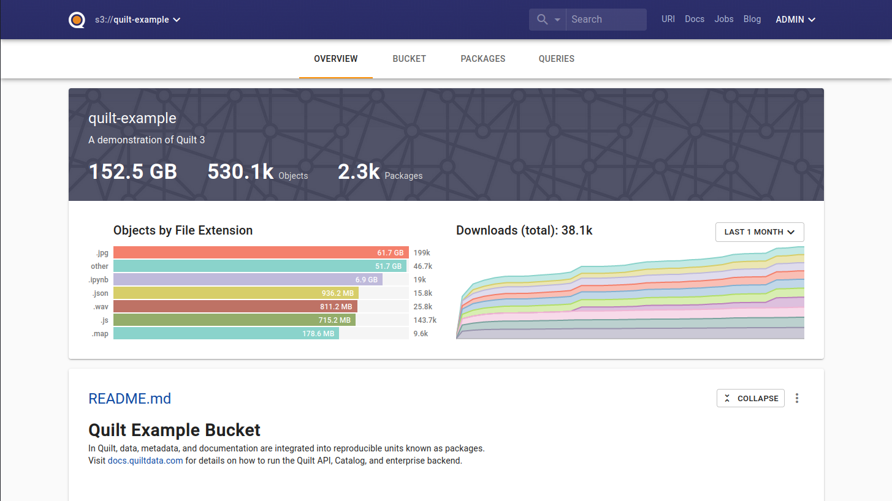
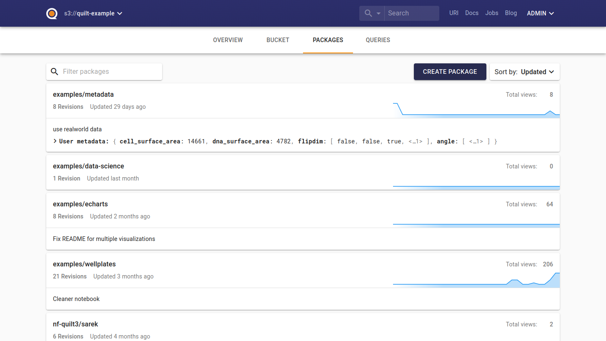
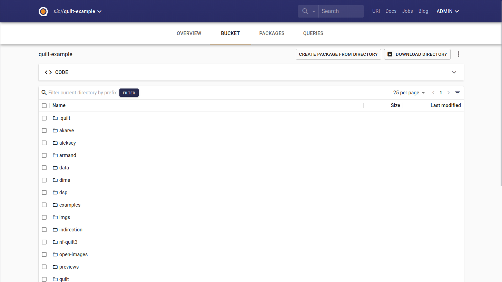
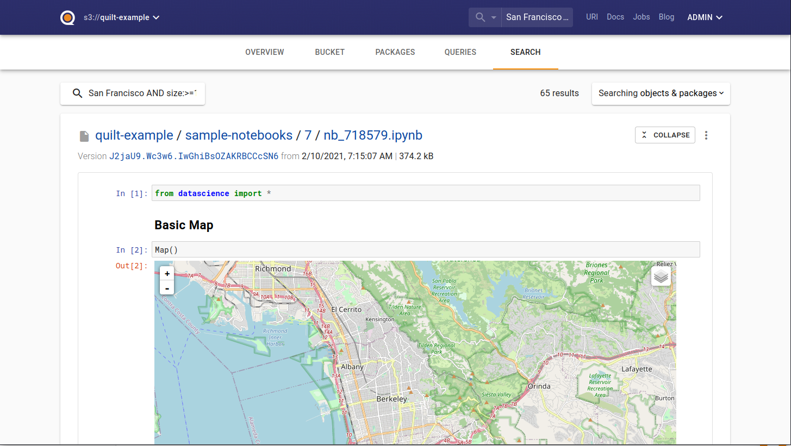
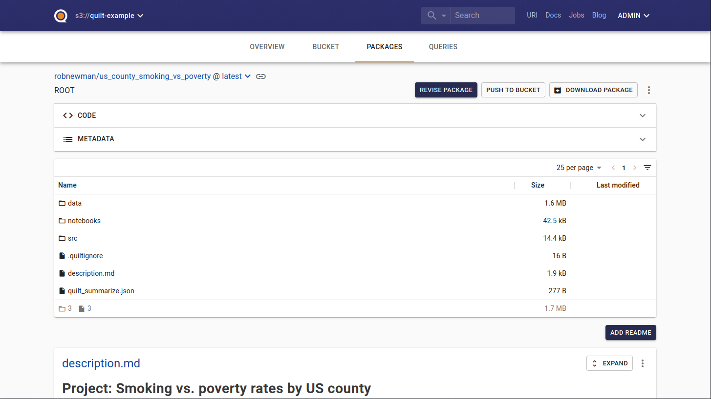
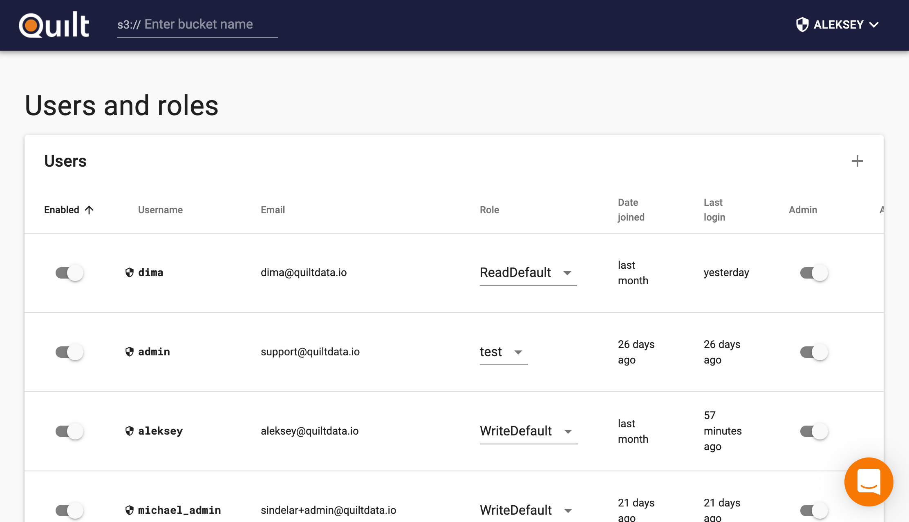

The Quilt Catalog is the second half of Quilt. It provides an interface on top of your S3 bucket that brings Quilt features like data packages and search to the web.

**[For a hands-on demo, check out the public demo catalog](https://open.quiltdata.com/b/quilt-example).**

Note that you can use the Quilt Python API without using the catalog product, but they are designed to work together.

## Brief tour

The Quilt catalog provides a homepage for your catalog, based on a `README.md` file that you can optionally create at the top of your bucket.

The catalog lets you navigate packages in the registry on the packages tab.

You can also browse the underlying S3 files using the files tab.

Catalogs also enable you to search the contents of your bucket. We support both unstructured  (e.g. "`San Francisco`") and structured (e.g. "`metadata_key: metadata_value`") search. Hits are previewed right in the search results.

Adding a `quilt_summarize.json` file to a data package (or S3 directory path) will enable content preview right on the landing page.

Colocating data with context in this way is a powerful way of making your data projects approachable and accessible to collaborators.

`quilt_summarize.json` can be a list of paths to files in S3 that you want to include in your summary. For example: `["description.md", "../notebooks/exploration.ipynb"]`. Additionally, note that if a `README.md` file is present, it will always be rendered as well.

> There are currently some small limitations with preview:
>
> * Objects linked to in `quilt_summarize.json` are always previewed as of the latest version, even if you are browsing an old version of a package.
> * Object titles and image thumbnails link to the file view, even if you are in the package view.

## Access control

The Quilt catalog includes an admin panel. This is used to control user authorization to your catalog.

You can create and delete, activate and deactivate, admin and de-admin, and assign and de-assign [IAM roles](https://docs.aws.amazon.com/IAM/latest/UserGuide/id_roles.html) to users on this page.

The admin page is only accessible to catalog admins. Only admins may create other admins, and the catalog enforces a constraint that there must always be at least one admin account on the catalog (a default one is created as part of the catalog standup process).

You may invite new users to collaborate on your QUILT bucket via email, again from the admin interface.

**[To learn more, check out the public demo catalog](https://open.quiltdata.com/b/quilt-example)**.
