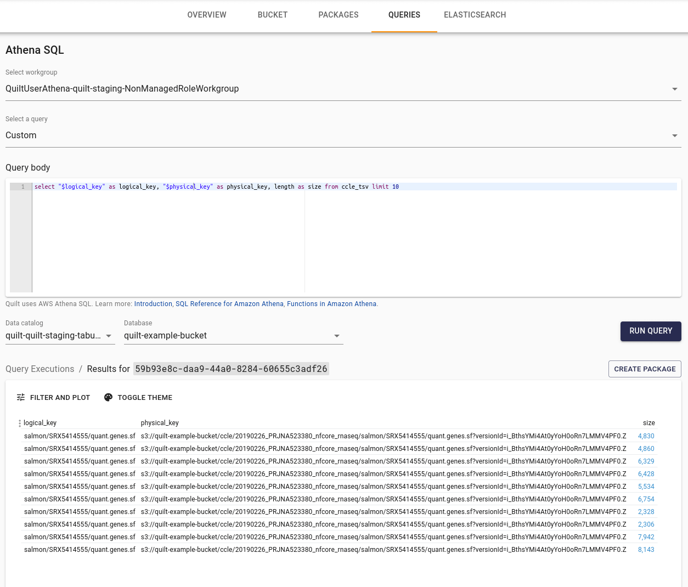

<!-- markdownlint-disable -->

# Querying package metadata with Athena
Quilt stores package data and metadata in S3. Metadata lives in a per-package manifest file
in a each bucket's `.quilt/` directory.

You can therefore query package metadata wth SQL engines like AWS Athena.
Users can write SQL queries to select packages (or files from within packages)
using predicates based on package or object-level metadata.

Packages can be created from the resulting tabular data.
To be able to create a package,
the table must contain the columns `logical_key`, `physical_keys` (or `physical_key`) and `size`.
(See also [Mental Model](https://docs.quilt.bio/mentalmodel))



## Defining package tables and views in Athena

> This step is not required for users of Quilt enterprise, since tables and views
are managed by Quilt. Check the value of `UserAthenaDatabaseName` output in your
CloudFormation stack to know the name of the Athena database it created.

The first step in configuring Athena to query the package contents and metadata
is to define a set of tables and views that represent the metadata fields as columns.
The easiest way to do this is using the pre-built CloudFormation templates
available in the [examples repository](https://github.com/quiltdata/examples/tree/master/athena_cfn/).

## Example: query object-level metadata

Suppose we wish to find all .tiff files produced by algorithm version 1.3
with a cell index of 5.

```sql
SELECT * FROM "YOUR-BUCKET_objects-view"
WHERE substr(logical_key, -5) = '.tiff'
-- extract and query object-level metadata
AND json_extract_scalar(meta, '$.user_meta.nucmembsegmentationalgorithmversion') LIKE '1.3%'
AND json_array_contains(json_extract(meta, '$.user_meta.cellindex'), '5');
```
