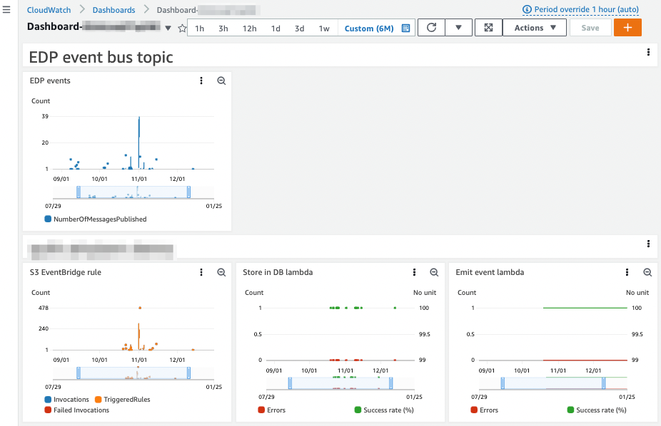

<!-- markdownlint-disable -->
# Event-Driven Packaging (EDP)

> EDP is in private preview. You can ask your Quilt account manager
about enabling it.

## Overview

Data tend to be created in logical batches by machines, people, and
pipelines. Detecting these logical events from Amazon S3 events alone is
complex and requires extensive custom logic.

Quilt's *Event-Driven Packaging* (EDP) service intelligently groups one
or more Amazon S3 object events into a single batch-level event.
You can easily (and if desired, **automatically**) trigger logical
events like data package creation that depend on batches rather
than on individual files.

> Any AWS service or action that generates S3 object events may trigger the EDP service.

## Requirements

1. A pre-existing VPC that includes a [NAT
Gateway](https://docs.aws.amazon.com/vpc/latest/userguide/vpc-nat-gateway.html)
or the following [VPC
endpoints](https://docs.aws.amazon.com/vpc/latest/privatelink/concepts.html#concepts-vpc-endpoints):
  - Amazon S3
  ([gateway](https://docs.aws.amazon.com/vpc/latest/privatelink/gateway-endpoints.html)
  or
  [interface](https://docs.aws.amazon.com/vpc/latest/privatelink/create-interface-endpoint.html)).
  - EventBridge ([interface endpoint](https://docs.aws.amazon.com/eventbridge/latest/userguide/eb-related-service-vpc.html)).
2. [Enable EventBridge S3
Events](https://docs.aws.amazon.com/AmazonS3/latest/userguide/enable-event-notifications-eventbridge.html)
for all S3 buckets to be monitored by EDP.

## Deployment

EDP is deployed by a standalone CloudFormation template that
configures the conditions under which events get generated. The
following template parameters are required:

| Parameter  | Description |
| ------------- | ------------- |
| `VPC` | Same as existing Quilt stack. |
| `SecurityGroup` | Same as existing Quilt stack. |
| `Subnets` | Same two subnets as existing Quilt stack. |
| `BucketName` | Name of the Amazon S3 bucket to monitor. |
| `BucketIgnorePrefixes` | Text string of comma separated bucket path segments to ignore, for example `raw/*, scratch/*`. Default value is an empty string (i.e. nothing ignored). |
| `BucketPrefixDepth` | The number of `/`-separated *common* path segments at the beginning of an S3 object key. Default value is `2`. |
| `BucketThresholdDuration` | Trigger a notification when this number of seconds has elapsed since the last object event in the S3 bucket occurred. Default value is `300` seconds. |
| `BucketThresholdEventCount` | Trigger a notification when this number of files have been created (since the prior trigger). Default value is `20`. |
| `DBUser` | Username for EDP RDS instance. |
| `DBPassword` | Password for EDP RDS instance. |
| `EventBusName` | Name of custom EventBridge event bus that receives events. |

## How EDP works

1. EDP monitors S3 object events for _s3://bucket-name_

2. After a fixed number of object events (`BucketThresholdEventCount`) or
a maximum duration within a common prefix (`BucketThresholdDuration`),
EDP creates a `package-objects-ready` event that signals there is
sufficient information to make Quilt data packages from a batch of
files:
    - S3 bucket name
    - Common prefix
    - Number of files
    - Timestamp of event

    The event payload is a JSON file:

    ```json
    {
        "version":"0",
        "id":"XXXXXXXXXXXXXXXXXXXXXXXXXXXXXXXX",
        "detail-type":"package-objects-ready",
        "source":"com.quiltdata.edp",
        "account":"XXXXXXXXXXXX",
        "time":"2022-12-08T20:01:34Z",
        "region":"us-east-1",
        "resources":[
            "arn:aws:s3:::bucket-name"
        ],
        "detail":{
            "version":"0.1",
            "bucket":"bucket-name",
            "prefix":"prefix-path-1/prefix-path-2/"
        }
    }
    ```

3. EDP publishes the event to an AWS EventBridge bus. From there
the event can be forwarded to any [services that can be targeted
from AWS
EventBridge](https://docs.aws.amazon.com/eventbridge/latest/userguide/eb-targets.html).

EDP, upon completion and if configured to do so, may warm its
contents to a File Gateway where it has read permissions to ensure
that new EDP-created Quilt packages are available to Gateway clients
like Windows Workspaces.

> Users can optionally subscribe to the Amazon SNS topic created to
receive notifications from EDP to review the event payload.

## Example workflow

1. An instrument automatically uploads a folder containing files
from a single experiment into
_s3://instrument-bucket/instrument-name/experiment-id/_.
1. EDP listens for events in
_s3://instrument-bucket/instrument-name/experiment-id/*_.  After the
specified duration or event count, a `package-objects-ready` event
is generated and sent to EventBridge.
1. A custom lambda fuction triggered by the `package-objects-ready`
event processes the experiment files and generates a data package.
Additional processing includes (but is not limited to):
    - Decorating the data package with helpful additional files
        - `README.md`: Noting that the package was created by EDP
        and a lambda fuction, and validated using a workflow
	- [`quilt_summarize.json`](../Catalog/VisualizationDashboards.md#quilt_summarize.json)
        - [`.quiltignore`](../advanced-features/.quiltignore.md)
    - Package metadata creation and validation: Send an SNS notification on [metadata validation failure](../advanced-features/workflows.md)

<!--pytest.mark.skip-->
```python
    import datetime
    import functools
    import os
    import pathlib
    import tempfile
    import boto3
    import quilt3 as quilt3
    from aws_lambda_powertools import Logger

    logger = Logger()
    s3 = boto3.client("s3")
    sns = boto3.client("sns")

    # Configuration environment variables defined for Lambda function
    WORKFLOW_NAME = os.environ.get("WORKFLOW_NAME") or ...
    QUARANTINE_BUCKET_NAME = os.environ["QUARANTINE_BUCKET_NAME"]
    SNS_TOPIC_ARN = os.environ["SNS_TOPIC_ARN"]
    MAX_SNS_SUBJECT_LEN = 99
    QUILT_URL = os.environ["QUILT_URL"]

    # Empty quilt_summarize.json object
    QUILT_SUMMARIZE_JSON_STR = "[]"

    # README.md default Markdown
    QUILT_README_STR = f"""#Quilt package auto-generated by EDP\n\n
    Created on {datetime.date.today()} by an 
    automated Lambda agent for the {WORKFLOW_NAME} workflow."""

    # File system files for Quilt to ignore
    QUILT_IGNORE_STR = """.DS_*
    Icon
    ._*
    .TemporaryItems
    .Trashes
    .VolumeIcon.icns
    """

    # Define standard package Quilt files
    beautify_files = {
        "quilt_summarize.json": QUILT_SUMMARIZE_JSON_STR,
        "README.md": QUILT_README_STR,
        ".quiltignore": QUILT_IGNORE_STR,
    }

    @logger.inject_lambda_context
    def lambda_handler(event, context):

        # EDP event data
        bucket = event["detail"]["bucket"]
        prefix = event["detail"]["prefix"]
    
        # Add every file to the package
        pkg = quilt3.Package().set_dir(".", f"s3://{bucket}/{prefix}")
    
        # Decorate with metadata
        meta = {
            "Author": "EDP",
            "ComputerName": "Genome Lab - 1234",
            "Date": datetime.date.today().strftime("%Y-%m-%d"),
            "DiseaseArea": "COVID-19",
            "Drug Substance": "RNA",
            "ELN_ID": "827392-0102",
            "FolderName": "A34-VB9877",
            "Organism": "Monkey",
            "ProjectID": "YYD",
            "StudyID": "ABC-23-023394",
            "Target": "T1",
            "Test Material": "FIS-1111",
            "Tissue": "Lungs"
        }

        with tempfile.TemporaryDirectory() as tmpdir:
            tmpdir_path = pathlib.Path(tmpdir)
            for name, body in beautify_files.items():
                if name in pkg:
                    logger.debug(f"File {name} already exists. Ignoring.")
                    continue
                logger.debug(f"File {name} does not exist at {prefix}. Creating.")
                file_path = tmpdir_path / name
                file_path.write_text(body)
                pkg.set(name, file_path)
        
            # Add metadata to package
            pkg.set_meta(meta)
            # Remove leading & trailing characters
            pkg_name = prefix.strip("/")
        
            # Define callable Quilt push()
            push = functools.partial(
                pkg.push,
                pkg_name,
                registry=f"s3://{bucket}",
                force=True,
                message="Created by EDP",
                workflow=WORKFLOW_NAME
            )
        
            # Validate against the Quilt workflow schema
            try:
                push(dedupe=True)
            except quilt3.workflows.WorkflowValidationError as e:
                logger.warning("Workflow check failed")
            
                # Write out error to README.md file in quarantine bucket
                file_path = tmpdir_path / "README.md"
                file_path.write_text(str(e))
                pkg.set("README.md", file_path)
            
                # Push package to quarantine bucket
                push(registry=f"s3://{QUARANTINE_BUCKET_NAME}", workflow=...)
            
                # Error SNS notification content
                subject = f"Failed validation for package {pkg_name}"
                if len(subject) > MAX_SNS_SUBJECT_LEN:
                    subject = subject[: MAX_SNS_SUBJECT_LEN - 1] + "…"
                message = (
                    f"Validation failed for workflow {WORKFLOW_NAME} while pushing "
                    f"package with name {pkg_name} to {bucket}. It was pushed to "
                    f"{QUARANTINE_BUCKET_NAME} instead.\n"
                    f"{QUILT_URL}/b/{QUARANTINE_BUCKET_NAME}/packages/{pkg_name}\n\n"
                    f"Error message is:\n{e}\n"
                )
                # Publish notification to SNS topic
                sns.publish(
                    TopicArn=SNS_TOPIC_ARN,
                    Message=message,
                    Subject=subject,
                )
```

1. If a metadata validation error occurs, the Lab and Computational
scientists receive an email notification and can check the package
created in the quarantine bucket for errors.
1. Computational scientist opens the new data package for additional
analysis and modeling.

## Debugging

EDP create a CloudWatch dashboard which exposes some metrics useful
for debugging:

- **EDP event bus topic**: Displays the number of events emitted by
EDP. If EDP is working correctly there should be one or more
events received (depending on the time range selected).
- **Per-bucket metrics**:
  - **S3 EventBridge rule**: The number of events published to
  EventBridge from the specified Amazon S3 bucket. If there is no
  data, there are several possibilities:
    - **Invocations**: If this value is zero, the S3 bucket isn't
    correctly configured (`Send notifications to Amazon EventBridge
    for all events in this bucket` is not turned `On`).
    - **TriggeredRules**: If this value is zero, there was a problem
    with the automated EventBridge rule creation process during
    deployment. In general, you want the number of invocations to
    approximately equal the number of triggered rules.
    - **Failed Invocations**: This value should be zero. If greater
    than zero, there is an EDP configuration issue.
  - **Store in DB lambda**: If EDP is configured correctly, there
  should be zero errors and a 100% success rate.
  - **Emit event lambda**: If EDP is configured correctly, there
  should be zero errors and a 100% success rate.



> Additionally, users can subscribe directly to an EDP SNS topic. This is
useful for both debugging and viewing how events are structured.

## Limitations

- Currently, only one Amazon S3 bucket can be monitored at a time.
