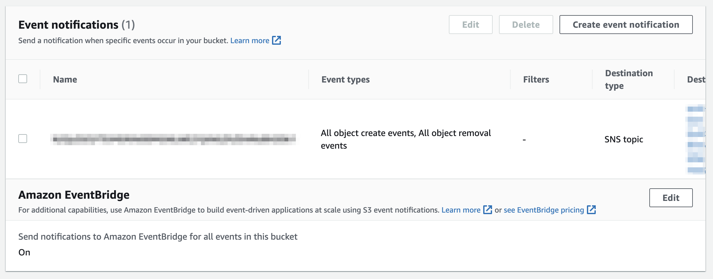
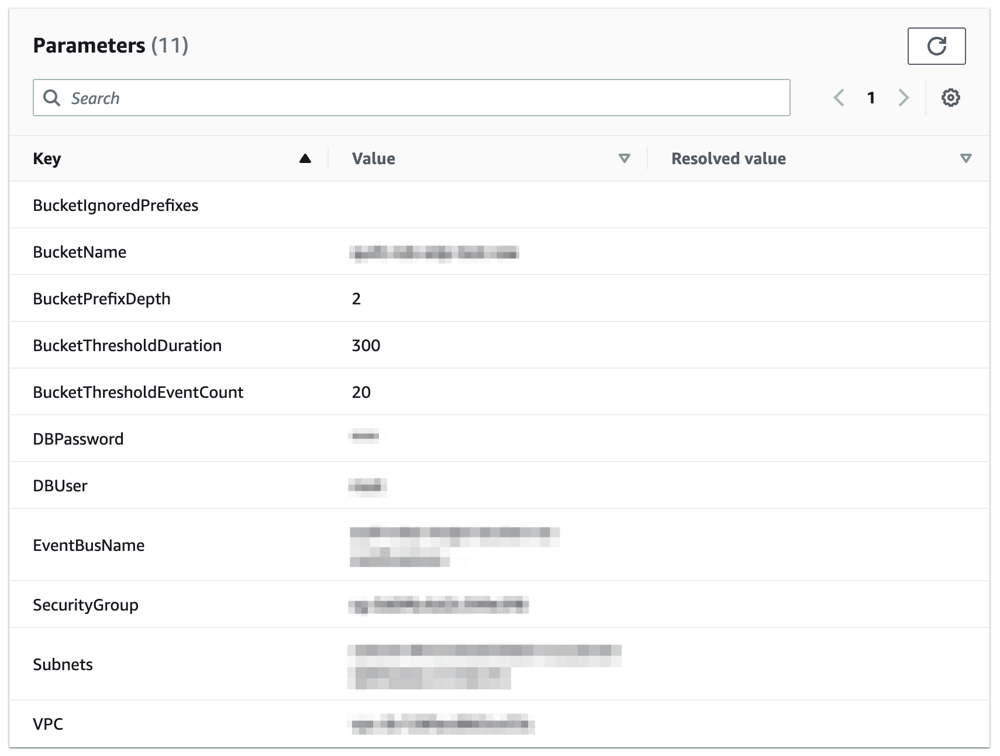

<!-- markdownlint-disable -->
# Event-Driven Packaging (EDP)

## Overview

Data can be added to your Amazon S3 buckets manually by internal
team members and/or external collaborators, or automatically via
instrumentation. No matter how it arrives in your institution's
buckets, it is helpful, and sometimes crucial, to be notified
of this data migration.

Quilt's *Event-Driven Packaging* service (EDP) monitors S3 object events
for a given Amazon S3 bucket prefix and generates a `files_ready`
event on the receiving [EventBridge](https://aws.amazon.com/eventbridge/)
in order to notify users and/or other AWS services that a group of S3
objects are ready to be packaged. This makes it easy to ingest data into
Quilt data packages from AWS data migration services such as [Storage
Gateway](https://aws.amazon.com/storagegateway/) and [Data
Sync](https://aws.amazon.com/datasync/).

## Requirements

1. A pre-existing VPC that includes a [NAT
Gateway](https://docs.aws.amazon.com/vpc/latest/userguide/vpc-nat-gateway.html)
or the following [VPC
endpoints](https://docs.aws.amazon.com/vpc/latest/privatelink/concepts.html#concepts-vpc-endpoints):
  - Amazon S3
  ([gateway](https://docs.aws.amazon.com/vpc/latest/privatelink/gateway-endpoints.html)
  or
  [interface](https://docs.aws.amazon.com/vpc/latest/privatelink/create-interface-endpoint.html))
  - EventBridge (interface)
2. [Enable EventBridge S3
Events](https://docs.aws.amazon.com/AmazonS3/latest/userguide/enable-event-notifications-eventbridge.html)
for all S3 buckets to be monitored by EDP

## Deployment

To use EDP in your Quilt instance, you will need an additional
CloudFormation template to configure when, and how, events get
generated.

### Parameters

The following parameters need to be defined in the CloudFormation
template during deployment:

- `VPC`: Same as the existing Quilt instance.
- `SecurityGroup`: Same as the existing Quilt instance.
- `Subnets`: Same two subnets as the existing Quilt instance.
- `BucketName`: Name of the Amazon S3 bucket to monitor. Must be
read accessible to EDP.
- `BucketIgnorePrefixes`: List of bucket path segments to ignore
- `BucketPrefixDepth`: The number of `/`-separated path segments
at the beginning of an S3 object key. Default value is `2`.
- `BucketThresholdDuration`: Trigger a notification when this number
of seconds has elapsed since the last object event in the S3 bucket 
occurred. Default value is `300` seconds.
- `BucketThresholdEventCount`: Trigger a notification when this
number of files have been created (since the prior trigger)
- `DBUser`: Username for EDP RDS instance
- `DBPassword`: Password for EDP RDS instance
- `EventBusName`: Name of custom EventBridge event bus that recieves events

