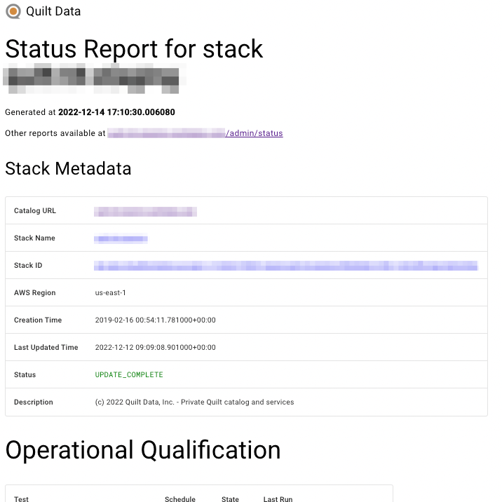
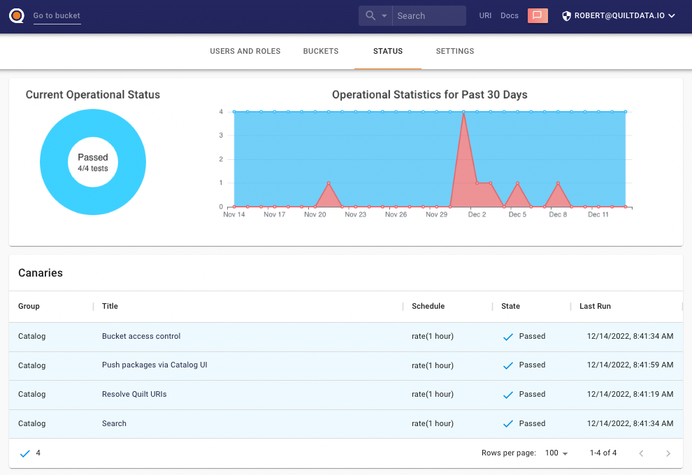

<!-- markdownlint-disable -->
# Good-practice (GxP) and Quilt

## Overview

GxP is the [general abbreviation](https://en.wikipedia.org/wiki/GxP)
for "Good x Practice", where the "x" represents the domain that the
guidelines and regulations apply to. Together the regulations
constitute a collection of quality guidelines for the bio/pharmaceutical
industries.

As a decentralized data platform for your organization, Quilt
provides a series of operational quality metrics through a *status
monitoring system*.

## Status monitoring

### Architectural overview

The Quilt status monitoring system consists of four parts:

1. *Canaries:* A collection of end-to-end quality tests for key
operational functionality provided by Quilt. They are run on a
schedule in your AWS infrastructure.
2. *Status reports:* Simple HTML files generated on a daily schedule
by an AWS Lambda function (`status_reports`) and stored in a dedicated
Amazon S3 bucket. The HTML files contain the most recent canary run
results (Operational Qualification) and Quilt instance Cloud Formation
parameters and outputs (Infrastructure Qualification).
  1. Operational Qualification report: all canary test results and
  status (historical and current)
  2. Infrastructue Qualification report: all CloudFormation parameters
  and status
3. *Administrative User Interface:* An HTML page in the Quilt catalog
that displays the current operational status of a Quilt instance
and provides access to current and historical status reports.
4. *Amazon SNS topic:* Users can subscribe to the topic and recieve
canary error notifications (available as `CanaryNotificationsTopic`
stack output).

### Setting up status monitoring for a Quilt instance

In order to enable status monitoring for a Quilt instance, the
following conditions must be met:

- The Quilt instance CloudFormation template must have canaries
enabled
- The correct template parameters must be provided during the Quilt instance
CloudFormation deployment

The required Quilt and AWS resources are provisioned automatically
by the Quilt deployment.

#### List of canaries

There are currently four end-to-end quality tests:

- `BucketAccessControl`: Test that Users can only access specifically
allowed Amazon S3 buckets
- `Immutable URIs`: Test to resolve immutable Quilt URIs
- `PackagePushUi`: Test package `push` functionality via Quilt
catalog package creation dialog
- `Search`: Search S3 objects and Quilt packages in the Quilt catalog

#### Quilt instance CloudFormation deployment parameters

When deploying a Quilt instance using a CloudFormation template
with canaries enabled, you will have to provide the following
parameters:

- `CanaryNotificationsEmail` (if enabled): A valid email address
to send canary failure and error notifications

### Accessing current operational status and reports archive

Go to your Quilt web-based catalog administration panel, "Status"
tab (under the /admin/status URL).
There you can see the stack's current operational status (as well
as the chart with historic data for the last month) and the reports
table (which can be sorted / filtered) where you can preview or
download stored reports (HTML files).

### Getting notifications about canary failures

For convenience, the following canary-related events are forwarded
to an SNS topic (available as `CanaryNotificationsTopic` in the
Quilt instance CloudFormation deployment Outputs tab):

1. A canary entering error state
2. A canary run failure

Quilt administrators can subscribe to this SNS topic to receive
these event notifications and process them appropriately (e.g. notifying first
responders or sending to incident management systems).

If enabled (see set-up instructions above), these events will be
also sent as emails to the configured address (`CanaryNotificationsEmail`
CloudFormation template parameter).

