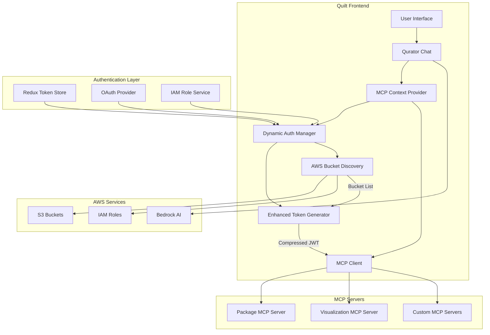
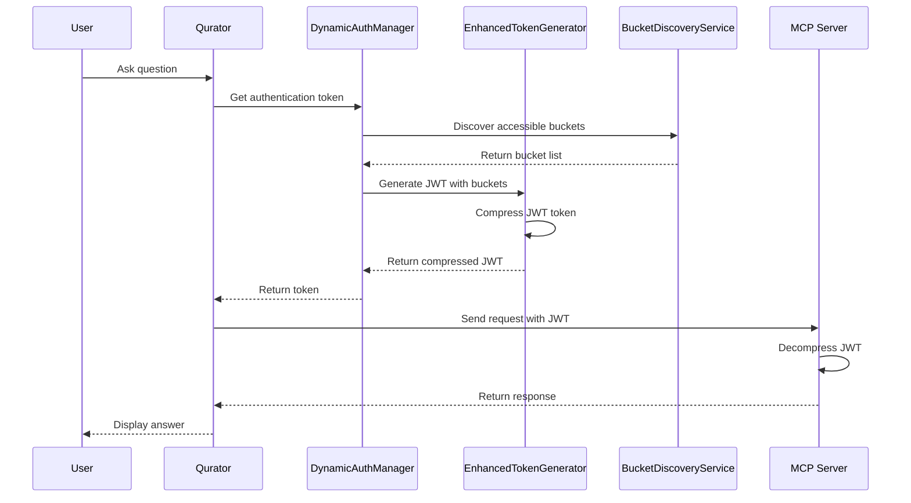
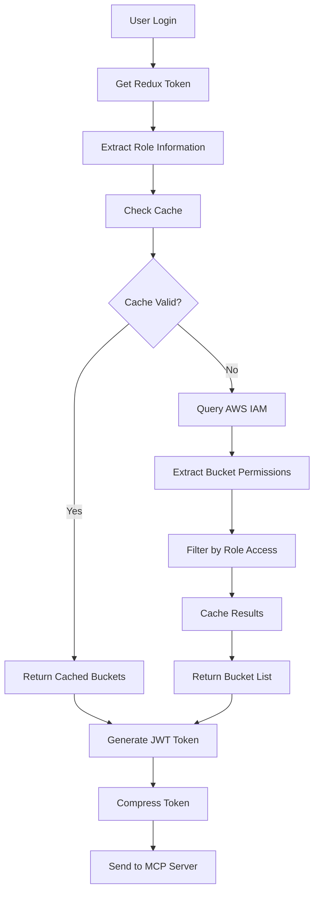
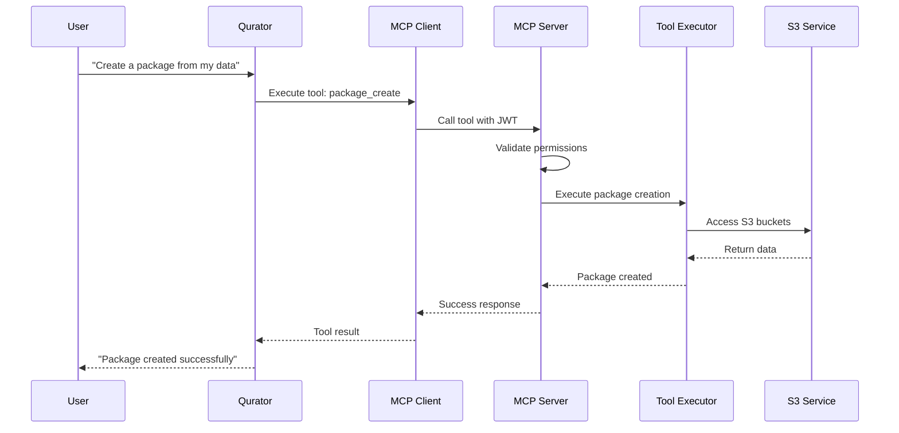
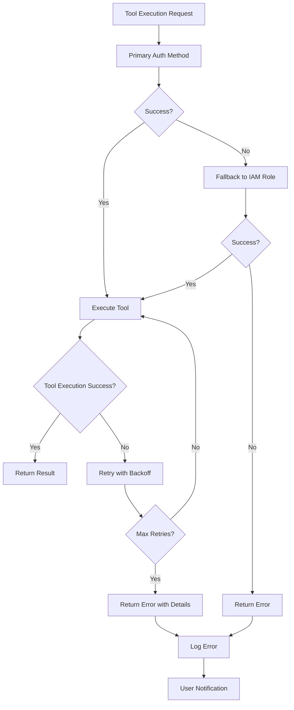
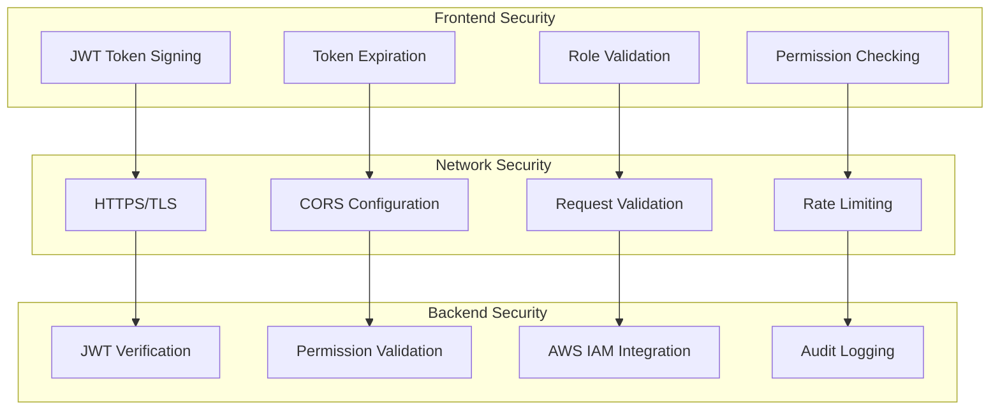
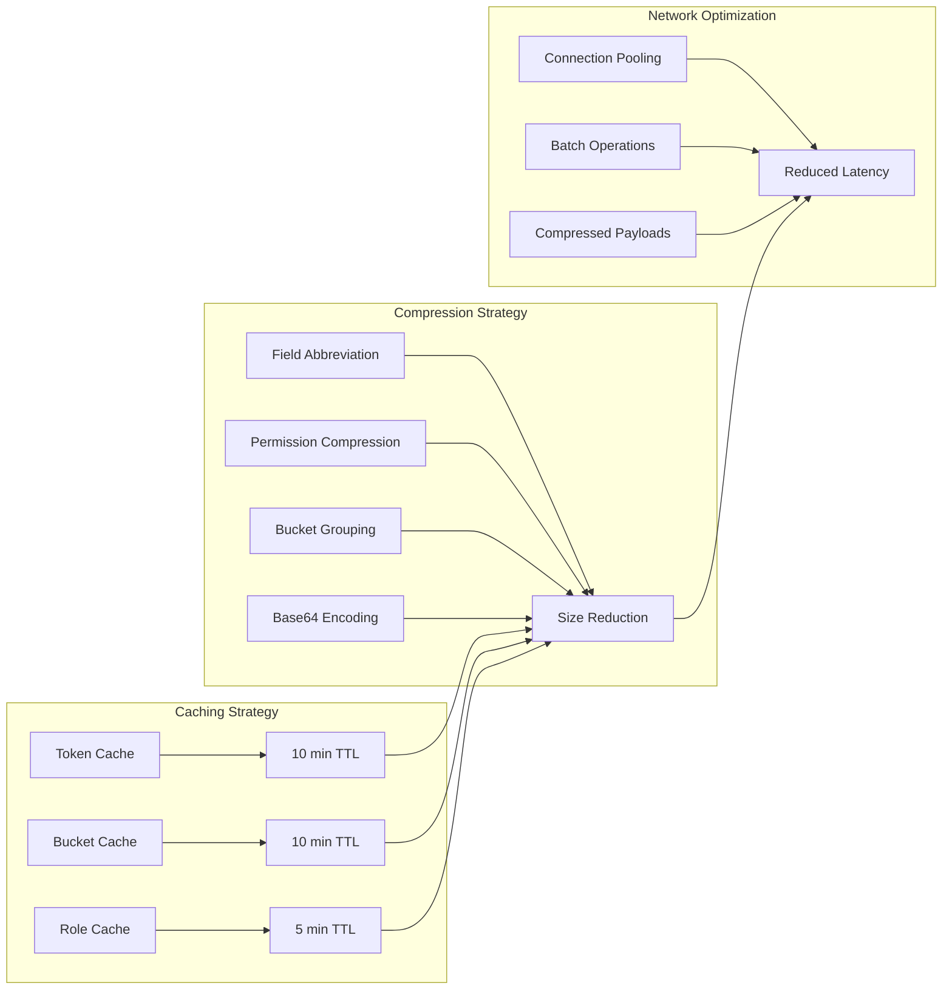
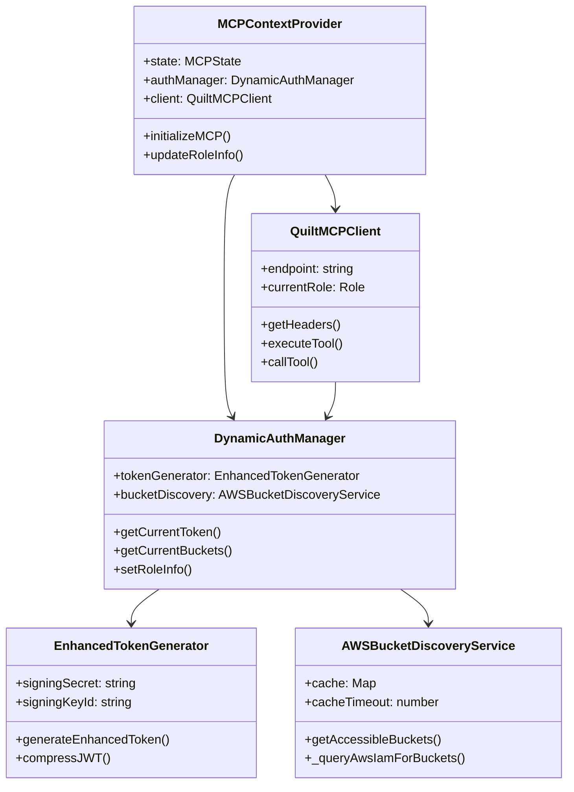

# MCP Integration Architecture Diagram

## System Overview

This document provides visual representations of the MCP integration architecture implemented in the Qurator feature.

## High-Level Architecture



## Authentication Flow



## JWT Token Compression Process

```mermaid
graph LR
    subgraph "Original JWT Payload"
        A1[scope: 'write'] --> B1[Field Abbreviation]
        A2[permissions: ['s3:GetObject', 's3:PutObject']] --> B2[Permission Compression]
        A3[roles: ['ReadWriteQuiltV2-sales-prod']] --> B3[Keep as-is]
        A4[buckets: ['quilt-sandbox', 'quilt-sales-raw', ...]] --> B4[Bucket Compression]
    end
    
    subgraph "Compressed JWT Payload"
        B1 --> C1[s: 'w']
        B2 --> C2[p: ['g', 'p']]
        B3 --> C3[r: ['ReadWriteQuiltV2-sales-prod']]
        B4 --> C4[b: {_type: 'groups', _data: {...}}]
    end
    
    subgraph "Size Reduction"
        D1[42,330 chars] --> D2[4,084 chars]
        D2 --> D3[90.3% reduction]
    end
```

## Bucket Discovery Process



## MCP Tool Execution Flow



## Error Handling and Fallback



## Security Layers



## Performance Optimization



## Component Relationships



## Data Flow Summary

1. **User Interaction**: User asks question in Qurator chat
2. **Authentication**: DynamicAuthManager retrieves and validates user token
3. **Bucket Discovery**: AWSBucketDiscoveryService finds accessible S3 buckets
4. **Token Generation**: EnhancedTokenGenerator creates compressed JWT with all claims
5. **MCP Communication**: QuiltMCPClient sends request to MCP server with JWT
6. **Tool Execution**: MCP server decompresses JWT and executes requested tool
7. **Response**: Results are returned to user through Qurator interface

This architecture ensures secure, efficient, and scalable MCP integration while maintaining compatibility with existing Quilt infrastructure.
