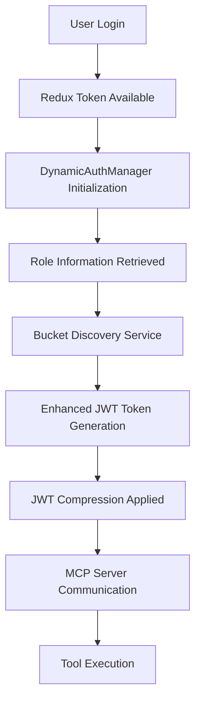

# MCP Integration in Qurator

## Overview

The Model Context Protocol (MCP) integration in Qurator enables seamless communication between the Quilt frontend and external MCP servers, providing enhanced AI capabilities through dynamic tool execution and data access. This integration includes sophisticated authentication mechanisms, JWT token compression, and dynamic bucket discovery to ensure secure and efficient data access.

## Architecture

### Core Components

The MCP integration consists of several key components working together:

1. **MCP Client** (`Client.ts`) - Handles communication with MCP servers
2. **Dynamic Authentication Manager** (`DynamicAuthManager.js`) - Manages authentication and token generation
3. **Enhanced Token Generator** (`EnhancedTokenGenerator.js`) - Creates compressed JWT tokens with authorization claims
4. **Bucket Discovery Service** (`AWSBucketDiscoveryService.js`) - Dynamically discovers accessible S3 buckets
5. **MCP Context Provider** (`MCPContextProvider.tsx`) - React context for MCP state management

### Authentication Flow



## Key Features

### 1. Dynamic Authentication

The system supports multiple authentication methods with automatic fallback:

- **Bearer Token Authentication** (Primary) - Uses JWT tokens with comprehensive claims
- **IAM Role Authentication** (Fallback) - Direct AWS IAM role assumption
- **OAuth Integration** - Seamless integration with existing OAuth flows

### 2. JWT Token Compression

To handle large numbers of accessible buckets while staying within header size limits, the system implements sophisticated compression:

#### Field Abbreviations
- `scope` → `s`
- `permissions` → `p` 
- `roles` → `r`
- `buckets` → `b`
- `level` → `l`

#### Permission Compression
AWS S3 permissions are abbreviated to single characters:
- `s3:GetObject` → `g`
- `s3:PutObject` → `p`
- `s3:DeleteObject` → `d`
- `s3:ListBucket` → `l`
- `s3:ListAllMyBuckets` → `la`

#### Bucket Compression Strategies
For large bucket lists (>15 buckets), multiple compression strategies are applied:

1. **Groups Strategy** - Groups buckets by common prefixes
2. **Patterns Strategy** - Categorizes by specific patterns (quilt-, cell-, etc.)
3. **Base64 Compression** - JSON-stringified and Base64 encoded

### 3. Dynamic Bucket Discovery

The system automatically discovers user-accessible S3 buckets through:

- **AWS IAM Policy Analysis** - Extracts bucket permissions from IAM roles
- **GraphQL Integration** - Leverages existing Quilt infrastructure
- **Intelligent Caching** - Reduces API calls and improves performance
- **Role-based Access** - Ensures users only see buckets they can access

## Implementation Details

### File Structure

```
catalog/app/
├── components/Assistant/MCP/
│   ├── Client.ts                    # MCP client implementation
│   ├── MCPContextProvider.tsx       # React context provider
│   ├── OAuthLoginButton.tsx         # OAuth integration
│   ├── tools/                       # MCP tool implementations
│   └── servers/                     # Example MCP servers
├── services/
│   ├── DynamicAuthManager.js        # Authentication management
│   ├── EnhancedTokenGenerator.js    # JWT token generation
│   ├── AWSBucketDiscoveryService.js # Bucket discovery
│   ├── mcpAuthorization.js          # Role definitions
│   └── jwt-decompression-utils.js   # Backend utilities
```

### Configuration

#### Environment Variables

```bash
# JWT Configuration
REACT_APP_MCP_ENHANCED_JWT_SECRET="your_super_secret_jwt_signing_key_here_at_least_32_chars"
REACT_APP_MCP_ENHANCED_JWT_KID="quilt-mcp-key-v1"

# MCP Server Configuration
REACT_APP_MCP_ENDPOINT="https://demo.quiltdata.com/mcp"
```

#### Role Definitions

Roles are defined in `mcpAuthorization.js` with comprehensive permissions:

```javascript
export const ROLE_DEFINITIONS = {
  'ReadWriteQuiltV2-sales-prod': {
    level: AuthorizationLevel.WRITE,
    buckets: [
      'quilt-sandbox-bucket',
      'quilt-sales-raw',
      // ... 30+ additional buckets
    ],
    tools: [
      'bucket_objects_list',
      'package_create',
      'package_update',
      // ... 25+ additional tools
    ],
    groups: ['quilt-users', 'mcp-users', 'quilt-contributors'],
  },
  // ... additional roles
}
```

## Backend Integration

### JWT Decompression

The MCP server backend must implement JWT decompression to handle the compressed tokens. Utilities are provided in:

- `jwt-decompression-utils.js` - JavaScript utilities
- `MCP_Server_JWT_Decompression_Guide.md` - Comprehensive implementation guide
- `test-jwt-decompression.js` - Test suite for validation

#### Example Decompression

```javascript
const { processCompressedJWT } = require('./jwt-decompression-utils');

// Decompress JWT payload
const decompressedPayload = processCompressedJWT(compressedPayload);

// Result includes:
// - Full permission strings (s3:GetObject, etc.)
// - Complete bucket list (all 32+ buckets)
// - Standard JWT claims (iss, aud, sub, etc.)
```

## Security Considerations

### Token Security
- JWT tokens are signed with HMAC-SHA256
- Tokens include expiration times (24 hours default)
- Unique JWT IDs prevent replay attacks
- Compressed data maintains cryptographic integrity

### Permission Validation
- All permissions are validated against AWS IAM policies
- Bucket access is verified before inclusion in tokens
- Role-based access control ensures least privilege

### CORS Configuration
The MCP server must be configured to allow requests from the Quilt frontend:

```javascript
// MCP Server CORS configuration
app.use(cors({
  origin: ['http://localhost:3000', 'https://your-quilt-domain.com'],
  credentials: true,
  methods: ['GET', 'POST', 'OPTIONS'],
  allowedHeaders: ['Content-Type', 'Authorization', 'X-Quilt-User-Role']
}));
```

## Testing and Validation

### Test Components

The implementation includes comprehensive testing components:

- `DynamicBucketDiscoveryTest.tsx` - Tests bucket discovery functionality
- `IntegrationTest.tsx` - End-to-end authentication flow testing
- `MCPServerValidation.tsx` - Real-world MCP server connectivity
- `test-jwt-decompression.js` - JWT decompression validation

### Running Tests

```bash
# Start the development server
cd catalog
npm start

# Access test components at:
# http://localhost:3000/#/mcp-test
# http://localhost:3000/#/integration-test
# http://localhost:3000/#/bucket-discovery-test
```

## Performance Optimizations

### Token Size Management
- JWT tokens are compressed to stay under 8KB header limits
- Smart compression strategies minimize token size
- Token size monitoring and logging for optimization

### Caching Strategy
- Bucket discovery results are cached for 10 minutes
- Token generation includes intelligent caching
- Role information is cached to reduce API calls

### Network Efficiency
- Compressed JWT tokens reduce network overhead
- Batch operations where possible
- Connection pooling for MCP server communication

## Troubleshooting

### Common Issues

1. **CORS Errors**
   - Ensure MCP server allows Quilt frontend origin
   - Check CORS headers configuration

2. **JWT Token Truncation**
   - Verify compression is working correctly
   - Check token size logs in console

3. **Bucket Access Denied**
   - Verify IAM role permissions
   - Check bucket discovery service logs

4. **MCP Server Connection Failed**
   - Verify MCP server endpoint configuration
   - Check network connectivity and firewall rules

### Debug Tools

The implementation includes extensive debugging:

```javascript
// Enable debug logging
localStorage.setItem('debug', 'MCP*');

// Check authentication status
console.log('MCP Auth Status:', mcpContext.authStatus);

// Validate JWT token
console.log('JWT Claims:', mcpContext.tokenClaims);
```

## Future Enhancements

### Planned Features
- Real-time permission updates
- Advanced caching strategies
- Multi-tenant support
- Enhanced error recovery

### Extension Points
- Custom tool implementations
- Additional compression strategies
- Enhanced security features
- Performance monitoring

## Migration Guide

### From Basic MCP to Enhanced MCP

1. **Update Environment Variables**
   ```bash
   REACT_APP_MCP_ENHANCED_JWT_SECRET="your-secret-key"
   REACT_APP_MCP_ENHANCED_JWT_KID="your-key-id"
   ```

2. **Deploy Backend Changes**
   - Implement JWT decompression utilities
   - Update CORS configuration
   - Deploy MCP server updates

3. **Update Frontend Configuration**
   - Enable enhanced authentication
   - Configure bucket discovery
   - Update role definitions

4. **Validate Integration**
   - Run test suite
   - Verify token compression
   - Test bucket access

## Support and Maintenance

### Monitoring
- JWT token generation metrics
- Bucket discovery performance
- MCP server connectivity status
- Error rates and patterns

### Maintenance Tasks
- Regular secret rotation
- Cache cleanup
- Performance optimization
- Security updates

For additional support or questions about the MCP integration, refer to the implementation files or contact the development team.
