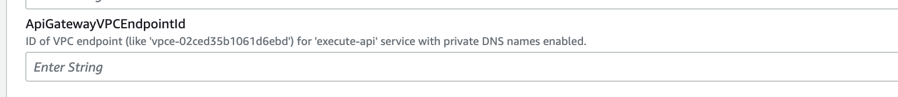

<!-- markdownlint-disable -->
# Private Endpoint Access

> This page describes a feature that is not enabled by default.
Ask your Quilt manager to enable it for you.

## The Data Perimeter concept

Establishing a **data perimeter** pattern that only allows access to trusted
principals from trusted networks is a best practice to guarantee your
organization's data security. A data perimeter helps protect your data
from unintended access and potential configuration errors via
built-in barriers.

You can restrict Amazon S3 bucket access to a particular VPC and VPN traffic
via a data perimeter pattern, which prevents leaked S3 credentials from
bypassing your organization's VPN.

To implement a data perimeter, you will need to take the following steps.

## 1. Create an interface VPC endpoint for Amazon API Gateway

Restrict access to the Quilt REST APIs to within your VPC by [creating
an interface VPC endpoint for Amazon API
Gateway](https://docs.aws.amazon.com/apigateway/latest/developerguide/apigateway-private-apis.html).

Once deployed, all traffic to the private API uses secure connections
and is isolated from the public internet.

During deployment, your CloudFormation template requires the VPC
endpoint ARN as the `ApiGatewayVPCEndpointId` template parameter:



## 2. Configure an Amazon S3 Gateway endpoint

To limit access to Amazon S3 from your VPC you use [gateway VPC
endpoints](https://docs.aws.amazon.com/vpc/latest/privatelink/vpc-endpoints-s3.html).
Note that there is no additional charge for using gateway endpoints.

Follow the [official AWS
instructions](https://docs.aws.amazon.com/vpc/latest/privatelink/vpc-endpoints-s3.html#create-gateway-endpoint-s3)
to create a gateway endpoint.

Alternatively you can use [AWS PrivateLink for Amazon
S3](https://docs.aws.amazon.com/AmazonS3/latest/userguide/privatelink-interface-endpoints.html)
to provision _interface VPC endpoints_ (interface endpoints) in
your VPC. These are assigned private IP addresses from subnets
in your VPC.

## 3. Configure NAT gateway

To allow Quilt services access AWS endpoints other than S3 the traffic
from the subnets where Quilt is deployed to the internet should be routed
through NAT gateway.

Follow the [official AWS
instructions](https://docs.aws.amazon.com/vpc/latest/userguide/vpc-nat-gateway.html#nat-gateway-creating)
to create a NAT gateway.

## 4. Configure and deploy a Service Control Policy and Amazon S3 bucket policy

Access should be restricted to trusted networks and principals:

* Allowed VPCs
* Allowed IP ranges
* Specific AWS services used by Quilt:
  * AWS Glue
  * Amazon Athena
  * Amazon CloudWatch
* Principals exempt from network restriction

The easiest way to do this is via a [Service Control
Policy (SCP)](https://docs.aws.amazon.com/organizations/latest/userguide/orgs_manage_policies_scps.html)

An SCP defines a **guardrail** on any action that the account's
administrator delegates to the IAM users and roles in the account.

> For instructions on enabling SCPs, see the [AWS documentation on
"Enabling and disabling policy
types"](https://docs.aws.amazon.com/organizations/latest/userguide/orgs_manage_policies_enable-disable.html)

### Example Service Control Policy

The example policy below denies access (`"Effect": "Deny"`) to all
Amazon S3 buckets prefixed with the string `quilt`
unless **any** of the following conditions is met:

1. A `Source VPC` matches either `vpc-LOCAL` or `vpc-VPN`.
2. The principal making the request has `NetworkRestrictedExempt` tag attached.
3. The request comes from IP range `192.0.2.0 - 192.0.2.255` or `203.0.113.0 - 203.0.113.255`.
4. The call to the S3 bucket is beng made by an AWS [service
principal](https://docs.aws.amazon.com/IAM/latest/UserGuide/reference_policies_elements_principal.html#principal-services)
(the idenitifer for a service, `"aws:PrincipalIsAWSService"`), such
as CloudWatch, or by an AWS service to another service
(`"aws:ViaAWSService"`).

```json
{
    "Version": "2012-10-17",
    "Statement": [
        {
            "Sid": "PreventUnexpectedNetworksButAllowAWSServices",
            "Effect": "Deny",
            "Action": "s3:*",
            "Resource": [
                "arn:aws:s3:::quilt*",
                "arn:aws:s3:::quilt*/*"
            ],
            "Condition": {
                "StringNotEqualsIfExists": {
                    "aws:SourceVpc": [
                        "vpc-LOCAL",
                        "vpc-VPN"
                    ]
                },
                "Null": {
                    "aws:PrincipalTag/NetworkRestrictedExempt": "true"
                },
                "NotIpAddressIfExists": {
                    "aws:SourceIp": [
                        "192.0.2.0/24",
                        "203.0.113.0/24"
                    ]
                },
                "Bool": {
                    "aws:PrincipalIsAWSService": "false",
                    "aws:ViaAWSService": "false"
                }
            }
        }
    ]
}
```

SCPs should be used in parallel with identity-based or resource-based
policies to IAM users or roles, or [explicit S3 bucket
policies](../CrossAccount.md#bucket-policies)

## Making sure everything is correctly set up

After doing steps above please check your [canaries](./good-practice.md)
status to make sure everything works as expected.

## Important considerations

1. There can only be one gateway endpoint per VPC.
2. Your S3 buckets must be in the same region as the gateway endpoint.
2. Keeping traffic on private networks will incur Transit Gateway,
inter-VPC, and Interface Endpoint charges.
3. The DNS of any VPN clients must assign AWS global and regional S3
service names to the Interface Endpoint IP addresses.

## Further reading

* [Choosing your VPC Endpoint Strategy for Amazon S3](https://aws.amazon.com/blogs/architecture/choosing-your-vpc-endpoint-strategy-for-amazon-s3/)
* [Secure hybrid access to Amazon S3 using AWS PrivateLink](https://aws.amazon.com/blogs/networking-and-content-delivery/secure-hybrid-access-to-amazon-s3-using-aws-privatelink/)
* [Establishing a Data Perimeter](https://aws.amazon.com/blogs/security/establishing-a-data-perimeter-on-aws/)
* [Building a Data Perimeter Whitepaper](https://docs.aws.amazon.com/whitepapers/latest/building-a-data-perimeter-on-aws/building-a-data-perimeter-on-aws.html)
