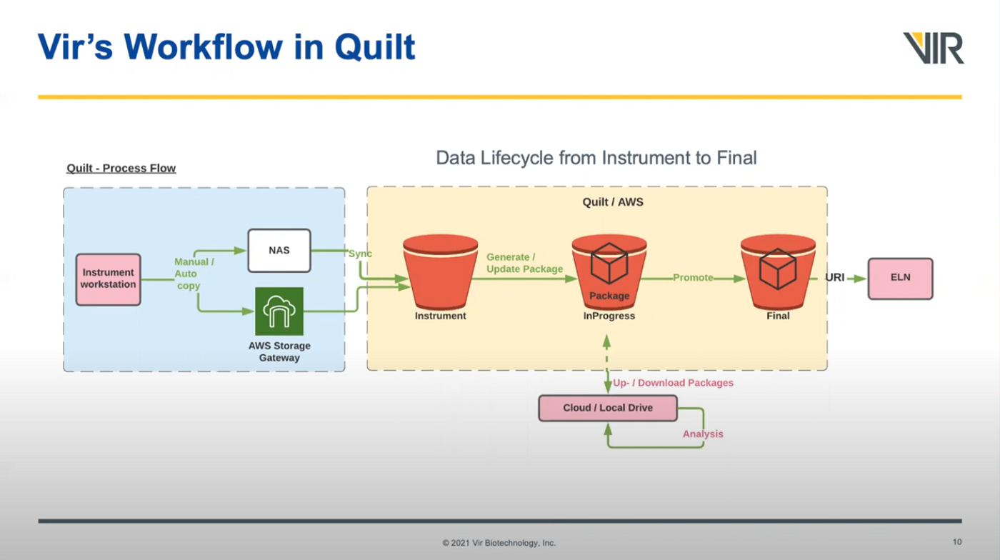

# Organizing data in S3 buckets

You can think of your data buckets as a grid. The horizontal dimension reflects
the data lifecycle phase (raw, refined, curated). The veritcal dimension reflects
topic or domain.

As discussed under [mental model](../MentalModel.md#buckets-are-branches), S3
buckets in Quilt are like branches in git; they reflect how "done" data are. 

## Don't rely on folder structure

There's no one folder structure that works for everyone. For instance,
if you organize experiments by `department/date` then it's tedious for users to
look at everything that happened on a given data. And vice versa.

For this reason, packages offer both metadata tags and infinite
_logical_ views atop _physical_ locations in S3. Metadata tags prevent file names
from getting longer and longer to spatchcock metadata.

With Quilt packages you can place one S3 object in a thousand packages without ever copying that object. Or you can "reorganize" S3 without moving any objects, with custom views of S3 for each team,
by using Quilt packages and the `.set*()` API calls.

## S3 data lifecycle
Below is an example of how you might organize three data domains according to a three-phase data lifecycle.

| Domain / Lifecycle phase | Raw | Refined | Curated |
|---|---|---|---|
| Domain1 | s3://domain1-raw | s3://domain1-refined | s3://domain1-curated |
| Domain2 | s3://domain2-raw | s3://domain2-refined | s3://domain2-curated |
| Domain3 | s3://domain3-raw | s3://domain3-refined | s3://domain3-curated |

## How enterprises organize intrument, scientist, ELN data

See [Bringing Scientific Data Management Systems Into the Cloud](https://blog.quiltdata.com/bringing-scientific-data-management-systems-into-the-cloud-video-41be228a41b9)
from Bio-IT world for a in-depth view of organizing scientific data in the cloud
from instrument, to scientist, to ELN.

## How many buckets do I need, and how should I divide data?
Generally, you'll need three S3 buckets for each data domain.

Below are a few questions you can use to determine how many data domains and
lifecycle phases you'll need:

1. Are these data related in a meaningful way?

    If not, favor separate buckets.
1. Are these data all a the same level of "doneness"; are they at the same stage
in the data quality lifecycle (raw, refined, curated)?

1. Do the data have related access patterns in terms of users and groups?

    If not, favor separate buckets for reasons of IAM simplicity and search speed in Quilt.
1. Do humans or pipelines have delete permissions against these buckets?

    If so, data should be duplicated to another bucket on push to ensure durability.

1. Does this data need to be sealed and linked to an IND filing or ELN?

    If so, favor curated or "production" buckets where all data are self-contained and delete access is exceptional or non-existent.

1. Are we mixing validated and non-validated data?

    If so, favor segregation at the bucket level.
1. Is this data part of a staging or dev environment?

    If so, consider how this data will be copied to more stable buckets, or why it is OK to lose this data at any time.

1.  Do you want to be able to trace the data provenance back to its source, for example from instrument, to scientist, to ELN entry?

    If so, consider isolated, only-instruments-can-write buckets for the early
    data lifecycle, and read-only or write-only buckets for the curated (ELN) phase.
