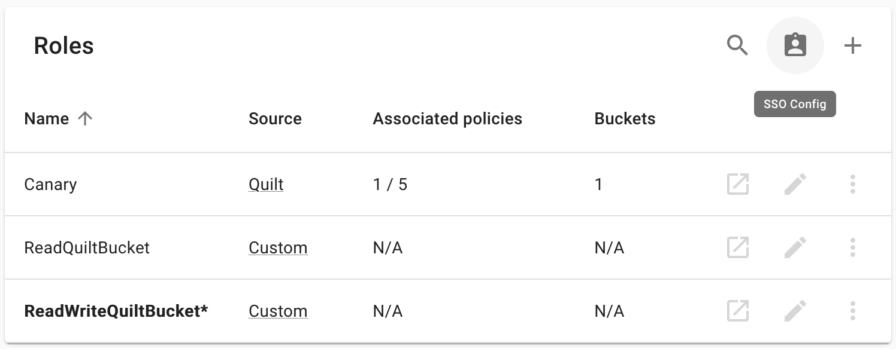

<!-- markdownlint-disable no-blanks-blockquote -->
# SSO permissions mapping

> This feature requires Quilt Platform version 1.54.0 or higher

## Overview

This feature allows Quilt admin to configure what roles and admin flag value are
assigned to the user who logs in via SSO based on the user's ID token claims.

The configuration can be set with `quilt3.admin.sso_config.set()`
or with admin UI.



> Note: Roles used by configuration can't be removed or renamed.

> Note: The user who sets the configuration will never have their admin flag revoked.

> Note: After configuration is set, any user who logs in via SSO can't be manually
assigned roles or admin permissions.

## Configuration

The configuration file is to be written in YAML and is defined by [this JSON Schema](https://github.com/quiltdata/quilt/blob/master/shared/schemas/sso-config-1.0.json)
which includes descriptions of all the fields.

> Warning: In schemas don't forget to add claims you want to check to `required`,
because otherwise the schema will match any ID token even if these claims are missing.

> Note: Mappings are evaluated in order, and **only the first matching
mapping is applied**. To assign multiple roles to a user, include all roles
in the `roles` array of a single mapping.

### Example

```yaml
version: "1.0"
default_role: ReadQuiltBucket
mappings:
  - schema:
      type: object
      properties:
        email:
          const: admin@example.com
      required:
        - email
    roles:
      - ReadWriteQuiltBucket
    admin: true
  - schema:
      type: object
      properties:
        groups:
          type: array
          contains:
            const: rw
      required:
        - groups
    roles:
      - ReadWriteQuiltBucket
```

1. user with email `admin@example.com` will have `ReadWriteQuiltBucket` role and
admin flag set to true
1. user with group `rw` will have `ReadWriteQuiltBucket` role and admin flag set
to false (except the user with `admin@example.com` email)
1. all other users will have `ReadQuiltBucket` role

> Note: Unrecognized users will have their role set to the `default_role`, but
their admin flag will be unchanged.
