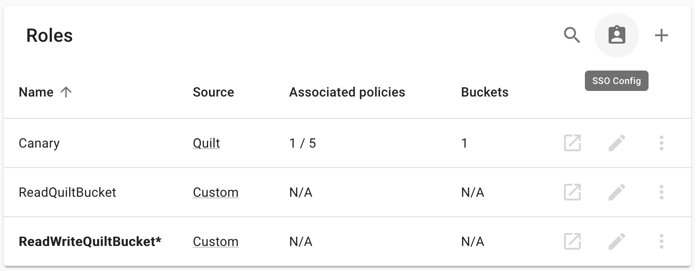

<!-- markdownlint-disable no-blanks-blockquote -->
# SSO permissions mapping

> This feature requires Quilt Platform version 1.54.0 or higher

## Overview

This feature allows Quilt admin to configure what roles and admin flag value are
assigned to the user who logs in via SSO based on the user's ID token claims.

The configuration can be set with `quilt3.admin.sso_config.set()`
or with admin UI.



> Note: Roles used by configuration can't be removed or renamed.

> Note: The user who sets the configuration will never have their admin flag revoked.

> Note: After configuration is set, any user who logs in via SSO can't be manually
assigned roles or admin permissions.

## Configuration

The configuration file is to be written in YAML and is defined by [this JSON Schema](https://github.com/quiltdata/quilt/blob/master/shared/schemas/sso-config-1.0.json)
which includes descriptions of all the fields.

> Warning: In schemas don't forget to add claims you want to check to `required`,
because otherwise the schema will match any ID token even if these claims are missing.

> Note: Mappings are evaluated in order, and **only the first matching
mapping is applied**. To assign multiple roles to a user, include all roles
in the `roles` array of a single mapping.

> Note: Set `union_roles: true` at the top level of the config (Quilt Platform
1.69+) to instead grant the union of roles from **all** matching mappings.
Users can switch between the assigned roles via the role switcher; any role no
longer in the match set is revoked on next login. Default is `false`.

### Example

```yaml
version: "1.0"
default_role: ReadQuiltBucket
union_roles: true
mappings:
  - schema:
      type: object
      properties:
        email:
          const: admin@example.com
      required:
        - email
    roles:
      - AdminTools
    admin: true
  - schema:
      type: object
      properties:
        groups:
          type: array
          contains:
            const: rw
      required:
        - groups
    roles:
      - ReadWriteQuiltBucket
```

With `union_roles: true`:

1. user with email `admin@example.com` **and** group `rw` is granted both
`AdminTools` and `ReadWriteQuiltBucket`, with admin flag set to true; they
can switch between roles via the role switcher
1. user with group `rw` only is granted `ReadWriteQuiltBucket`

Without `union_roles` (or set to `false`), only the first matching mapping
applies — the `admin@example.com` user above would receive `AdminTools` only.

Users matching no mapping receive the `default_role` (`ReadQuiltBucket` in
this example).

> Note: Unrecognized users will have their role set to the `default_role`, but
their admin flag will be unchanged.
