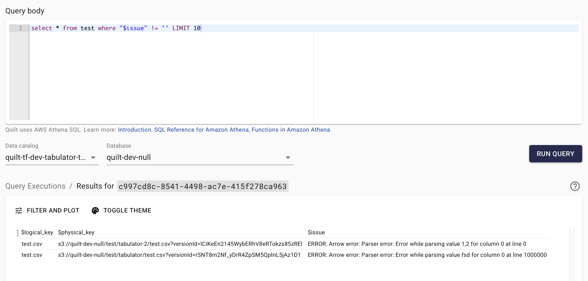
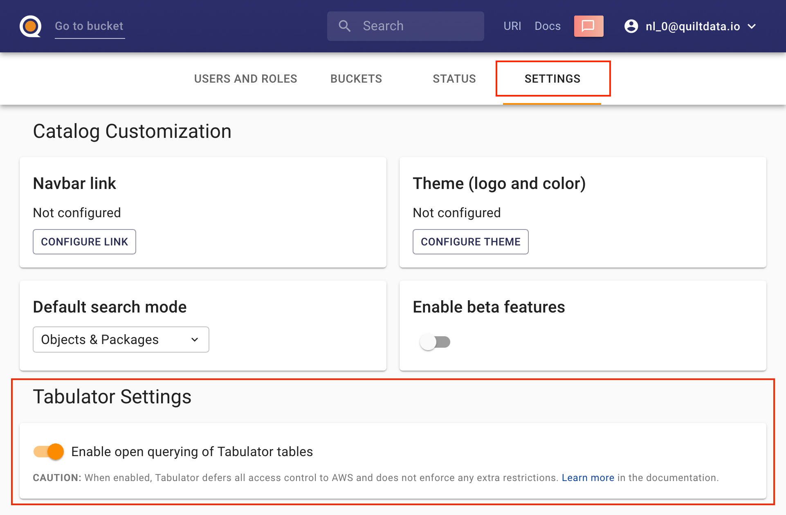

<!-- markdownlint-disable-next-line first-line-h1 -->
> NOTE: This feature requires Quilt Platform version 1.55.0 or higher

Tabulator aggregates tabular data objects across multiple packages using AWS
Athena. Admins define schemas and data sources for CSV, TSV, or Parquet files,
enabling users to run SQL queries directly on the contents of Quilt packages.
You can even use named capture groups to extract additional columns from
the logical key and package name.

The configuration is written in YAML and managed using the
`quilt3.admin.tabulator`
[APIs](../api-reference/Admin.md#quilt3.admin.tabulator) or via the
Quilt Admin UI:


## Configuration

Each Tabulator configuration is written in YAML, following the structure
outlined below.

### Example

```yaml
schema:
  - name: name  # must match ^[a-z_][a-z0-9_]*$
    type: STRING  # usually BOOLEAN, INT, FLOAT, DOUBLE, STRING, DATE, TIMESTAMP
  - name: length
    type: INT
  - name: effective_length
    type: FLOAT
  - name: tpm
    type: FLOAT
  - name: num_reads
    type: FLOAT
source:
  type: quilt-packages  # currently the only supported type
  package_name: "^ccle/(?<date>[^_]+)_(?<study_id>[^_]+)_nfcore_rnaseq$"
  logical_key: "salmon/(?<sample_id>[^/]+)/quant*\\.genes\\.sf$"
parser:
  format: csv  # or `parquet`
  delimiter: "\t"
  header: true
continue_on_error: true
```

1. **Schema**: The schema defines the columns in the table. Each column must
   have a name and a type. The name must match the regular expression
   `^[a-z_][a-z0-9_]*$`. For CSV/TSVs, these names do not need to match the
   column names in the document. For Parquet, they must match except for case.
   However, if column names are present in a CSV/TSV, you must set `header` to
   `true` in the parser configuration.
1. **Types**: Must be uppercase and match the
   [Apache Arrow Data Types](https://docs.aws.amazon.com/athena/latest/ug/data-types.html)
   used by Amazon Athena. Valid types are BOOLEAN, TINYINT, SMALLINT, INT,
   BIGINT, FLOAT, DOUBLE, STRING, BINARY, DATE, TIMESTAMP.
1. **Source**: The source defines the packages and objects to query. The `type`
   must be `quilt-packages`. The `package_name` is a regular expression that
   matches the package names to include. The `logical_key` is a regular
   expression that matches the keys of the objects to include. The regular
   expression may include named capture groups that will be added as columns
   to the table.
1. **Parser**: The parser defines how to read the files. The `format` must be
   one of `csv` or `parquet`. The optional `delimiter` (defaults to ',') is the
   character used to separate fields in the CSV file. The optional `header`
   field (defaults to 'false') is a boolean that indicates whether the first row
   of the CSV file contains column names.

### Added columns

In addition to the columns defined in the schema, Tabulator will add:

- any named capture groups from the `logical_key` or `package_name` regular expression
- `$pkg_name` for the package name
- `$logical_key` for the object as referenced by the package
- `$physical_key` for the underlying S3 URI
- `$top_hash` for the revision of the package containing the object (currently
  we query only the `latest` package revision)
- `$issue` for any problems encountered while parsing the file (new in Quilt
  Platform version 1.58)

### Using Athena to Access Tabulator

The primary way of accessing Tabulator is using the Quilt stack to query those
tables. This can be done by users via the per-bucket "Queries" tab in the Quilt
Catalog, or programmatically via `quilt3`. See "Usage" below for more details.

As of Quilt Platform version 1.57, admins can enable [open query](#open-query)
(below) to allow external users to access Tabulator tables directly from the AWS
Console, Athena views, or JDBC connectors. This is especially useful for
customers who want to access Tabulator from external services, such as Tableau
and Spotfire.

### Continuing After Errors

> Available since Quilt Platform version 1.58

If Tabulator encounters an error while processing a file, it normally stops and
returns an error. As of Quilt Platform version 1.58

1. If a file is missing a `nullable` column (the default), Tabulator will
   automatically fill that column with null, record that fact in the `$issue`
   column and continue processing the remaining files.

2. If `continue_on_error` is set to true, Tabulator will also skip files with
   other errors (e.g. non-nullable columns, malformed CSVs with non-numeric
   strings in numeric columns).  It will add a single line with non-nullable
   columns set to a default value (e.g., 0) and record that fact in the `$issue`
   column.



### Caveats

1. **Schema Consistency**: All files in the package that match the logical key
   must have the exact same schema as defined in the configuration (unless using
   Quilt Platform version 1.58 or higher, and using `continue_on_error: true`).
2. **Memory Usage**: Tabulator may fail on large files (> 10 GB), files with
   large rows (> 100 KB), and large numbers of files (> 10000). Additionally,
   Athena has a 16 MB limit per row.
3. **Cost Management**: Querying very large datasets can be expensive
   (approximately dollars per terabyte). Be sure to set up appropriate cost
   controls and monitoring.
4. **Concurrency**: Tabulator will attempt to process each file concurrently,
   but may be limited by the concurrency of Athena or the federation lambda in
   the
   [region](https://us-east-1.console.aws.amazon.com/lambda/home?region=us-east-1#/discover)
   where the query is running. If you are experiencing slow performance, it may
   be because the concurrency is too low. You can increase the concurrency in
   [that
   region](https://us-east-1.console.aws.amazon.com/servicequotas/home/services/lambda/quotas/L-B99A9384)'s
   AWS Service Quotas console.
5. **Athena VPC**: If you are using a VPC endpoint for Athena, you must ensure
   it is accessible from the Quilt stack and Tabulator lambda.

## Usage

Once the configuration is set, users can query the tables using the Athena tab
from the Quilt Catalog. Note that because Tabulator runs with elevated
permissions, it cannot be accessed from the AWS Console by default
(unless [open query](#open-query) is enabled).

For example, to query the `ccle_tsv` table from the appropriate workgroup in
the `quilt-tf-stable` stack, where the database (bucket name) is `udp-spec`:

```sql
SELECT * FROM "quilt-tf-stable-tabulator"."udp-spec"."ccle_tsv"
```

You can join this with any other Athena table, including the package and
object tables automatically created by Quilt. For example, this is the package
table:

```sql
SELECT * FROM "userathenadatabase-1qstaay0czbf"."udp-spec_packages-view"
LIMIT 10
```

We can then join on `PKG_NAME` to add the `user_meta` field from the package
metadata to the tabulated results:

```sql
SELECT
  "ccle_tsv".*,
  "udp-spec_packages-view".user_meta
FROM "quilt-tf-stable-tabulator"."udp-spec"."ccle_tsv"
JOIN "userathenadatabase-1qstaay0czbf"."udp-spec_packages-view"
ON "ccle_tsv".pkg_name = "udp-spec_packages-view".pkg_name
```

### From Outside the Quilt Catalog

To call Tabulator from outside the Queries tab, you must use `quilt3` to
authenticate against the stack using `config()` and `login()`, which opens a web
page from which you must paste in the appropriate access token. Use
`get_boto3_session()` to get a session with the same permissions as your Quilt
Catalog user, then use the `boto3` Athena client to run queries.

> If [open query](#open-query) is enabled, you can use any
> AWS credentials providing access to Athena resources associated with Tabulator.

Here is a complete example:

<!--pytest.mark.skip-->
```python
import quilt3
import time

DOMAIN = 'stable'
WORKGROUP = f'QuiltUserAthena-tf-{DOMAIN}-NonManagedRoleWorkgroup'
FULL_TABLE = f'"quilt-tf-{DOMAIN}-tabulator"."udp-spec"."ccle_tsv"'
QUERY = f'SELECT * FROM {FULL_TABLE} LIMIT 10'

quilt3.config(f'https://{DOMAIN}.quilttest.com/')
quilt3.login()
session = quilt3.get_boto3_session()
athena_client = session.client('athena')

response = athena_client.start_query_execution(
    QueryString=QUERY,
    WorkGroup=WORKGROUP
)
query_execution_id = response['QueryExecutionId']
print(f'Query execution ID: {query_execution_id}')

while True:
    execution_response = athena_client.get_query_execution(QueryExecutionId=query_execution_id)
    state = execution_response['QueryExecution']['Status']['State']
    if state in ('SUCCEEDED', 'FAILED', 'CANCELLED'):
        break
    print(f'\tQuery state: {state}')
    time.sleep(1)
print(f'Query finished with state: {state}')

if state == 'SUCCEEDED':
    results = athena_client.get_query_results(QueryExecutionId=query_execution_id)
    for row in results['ResultSet']['Rows']:
        print([field.get('VarCharValue') for field in row['Data']])
else:
    print(f'Query did not succeed. Final state: {state}')
```

## Open Query

> Available since Quilt Platform version 1.57

By default, Tabulator is only accessible via a session provided by the Quilt
Catalog, and the access is scoped to the permissions of the Catalog user
associated with that session. However, admins can choose to enable **open
query** to Tabulator tables, deferring all access control to AWS, thus enabling
access from external services. This allows querying Tabulator from the AWS
Console, Athena views or JDBC connectors -- as long as the caller has been
granted the necessary permissions to access Athena resources associated with
Tabulator.

### 1. Enable Open Query

An admin can enable open query via the `quilt3.admin.tabulator.set_open_query()`
[API](../api-reference/Admin.md#set_open_query)
or Admin UI:



### 2. Configure Permissions

In order to access Tabulator in open query mode, the caller must use a special
workgroup, and have permissions to use that workgroup and access tabulator
resources. For convenience, Quilt Stack provides a pre-configured workgroup and
policy for open query -- they can be found in the stack outputs:

1. `TabulatorOpenQueryPolicyArn`: attach this managed policy to a relevant IAM
   role (or copy the statements directly to your own role/policy).

2. `TabulatorOpenQueryWorkGroup`: configure your Athena client or connector to
   use this workgroup (or create your own with the same results output configuration).


