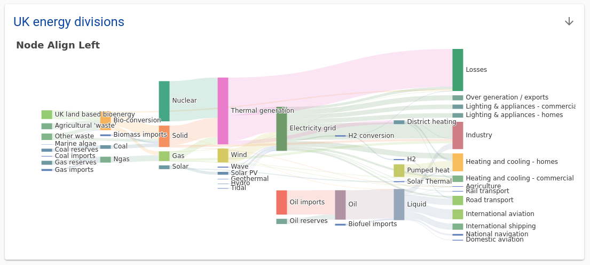

# Visualization

## Echarts

We support visualization library `echarts` on Summary page using [`quilt_summarize.json`](../Catalog/Preferences.md#custom-overviews-for-buckets-folders)

To draw a chart you can provide a JSON file which content will be treated as an [option parameter](https://echarts.apache.org/en/option.html) and set `"types"` property to `[ "echart" ]`

```json
// quilt_summarize.json
[
  {
    "path": "echart-option-file.json",
    "title": "Awesome pie chart",
    "types": ["echart"]
  }
]
```

Basic Echarts example: https://echarts.apache.org/examples/en/editor.html?c=line-simple

```json
{
  "dataset": {
    "source": [
      ["Mon", 150],
      ["Tue", 230],
      ["Wed", 224],
      ["Thu", 218],
      ["Fri", 135],
      ["Sat", 147],
      ["Sun", 250]
    ]
  },
  "xAxis": {
    "type": "category"
  },
  "yAxis": {
    "type": "value"
  },
  "series": [
    {
      "type": "line"
    }
  ]
}
```



### Embed dataset

As additional enhancement instead of inserting datasets inside JSON, you can provide a path or URL to the dataset file.

```json
{
  "dataset": {
    "source": "./dataset.csv"
  },
  "xAxis": {
    "type": "category"
  },
  "yAxis": {
    "type": "value"
  },
  "series": [
    {
      "type": "line"
    }
  ]
}
```

Relative paths are relative to JSON file containing `option` data:

```
 ├─ echart-option-file.json # { "dataset": {"source": "./dataset.csv" }}
 ├─ dataset.csv

```

### Limitations

Since we support JSON only, functionality is limited by JSON types only (numbers, strings, objects, arrays, etc.). You can't use functions like [`symbolSize`](https://echarts.apache.org/en/option.html#series-scatter.symbolSize)
