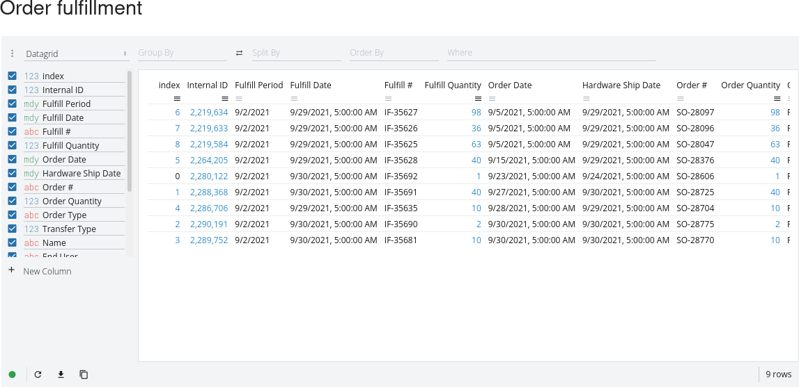

*This feature is in beta preview, details are subject to change.
It's disabled by default: ask Quilt engineer to enable it in your
CloudFormation template.*

Enterprise deployment of Quilt is able to run interactive Jupyter notebooks
using [Voilà](https://github.com/voila-dashboards/voila).
All Jupyter kernels run on single EC2 instance (`t3.small` by default) in
Linux containers that have network access and don't have access to persistent
storage. AWS credentials of user are passed to Jupyter kernel as
[environment variables](https://docs.aws.amazon.com/cli/latest/userguide/cli-configure-envvars.html#envvars-list).

These Python packages come pre-installed in Jupyter kernel:

```
altair
bqplot
ipykernel
ipyvolume
ipywidgets
pandas
perspective-python
PyYAML
quilt3
scipy
```

Here's [example notebook](voila-example.ipynb) and that's how it gets rendered:




