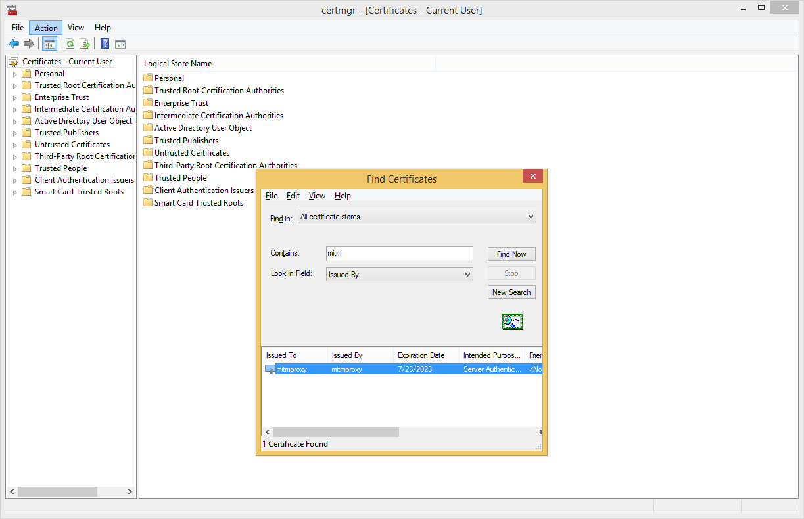

<!--pytest-codeblocks:skipfile-->
<!-- markdownlint-disable-next-line first-line-h1 -->
When using the `quilt3` API or CLI with a client-to-site
VPN you may need to trust a custom certificate in Python.

## Mac OS X

1. Direct your browser to an HTTPS website that uses a custom certificate.
1. Click the lock icon in the address bar.
1. Click View certificates and copy the certificate name to a safe place.
1. Open Keychain Access and select System Keychains > System Roots
1. Click the Certificates tab.
1. Find the certificate that you noted above.
1. Click File > Export Items... to export the root certificate.
1. Convert the exported certificate in Terminal as follows:
    ```sh
    openssl x509 -inform der -in /path/to/your/certificate.cer -out /path/to/converted/certificate.crt
    ```
1. Export the following variable (e.g. `~/.bashrc` or `~/.zshrc`):
    ```ssh
    export REQUESTS_CA_BUNDLE=/path/to/converted/certificate.crt
    ```

## Linux

1. Export the single-file versions of CA certificates variable (e.g.
`~/.bashrc` or `~/.zshrc`):
    ```sh
    export REQUESTS_CA_BUNDLE=/etc/pki/tls/certs/ca-bundle.crt`
    ```

> The single-file version of CA certificates may be located elsewhere
in different Linux distributions. For example, in Ubuntu Linux
distributions the file is located at `/etc/ssh/certs/ca-certificates.crt`

## Windows

1. Direct your browser to an HTTPS website that uses the custom certificate.
1. Click the lock icon in the address bar.
1. Click View certificates and copy the certificate name to a safe place.
1. Open the Command Prompt («Win + R») and type `certmgr`. This
opens the Windows Certificate Manager for the current user.
1. Find the certificate that you noted above.

   

1. Export the certificate in Base-64 encoded X.509 (.CER) to your
file system (`Path\To\mycert.cer`).
1. Export the following variable:
    ```sh
    > set REQUESTS_CA_BUNDLE=Path\To\mycert.cer
    ```
> This only affects the current shell session.

## Verification

Requesting access to a registry with the `quilt3` API or CLI should
no longer fail with SSL errors.

## Further information

- [SSL certificate verification with Python `Requests`
library](https://requests.readthedocs.io/en/latest/user/advanced/#ssl-cert-verification)
